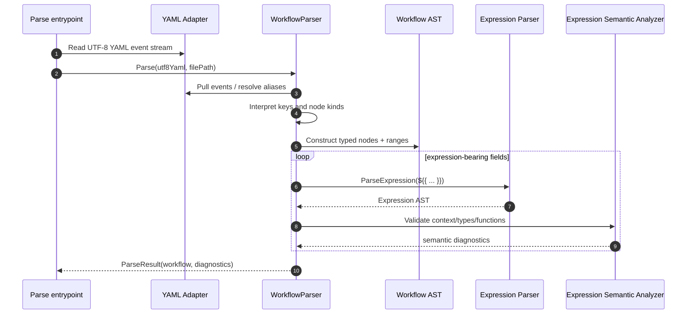

# Seiton Parser Specification

> This document is language-neutral — it specifies WHAT the Parser does, not HOW a specific implementation achieves it. Defines the parser contract for syntactic analysis, AST construction, and expression parsing/validation. For C#-specific implementation details, see `Seiton_Parser_csharp_spec.md`, For Go-specific implementation details, see `Seiton_Parser_go_spec.md`. Parser and linter behavior are specified in `Seiton_Parser_spec.md` and `Seiton_Linter_spec.md`.

> **Cross-document rule**: This spec is the source of truth. When revised, also review and update `Seiton_Parser_csharp_spec.md`, `Seiton_Parser_go_spec.md` for consistency.

---

## 1. Overall Parser Flow

```
  ┌───────────────────────────────────────────────────────────────┐
  │                        Parse()                                │
  │                                                               │
  │  1. Parse(utf8Yaml)                                           │
  │     1a. Read events via YAML Adapter Layer                    │
  │     1b. Resolve aliases                                       │
  │     1c. Parser.parse() -> Workflow AST                        │
  │     1d. Collect syntax diagnostics                            │
  │  2. Parse expression-bearing scalar values                    │
  │  3. Run expression semantic validation                         │
  │  4. Return ParseResult(workflow, diagnostics, fatalFlag)      │
  └───────────────────────────────────────────────────────────────┘
```

### 1.1 Entry Point

```
Parse(utf8Yaml, filePath) -> owned parse result
```

- Return: owned parse result containing `Workflow?`, `Diagnostic[]`, `HasFatalError`
- Returns `Diagnostic[]` even if YAML parsing itself fails; `Workflow` is null in that case
- Errors during AST construction are accumulated, not immediately fatal

### 1.1.2 Input Document Kind Classification

Before parser-kind-specific traversal, Seiton classifies input as one of:

- `workflow`
- `action-metadata`
- `unknown` (classification failure)

Classification contract:

1. Build a candidate kind from `filePath` path hints.
2. Confirm/finalize kind from YAML top-level structure.
3. When hint and structure disagree, structure wins and a diagnostic must report mismatch.

Normative structural hints (finalization stage):

- Workflow candidate is confirmed when root mapping has `jobs`.
- Action-metadata candidate is confirmed when root mapping has `runs`.
- If both `jobs` and `runs` exist, classify as `unknown` and emit ambiguity diagnostic.
- If neither `jobs` nor `runs` is present, fall back to the path-hint candidate kind. This allows action metadata files that lack `runs:` (e.g., malformed `action.yml`) to still be parsed as action metadata when the file path indicates it, enabling proper required-key diagnostics.

Normative path hints (fast candidate stage):

- Basename `action.yml` or `action.yaml` -> `action-metadata` candidate
- Path matching `.github/actions/<name>/action.yml` or `.github/actions/<name>/action.yaml` -> `action-metadata` candidate

Workflow-path hints are optional optimization only. Final kind is always structure-derived.

Browser WASM is the exception: the Playground's explicit document selection is authoritative, so the parser omits the structural-hint pre-pass and performs one kind-specific traversal. An action-metadata selection supplies an action-metadata path hint; other selections use workflow mode. This prevents a skip-only VYaml traversal from blocking on transient, incomplete editor input.

### 1.1.1 Supported Scope and Reference Parity

This document defines Seiton's formal parser contract.

- Behavior described in this document is **in scope** for Seiton and should be kept consistent with implementation and regression tests.
- Language-specific documents may compare Seiton against reference implementations such as actionlint. Those comparisons are informational and may identify **reference parity gaps**, but they do not expand Seiton's formal contract by themselves.
- A behavior is **out of scope** only when this specification or a companion spec explicitly marks it as a non-goal.
- Features present in a reference implementation but absent from this document are not part of Seiton's supported contract until they are added here.

### 1.2 Reference Implementation Correspondence

| actionlint (Go) | seiton |
|---|---|
| `yaml.Unmarshal` -> `yaml.Node` tree | Reads event stream via YAML adapter |
| `parser.resolveAliases()` | Handled in adapter layer or YAML library internals |
| `parser.parse()` -> `*Workflow` | `Parser.parse()` -> `Workflow` AST node |

### 1.3 Parse Call Sequence (Parse -> Interpret -> Evaluate)



---

## 2. AST Definitions

### 2.1 Design Principles

1. All major nodes carry source position (range)
2. Scalar values are stored as UTF-8 byte-sequence offset/length pairs by default; materialized to strings only when needed
3. Nullable fields represent "omitted in YAML"
4. Locations where expressions are allowed have an Expression field
5. Variable-length elements are stored as arrays

### 2.2 Workflow (Root)

| Field | Type | Required | Description |
|---|---|---|---|
| Name | StringNode? | - | `name:` |
| RunName | StringNode? | - | `run-name:` |
| On | Event[] | ✓ | `on:` section |
| Permissions | Permissions? | - | `permissions:` |
| Env | Env? | - | `env:` |
| Defaults | Defaults? | - | `defaults:` |
| Concurrency | Concurrency? | - | `concurrency:` |
| Jobs | map[string, Job] | ✓ | `jobs:` mapping |
| Range | TextRange | ✓ | Source range |

### 2.3 Event (`on:` Section)

Event has the following derived types:

- **WebhookEvent**: Webhook events such as `push`, `pull_request`
- **ScheduledEvent**: `schedule` event
- **WorkflowDispatchEvent**: `workflow_dispatch` event
- **WorkflowCallEvent**: `workflow_call` event
- **RepositoryDispatchEvent**: `repository_dispatch` event
- **ImageVersionEvent**: `image_version` event

All Events have `EventName` and `Range`.

#### 2.3.1 WebhookEvent

| Field | Type | Description |
|---|---|---|
| Hook | StringNode | Event name |
| Types | StringNode[]? | Activity types |
| Branches | WebhookEventFilter? | `branches:` filter |
| BranchesIgnore | WebhookEventFilter? | `branches-ignore:` filter |
| Tags | WebhookEventFilter? | `tags:` filter |
| TagsIgnore | WebhookEventFilter? | `tags-ignore:` filter |
| Paths | WebhookEventFilter? | `paths:` filter |
| PathsIgnore | WebhookEventFilter? | `paths-ignore:` filter |
| Workflows | StringNode[]? | `workflows:` for `workflow_run` |

WebhookEventFilter has `Name` (filter name) and `Values` (string array).

#### 2.3.2 ScheduledEvent

| Field | Type | Description |
|---|---|---|
| Schedules | ScheduleEntry[] | List of cron entries |

ScheduleEntry: `Cron` (StringNode?, required), `Timezone` (StringNode?)

#### 2.3.3 WorkflowDispatchEvent

| Field | Type | Description |
|---|---|---|
| Inputs | map[string, DispatchInput]? | Input definitions |

DispatchInput: `Name`, `Description?`, `Required?`, `Default?`, `Type` (None/String/Number/Boolean/Choice/Environment), `Options?`

**Empty option policy**: Empty strings (`''`) in `Options` are intentionally allowed without diagnostic. This is a legitimate GitHub Actions pattern for choice-type inputs representing "no selection" (e.g., `default: ''` with `options: ['', 'enable', 'disable']`). The parser collects empty option elements in the AST but does not emit an error.

#### 2.3.4 WorkflowCallEvent

| Field | Type | Description |
|---|---|---|
| Inputs | WorkflowCallEventInput[]? | Input definitions |
| Secrets | map[string, Secret]? | Secret definitions |
| Outputs | map[string, Output]? | Output definitions |

WorkflowCallEventInput: `Name`, `Id` (lower-case), `Description?`, `Required?`, `Default?`, `Type` (Invalid/Boolean/Number/String, required)

WorkflowCallEventSecret: `Name`, `Description?`, `Required?`

WorkflowCallEventOutput: `Name`, `Description?`, `Value` (required)

#### 2.3.5 RepositoryDispatchEvent

| Field | Type | Description |
|---|---|---|
| Types | StringNode[]? | Custom event types |

#### 2.3.6 ImageVersionEvent

| Field | Type | Description |
|---|---|---|
| Names | StringNode[]? | Image name patterns |
| Versions | StringNode[]? | Image version patterns |

### 2.4 Job

| Field | Type | Required | Description |
|---|---|---|---|
| Id | StringNode | ✓ | Job ID |
| Name | StringNode? | - | `name:` |
| Needs | StringNode[]? | - | `needs:` |
| RunsOn | Runner? | ※ | `runs-on:` (required for normal jobs) |
| Permissions | Permissions? | - | `permissions:` |
| Environment | Environment? | - | `environment:` |
| Concurrency | Concurrency? | - | `concurrency:` |
| Outputs | map[string, Output]? | - | `outputs:` |
| Env | Env? | - | `env:` |
| Defaults | Defaults? | - | `defaults:` |
| If | StringNode? | - | `if:` |
| Steps | Step[]? | ※ | `steps:` (required for normal jobs) |
| TimeoutMinutes | FloatNode? | - | `timeout-minutes:` (> 0) |
| Strategy | Strategy? | - | `strategy:` |
| ContinueOnError | BoolNode? | - | `continue-on-error:` |
| Container | Container? | - | `container:` |
| Services | Services? | - | `services:` |
| WorkflowCall | WorkflowCall? | ※ | `uses:` reusable workflow call |

### 2.5 Step

| Field | Type | Required | Description |
|---|---|---|---|
| Id | StringNode? | - | `id:` |
| If | StringNode? | - | `if:` |
| Name | StringNode? | - | `name:` |
| Background | BoolNode? | - | `background:` modifier on `run` / `uses` steps only (bool literal; no expression) |
| Exec | StepExec | ✓ | Execution content (see below) |
| Env | Env? | - | `env:` |
| ContinueOnError | BoolNode? | - | `continue-on-error:` |
| TimeoutMinutes | FloatNode? | - | `timeout-minutes:` (> 0) |

**Execution primary (mutually exclusive per step object):** `run` | `uses` | `wait` | `wait-all` | `cancel` | `parallel`. Per-form allowed keys and unexpected-key descriptions are generated from the **`step-schema` dataset** (`StepSchema.g.cs`).

**ExecRun** (`run:`): `Run` (required), `Shell?`, `WorkingDirectory?`

**ExecAction** (`uses:`): `Uses` (required), `Inputs?` (`with:`), `Entrypoint?` (docker only), `Args?` (docker only)

**ExecWait** (`wait:`): `Targets` — plain string or non-empty string sequence

**ExecWaitAll** (`wait-all:`): marker only; value must be null, empty, or `true`

**ExecCancel** (`cancel:`): `Target` — non-empty plain string

**ExecParallel** (`parallel:`): `Steps` — non-empty nested step sequence (same parse rules as job `steps:`)

### 2.6 Common Node Types

| Node | Fields | Description |
|---|---|---|
| **StringNode** | Value, Quoted, Range | Positioned string value. Can determine whether it contains `${{` |
| **BoolNode** | Value, Expression?, Range | Boolean literal or expression |
| **IntNode** | Value, Expression?, Range | Integer literal or expression |
| **FloatNode** | Value, Expression?, Range | Floating-point literal or expression |

### 2.7 Permissions

- **scalar form**: `read-all` / `write-all` / `{}`
- **mapping form**: scope -> value dictionary

### 2.8 Env

- **expression form**: Entire `env` is `${{ }}`
- **mapping form**: variable name -> value dictionary

### 2.9 Defaults

- Only `run` key (required)
- Inside `run`: `shell?`, `working-directory?`

### 2.10 Concurrency

- **scalar form**: group name only
- **mapping form**: `group` (required), `cancel-in-progress?`, `queue?`
- `queue` literal values are `single` or `max`; expression-bearing string values are also accepted and are validated at parse time for expression syntax and expression semantic/context-property rules. Only the literal `single`/`max` domain check is skipped for expression-bearing strings.

### 2.11 Environment

- **scalar form**: name only
- **mapping form**: `name` (required), `url?`, `deployment?`

### 2.12 Runner (runs-on)

- **scalar / sequence**: label specification
- **mapping**: `labels` + `group`
- **expression**: labels specified via `${{ }}`

### 2.13 Strategy / Matrix

Strategy: `matrix?`, `fail-fast?`, `max-parallel?` (> 0)

Matrix:
- **expression form**: Entire value is `${{ }}`
- **mapping form**: `include?`, `exclude?`, custom rows
- Custom row: expression or array of values

### 2.14 Container / Services

Container: `image` (required), `credentials?`, `env?`, `ports?`, `volumes?`, `options?`

- **scalar form**: image name only
- **mapping form**: all fields above

Services: Dictionary of named Services. Each Service has a Container.

Credentials: `username` + `password` (both required), or expression.

### 2.15 WorkflowCall (job-level reusable workflow)

`uses` (required), `inputs?` (`with:`), `secrets?` (mapping or `"inherit"`)

### 2.16 ActionMetadata (action.yml / action.yaml)

| Field | Type | Required | Description |
|---|---|---|---|
| Name | StringNode? | - | `name:` |
| Description | StringNode? | ✓ | `description:` — must be present; parser emits error if missing |
| Inputs | map[string, ActionMetadataInput]? | - | `inputs:` mapping |
| Outputs | map[string, ActionMetadataOutput]? | - | `outputs:` mapping |
| Runs | ActionMetadataRuns? | ✓ | `runs:` — must be present; parser emits error if missing |
| Branding | ActionMetadataBranding? | ✓ | `branding:` (icon, color) |
| Range | TextRange | ✓ | Source range |

Required-key validation: When parsing in action-metadata mode, the parser checks that `description` and `runs` are present at the root level. Missing keys emit error diagnostics with position `1:1`.

---

## 3. Parse Algorithms

### 3.1 Basic Design

- **Hand-written recursive descent** over YAML event stream
- Parser depends only on the YAML adapter's read contract
- Errors are accumulated; **parsing does not abort** (multi-error recovery)

### 3.1.1 YAML Anchor and Alias Support

YAML anchors (`&name`) and aliases (`*name`) are supported as a current contract feature.

#### Scope

Anchor and alias resolution is handled transparently by the YAML adapter layer.
The parser core receives an event stream where every `*alias` has been expanded to the full
event sequence of the referenced anchor — the parser core never sees raw `Alias` events.

Supported anchor targets:

| Anchor target | Example |
|---|---|
| Scalar | `env: &my_val ubuntu-latest` / `runs-on: *my_val` |
| Sequence | `paths: &paths [src/**]` / `paths: *paths` |
| Mapping | `env: &envs {FOO: bar}` / `env: *envs` |
| Step mapping | `- &step run: echo hello` / `- *step` |
| Job mapping | `job1: &base_job ...` / `job2: *base_job` |
| Nested usage | Anchors can be used anywhere a scalar, sequence, or mapping is valid |

#### Constraints

- **YAML merge key `<<`** is not supported. Any `<<:` key produces a `does not support merge key '<<'` error.
- **Recursive anchors** (an alias that directly or indirectly references itself) produce parser diagnostics rather than a hang or fatal error.
- **Undefined aliases** (aliases for which no anchor was defined) produce a `yaml parse failure` fatal error.
- **Null scalar anchors** (e.g. `env: &name` with no value) are handled gracefully — the adapter returns empty bytes instead of throwing.
- Parser core does not directly access anchor/alias graph structures; all resolution is owned by the adapter layer.

#### Error recovery

| Situation | Recovery |
|---|---|
| Undefined alias (`*name` with no matching `&name`) | `yaml parse failure` fatal diagnostic |
| Unresolvable alias in adapter | Surface as `Alias` event; parser core reports type-mismatch diagnostic and skips |
| YAML merge key `<<` | `does not support merge key '<<'` diagnostic; value is skipped |
| Recursive anchor | Deterministic parse diagnostics (no hang) |
| Null scalar with anchor (`key: &name`) | Adapter returns empty span; parser reports structural error (e.g. "env must be mapping") |

#### Fatal Parse Explanatory Hints

When a YAML fatal parse occurs, the parser may augment the `yaml parse failure` diagnostic with a `Help` field containing an explanatory hint for common authoring mistakes. This is NOT recovery — the parse still fails fatally and no AST is produced.

Currently supported hints:

| Pattern | Condition | Help message |
|---|---|---|
| Plain scalar colon-space in `run:`/`script:` | Error line or nearby lines contain a `run:` or `script:` key whose plain scalar value contains `: ` | Explains that the `: ` is invalid in a plain scalar and suggests quoting or block scalar (`\|`) |
| Step-level duplicate known key | Second occurrence of a step mapping key (`run`, `uses`, `with`, `env`, etc.) | Explains that YAML mapping keys must be unique; for `env`, suggests merging into a single `env:` block |

Constraints:

- Hints fire only when the parser has a reliable fatal position from the YAML library (for C# VYaml integration, parseable `Line:`, `Col:`, and `Idx:` markers)
- Hints fire only when all heuristic conditions are met (key match + plain scalar + `: ` presence)
- Hints do not fire for quoted scalars, block scalars, or values without `: `
- YAML node properties before the scalar value (for example `&anchor`, `!tag`) are ignored when deciding whether the value is plain vs quoted/block
- YAML flow indicators (`[`, `{`) and alias indicators (`*`) at value position are recognized as non-plain-scalar and excluded
- Inline comments are excluded from the colon-space check; only the scalar value itself is considered
- Empty/comment-only values such as `run: # note` do not qualify as plain scalars for this hint
- The fatal parse diagnostic is unchanged; hint is additive via the `Help` field
- Hint detection scans the error line and up to 3 lines above the error position

### 3.2 Workflow Top-Level Parse

```
ParseWorkflow(utf8Yaml) -> ParseResult
  1. reader.SkipHeader()
  2. expect MappingStart -> workflow root
  3. mapping traversal:
     switch by key:
       "name"         -> parseString -> workflow.Name
       "run-name"     -> parseString -> workflow.RunName
       "on"           -> ParseEvents -> workflow.On
       "permissions"  -> ParsePermissions -> workflow.Permissions
       "env"          -> ParseEnv -> workflow.Env
       "defaults"     -> ParseDefaults -> workflow.Defaults
       "concurrency"  -> ParseConcurrency -> workflow.Concurrency
       "jobs"         -> ParseJobs -> workflow.Jobs
       other          -> UnexpectedKey error + SkipValue
  4. Required key validation: error if "on" or "jobs" missing
  5. return ParseResult(workflow, diagnostics, hasFatalError)
```

### 3.3 Mapping Traversal Pattern

Generic routine:

```
ParseMapping(sectionName, allowEmpty, caseSensitive):
  1. null scalar -> allowEmpty ? ok : error "should not be empty"
  2. expect MappingStart
  3. duplicate detection via seen keys (lower-case if case-insensitive)
  4. for each key:
     a. parseString to read key
     b. "<<" (YAML merge key) -> error
     c. duplicate check -> error if dup
     d. yield (id, keyNode, valueEvent) to caller
  5. if not allowEmpty and 0 entries -> error
```

### 3.4 Events Parse (`on:` Section)

`on:` takes 3 forms:

1. **scalar**: `on: push` -> single event
2. **sequence**: `on: [push, pull_request]` -> multiple events
3. **mapping**: `on: { push: { branches: [main] } }` -> events with config

```
ParseEvents(node):
  switch kind:
    Scalar  -> parseEventWithNoConfig(scalar) -> [Event]
    Sequence -> for each item: parseEventWithNoConfig(scalar) -> [Event]
    Mapping  -> for each entry:
      switch eventName:
        "schedule"            -> ParseScheduleEvent
        "workflow_dispatch"   -> ParseWorkflowDispatchEvent
        "repository_dispatch" -> ParseRepositoryDispatchEvent
        "workflow_call"       -> ParseWorkflowCallEvent
        "image_version"       -> ParseImageVersionEvent
        other                 -> ParseWebhookEvent
```

#### 3.4.1 parseEventWithNoConfig

When the scalar is an event name:
- `"schedule"` -> error (mapping required)
- `"repository_dispatch"` / `"workflow_dispatch"` / `"workflow_call"` / `"image_version"` -> empty typed event
- other -> `WebhookEvent { Hook = name }`

For mapping form of `image_version`:
- `names` -> sequence of scalar
- `versions` -> sequence of scalar
- other -> unknownOptionWithSuggestion (candidates: `names`, `versions`)

#### 3.4.2 WebhookEvent Parse

```
ParseWebhookEvent(name, configNode):
  mapping traversal:
    "types"            -> parseStringOrStringSequence
    "branches"         -> parseWebhookEventFilter
    "branches-ignore"  -> parseWebhookEventFilter
    "tags"             -> parseWebhookEventFilter
    "tags-ignore"      -> parseWebhookEventFilter
    "paths"            -> parseWebhookEventFilter
    "paths-ignore"     -> parseWebhookEventFilter
    "workflows"        -> parseStringOrStringSequence   (workflow_run only)
    other              -> unknownOptionWithSuggestion
```

#### 3.4.2a Unknown Key Suggestion and Auto-Fix

When any key is unknown (not in the section's allowed key set), the parser performs case-insensitive distance-based matching against valid key names for that section. This applies to **all** unexpected-key diagnostic sites across the parser.

**Contract:**
- When a close match is found: diagnostic includes `did you mean "{suggestion}"?` before the expected key list, and carries a `DiagnosticFix` that replaces the unknown key with the suggested key.
- When no match is within threshold: plain `expected one of {list}` message with no suggestion or fix.
- For unknown events with a suggestion, the URL reference is **always included**.
- Message ordering: `did you mean "{suggestion}"?` always comes before `expected one of {list}`.

This is an error-path-only feature; distance computation does not affect parse performance on valid inputs.

#### 3.4.3 Exclusive Filter Validation

Validate after mapping traversal:
- `branches` and `branches-ignore` are mutually exclusive
- `tags` and `tags-ignore` are mutually exclusive
- `paths` and `paths-ignore` are mutually exclusive

#### 3.4.4 Activity Types Validation

Validate against the per-event allowed activity type table.

### 3.5 Permissions Parse

```
ParsePermissions(node):
  if Scalar -> All = parseString
  if Mapping -> for each entry:
    Scopes[id] = { Name = key, Value = parseString(val) }
```

### 3.6 Env Parse

```
ParseEnv(node):
  if Scalar -> Expression = parseExpression (verify entire value is ${{ }})
  if Mapping -> for each entry: Vars[id] = { Name = key, Value = parseString(val, allowEmpty) }
```

**Note**: If the `env:` value is a plain string (not `${{ }}`), it is an error ("expecting ${{ }} expression or mapping").

### 3.7 Defaults Parse

```
ParseDefaults(node):
  mapping traversal:
    "run" -> ParseDefaultsRun(val):
      "shell" -> parseString
      "working-directory" -> parseString
      other -> unexpectedKey
    other -> unexpectedKey
  run is nil -> error "defaults should have run"
```

### 3.8 Concurrency Parse

```
ParseConcurrency(node):
  if Scalar -> group = parseString
  if Mapping:
    "group" -> parseString
    "cancel-in-progress" -> parseBool
    "queue" -> parseString; if plain literal, value must be `single` or `max`
    other -> unexpectedKey
  group is nil -> error
```

### 3.9 Jobs Parse

```
ParseJobs(node):
  mapping traversal (case-insensitive):
    for each entry: jobs[id] = ParseJob(keyNode, valNode)
```

### 3.10 Job Parse

```
ParseJob(id, node):
  mapping traversal:
    "name"             -> parseString
    "needs"            -> scalar or sequence of strings
    "runs-on"          -> ParseRunsOn
    "permissions"      -> ParsePermissions
    "environment"      -> ParseEnvironment
    "concurrency"      -> ParseConcurrency
    "outputs"          -> ParseOutputs
    "env"              -> ParseEnv
    "defaults"         -> ParseDefaults
    "if"               -> parseString
    "steps"            -> ParseSteps
    "timeout-minutes"  -> parseTimeoutMinutes (Float, > 0)
    "strategy"         -> ParseStrategy
    "continue-on-error" -> parseBool
    "container"        -> ParseContainer
    "services"         -> ParseServices
    "uses"             -> parseString -> WorkflowCall.Uses
    "with"             -> mapping -> WorkflowCall.Inputs
    "secrets"          -> "inherit" or mapping -> WorkflowCall.Secrets
    other              -> unexpectedKey

  Post-validation:
    if uses present:
      if stepsOnlyKey present -> error
        (runs-on, environment, outputs, env, defaults, steps,
         timeout-minutes, continue-on-error, container are invalid for reusable workflows)
    else:
      steps missing -> error "steps is missing"
      runs-on missing -> error "runs-on is missing"
      callOnlyKey (with, secrets) present -> error
```

#### 3.10.1 Allowed Keys for Reusable Workflow Calls

Keys allowed when calling via `uses`:
- `name`, `uses`, `with`, `secrets`, `needs`, `if`, `permissions`, `concurrency`, `strategy`

All other keys produce a `stepsOnlyKey` error.

### 3.11 Steps Parse

```
ParseSteps(node):
  expect SequenceStart, not empty
  for each item: ParseStep(item)
```

### 3.12 Step Parse

Per-form allowed keys and unexpected-key descriptions are generated from the **`step-schema` dataset** (`StepSchema.g.cs`). The `expected-keys` dataset still provides the union of all documented step keys for the generic `step` section only.

**Primary forms (one per step mapping):** `run`, `uses`, `wait`, `wait-all`, `cancel`, `parallel`. **`background`** is a modifier allowed only on `run` / `uses` forms (same object).

**`StepParseContext` (GitHub runtime constraints):** `ParseStep` / `ParseSteps` take a context that reflects where the step appears. Raw JSON Schema allows recursive `parallel` items; GitHub’s runtime validator is stricter (verified 2026-06-26).

| Context | Allowed primary | `background` modifier | `if:` modifier |
|---------|----------------|---------------------|----------------|
| `WorkflowJobStep` (`jobs.*.steps`) | all six primaries | `run` / `uses` only | `run` / `uses` only; **not** on `parallel` / `wait` / `wait-all` / `cancel` (D21, verified 2026-06-27) |
| `ParallelChild` (`parallel` array items) | `run` / `uses` only | not allowed (implicit background) | allowed on child `run` / `uses` |
| `CompositeActionStep` (`runs.steps`) | `run` / `uses` only | not allowed | allowed on child `run` / `uses` |

Disallowed keys emit: `has unexpected key "…" for step in parallel group` or `… for step in composite action` with the restricted key list. Control-step `if:` emits: `has unexpected key "if" for …. "if" is not supported on parallel, wait, wait-all, or cancel steps`.

```
ParseStep(node, context):
  single-pass mapping dispatch (Utf8MappingDispatch + StepSchema):
    detect primary form + optional background modifier (per context)
    parse values per StepSchema valueKind
    parallel -> ParseSteps(..., ParallelChild)
    composite runs.steps -> ParseSteps(..., CompositeActionStep)
    missing primary -> context-specific hint (workflow includes parallel controls; restricted contexts run/uses only)
    unexpected keys -> StepSchema unexpectedKeyDescription per form, or context message when restricted
```

Step-level known keys use duplicate detection identical to job-level known keys: first occurrence wins, duplicate occurrences emit a non-fatal error and skip the value node. Duplicate diagnostics use the dotted-path prefix (Principle 5) and include a `Help` hint explaining how to merge keys.

**Notes:**

- Bare `wait-all:` with no trailing file newline hung VYaml before 1.4.0; fixed upstream. Seiton requires VYaml ≥ 1.4.0.
- Restricted-context diagnostics materialize the mapping key name before advancing the YAML reader past the key scalar (the reader reuses scalar buffers; reporting after `Read()` can corrupt hyphenated keys such as `wait-all`).
- Control-step `if:` (D21): GitHub rejects `if` on `parallel` / `wait` / `wait-all` / `cancel` primaries even though raw JSON Schema lists `if` in those forms. Seiton reports at end-of-step (or immediately when `if` follows a resolved control primary) and does not retain `Step.If` on the AST.

#### 3.12.1 ExecAction Parse

```
parseStepExecAction(entries, isDocker):
  "uses" -> parseString
  "with" -> mapping:
    if isDocker:
      "entrypoint" -> Entrypoint
      "args"       -> Args
      other        -> Inputs[id]
    else:
      all          -> Inputs[id]
  other than common keys -> unexpectedKey
```

#### 3.12.2 ExecRun Parse

```
parseStepExecRun(entries):
  "run"               -> parseString
  "shell"             -> parseString
  "working-directory" -> parseString
  other than common keys -> unexpectedKey
```

### 3.13 RunsOn Parse

```
ParseRunsOn(node):
  if expression(${{ }}) -> Runner { LabelsExpr }
  if Scalar or Sequence -> labels = parseStringOrStringSequence
  if Mapping:
    "labels" -> expression or stringOrSeq
    "group"  -> parseString
    other    -> unexpectedKey
```

### 3.14 Environment Parse

```
ParseEnvironment(node):
  if Scalar -> Name = parseString
  if Mapping:
    "name"       -> parseString (required)
    "url"        -> parseString
    "deployment" -> parseBool
    other -> unexpectedKey
  name is nil -> error
```

### 3.15 Strategy / Matrix Parse

```
ParseStrategy(node):
  "matrix"       -> ParseMatrix
  "fail-fast"    -> parseBool
  "max-parallel" -> parseInt (> 0)
  other -> unexpectedKey

ParseMatrix(node):
  if Scalar -> expression
  if Mapping:
    "include" -> parseMatrixCombinations
    "exclude" -> parseMatrixCombinations
    other     -> custom row:
      if Scalar -> expression
      if Sequence -> [parseRawYAMLValue(item)]
```

### 3.16 Container Parse

```
ParseContainer(section, node):
  if Scalar:
    if NullTag:
      if explicitNull (source contains "null" or "~") -> return nil (no error)
      else (implicit empty, e.g. `container:`) -> error "image should not be empty"
    else -> Image = parseString
  if Mapping:
    "image"       -> parseString (required)
    "credentials" -> ParseCredentials
    "env"         -> ParseEnv
    "ports"       -> stringSequence
    "volumes"     -> stringSequence
    "options"     -> parseString
    other -> unexpectedKey
  image nil -> error
```

### 3.17 Services Parse

```
ParseServices(node):
  if expression -> Services { Expression }
  if Mapping:
    for each entry:
      services[id] = Service { name, ParseContainer("services", val) }
```

### 3.18 Credentials Parse

```
ParseCredentials(node):
  if expression -> Credentials { Expression }
  if Mapping:
    "username" -> parseString (required)
    "password" -> parseString (required)
    other -> unexpectedKey
  both nil -> error
```

---

## 4. Scalar Parsing Helpers

### 4.1 parseString

```
parseString(node, allowEmpty):
  expect Scalar
  if !allowEmpty && value == "" -> error
  return StringNode { Value, Quoted, Range }
```

### 4.2 parseBool

```
parseBool(node):
  if tag == !!str -> parseExpression -> BoolNode { Expression }
  if tag == !!bool -> BoolNode { value == "true" }
  else -> error
```

### 4.3 parseInt

```
parseInt(node):
  if tag == !!str -> parseExpression -> IntNode { Expression }
  if tag == !!int -> parse int literal -> IntNode { Value }
  else -> error
```

### 4.4 parseFloat

```
parseFloat(node):
  if tag == !!str -> parseExpression -> FloatNode { Expression }
  if tag == !!int or !!float -> parse float literal -> FloatNode { Value }
  else -> error
```

### 4.5 parseExpression

```
parseExpression(node, expecting):
  verify value matches ${{ ... }} form
  if not -> error "expecting ${{ }} or {expecting}"
  return StringNode
```

### 4.6 mayParseExpression

```
mayParseExpression(node):
  if tag is !!str and value is ${{ ... }} -> return StringNode
  otherwise -> return null
```

### 4.7 parseStringOrStringSequence

```
parseStringOrStringSequence(section, node, allowEmpty, allowElemEmpty):
  if Scalar:
    if null tag && allowEmpty -> []
    else -> [parseString]
  if Sequence:
    for each item: parseString
```

### 4.8 Scalar Tag Information

The parser uses tag information (`!!str`, `!!bool`, `!!int`, `!!float`, `!!null`) obtained from the YAML library, normalized into a custom enum. For libraries that do not provide tag information, fallback estimation is performed based on value content (`"true"` / `"false"` / numeric patterns).

---

## 5. Error Recovery Strategy

### 5.1 Basic Policy

1. Do **not stop** parsing on a single error
2. Errors beyond mapping/sequence boundaries are recovered via subtree skip
3. Return as many diagnostics as possible

### 5.2 Recovery by Pattern

| Situation | Recovery |
|---|---|
| Unknown key | error + SkipCurrentNode for value. Includes Levenshtein suggestion ("did you mean") when a close match is found (§3.4.2a), across all sections |
| Type mismatch | error + SkipCurrentNode |
| Missing required key | aggregate error after mapping traversal |
| Exclusive constraint violation | aggregate error after mapping traversal |
| YAML parse failure (including alias resolution failure in adapter/library) | Add a fatal `yaml parse failure` diagnostic and preserve any parser diagnostics already emitted earlier in the same file; AST may be partial or null |
| Duplicate key | error + ignore the later key (first wins) |

---

## 6. Expression Parser Specification

### 6.1 Overview

A recursive descent parser for GitHub Actions `${{ }}` expressions.

### 6.2 Grammar (EBNF)

```
Expression    := LogicalOr
LogicalOr     := LogicalAnd ( "||" LogicalAnd )*
LogicalAnd    := Equality ( "&&" Equality )*
Equality      := Comparison ( ( "==" | "!=" ) Comparison )*
Comparison    := Primary ( ( "<" | "<=" | ">" | ">=" ) Primary )*
Primary       := UnaryExpr
UnaryExpr     := "!" UnaryExpr | Postfix
Postfix       := Atom ( "." Ident | "." "*" | "[" Index "]" | "(" ArgList ")" )*
Atom          := Ident | StringLit | IntLit | FloatLit | "true" | "false" | "null" | "(" Expression ")"
ArgList       := Expression ( "," Expression )*
Index         := Expression
```

**Note**: The GitHub Actions expression specification does not include arithmetic operators (`+`, `-`, `*`, `/`, `%`). actionlint does not parse these either.

### 6.3 Token Types

| Token | Symbol |
|---|---|
| `Ident` | alphanumeric + `_` + `-` |
| `String` | `'...'` (single-quoted, `''` for escape). Double quotes (`"`) are rejected with a diagnostic: "only single quotes are available for string delimiter in expressions". |
| `Int` | integer literal (decimal / `0x` hex) |
| `Float` | floating-point literal |
| `(` `)` `[` `]` `.` `!` | symbols |
| `<` `<=` `>` `>=` `==` `!=` | comparison operators |
| `&&` `\|\|` | logical operators |
| `*` | wildcard (`*` in `foo.*`) |
| `,` | function argument separator |

### 6.4 Expression AST Nodes

| Node Type | Description |
|---|---|
| `VariableNode` | Context variables such as `github`, `env`, `secrets` |
| `ObjectDerefNode` | `foo.bar` — property access |
| `ArrayDerefNode` | `foo.*` — wildcard access |
| `IndexAccessNode` | `foo['bar']` or `foo[0]` — index access |
| `NotOpNode` | `!expr` |
| `CompareOpNode` | `==`, `!=`, `<`, `<=`, `>`, `>=` |
| `LogicalOpNode` | `&&`, `\|\|` |
| `FuncCallNode` | `contains(...)`, `startsWith(...)`, etc. |
| `NullNode` | `null` literal |
| `BoolNode` | `true` / `false` literal |
| `IntNode` | Integer literal |
| `FloatNode` | Floating-point literal |
| `StringNode` | String literal |

### 6.5 Expression Visitor

The expression AST is traversed using the `VisitExprNode(node, parent, entering)` pattern. `entering = true` fires before visiting children; `entering = false` fires after visiting children.

---

## 7. Expression Semantic Analysis

> **Ownership boundary note**: This section documents expression semantic analysis that the parser performs. Under the refined boundary (see `Seiton_spec.md` §3), semantic checks are split into two categories:
>
> - **Parser-owned (expression-language intrinsic)**: Function existence, arity/overload matching, operator-local type validity — these do not depend on workflow position or dynamic context. The parser emits diagnostics for these unconditionally.
> - **Linter-owned (GitHub Actions context-dependent)**: Context availability, function availability by workflow position, dynamic property existence, workflow-site-aware type suitability — these depend on the workflow AST and dynamic context resolution. The linter owns these diagnostics via `ExprUndefinedVarRule` and related rules.
>
> The current C# implementation reflects this boundary: the parser emits only expression-language intrinsic diagnostics (§7.1–§7.3), while the linter performs all context-dependent checks using override-aware type inference. Deduplication handles operator-local overlap where both layers may emit equivalent diagnostics.

### 7.1 Built-in Function Signatures

| Function | Parameters | Return | Variadic |
|---|---|---|---|
| `contains` | (string, string) or (array, any) | bool | No |
| `startsWith` | (string, string) | bool | No |
| `endsWith` | (string, string) | bool | No |
| `format` | (string, any...) | string | Yes |
| `join` | (array\|string, string?) | string | No |
| `toJSON` | (any) | string | No |
| `fromJSON` | (string) | any | No |
| `hashFiles` | (string...) | string | Yes |
| `success` | () | bool | No |
| `always` | () | bool | No |
| `failure` | () | bool | No |
| `cancelled` | () | bool | No |
| `case` | (bool, any, any, any...) | any | Yes (trailing args) |

### 7.2 Context Availability Validation

The root identifiers of expressions (`github`, `env`, `vars`, `job`, `steps`, `runner`, `secrets`, `strategy`, `matrix`, `needs`, `inputs`) have different availability depending on the workflow key where the expression appears.

#### 7.2.1 Per-Key Context Availability Table

The complete per-key availability matrix is generated from `data/sources/availability/` and materialized in `Availability.g.cs`. Each workflow key position maps to a dedicated `ExpressionValidationContext` enum value with its own context root array.

Context availability varies by workflow position: workflow-level keys have the fewest roots (3–4), job-level keys progressively gain `strategy`/`matrix`/`needs`/`secrets`, and common step expression sites such as `steps.run`, `steps.with`, and `steps.env` have all 11 roots. See the full table below for the exact per-key matrix; notable exceptions include `steps.if`, which excludes `secrets`, and keys such as `steps.id` / `steps.shell`, which expose no expression roots.

<details>
<summary>Full availability table (reference)</summary>

**Workflow Level:**

| Workflow Key | `github` | `env` | `vars` | `job` | `steps` | `runner` | `secrets` | `strategy` | `matrix` | `needs` | `inputs` |
|---|---|---|---|---|---|---|---|---|---|---|---|
| `run-name` | ✓ | - | ✓ | - | - | - | - | - | - | - | ✓ |
| `env` | ✓ | - | ✓ | - | - | - | ✓ | - | - | - | ✓ |
| `concurrency` | ✓ | - | ✓ | - | - | - | - | - | - | - | ✓ |
| `on.workflow_call.inputs.*.default` | ✓ | - | ✓ | - | - | - | - | - | - | - | ✓ |
| `on.workflow_call.outputs.*.value` | ✓ | - | ✓ | - | - | - | - | - | - | - | ✓ |

> Note: `on.workflow_call.outputs.*.value` additionally has access to `jobs` context (for referencing job outputs).

**Job Level:**

| Workflow Key | `github` | `env` | `vars` | `job` | `steps` | `runner` | `secrets` | `strategy` | `matrix` | `needs` | `inputs` |
|---|---|---|---|---|---|---|---|---|---|---|---|
| `jobs.<id>.if` | ✓ | - | ✓ | - | - | - | - | - | - | ✓ | ✓ |
| `jobs.<id>.name` | ✓ | - | ✓ | - | - | - | - | ✓ | ✓ | ✓ | ✓ |
| `jobs.<id>.runs-on` | ✓ | - | ✓ | - | - | - | - | ✓ | ✓ | ✓ | ✓ |
| `jobs.<id>.env` | ✓ | - | ✓ | - | - | - | ✓ | ✓ | ✓ | ✓ | ✓ |
| `jobs.<id>.concurrency` | ✓ | - | ✓ | - | - | - | - | ✓ | ✓ | ✓ | ✓ |
| `jobs.<id>.strategy` | ✓ | - | ✓ | - | - | - | - | - | - | ✓ | ✓ |
| `jobs.<id>.continue-on-error` | ✓ | - | ✓ | - | - | - | - | ✓ | ✓ | ✓ | ✓ |
| `jobs.<id>.timeout-minutes` | ✓ | - | ✓ | - | - | - | - | ✓ | ✓ | ✓ | ✓ |
| `jobs.<id>.environment` | ✓ | - | ✓ | - | - | - | - | ✓ | ✓ | ✓ | ✓ |
| `jobs.<id>.environment.url` | ✓ | ✓ | ✓ | ✓ | ✓ | ✓ | - | ✓ | ✓ | ✓ | ✓ |
| `jobs.<id>.outputs.<out_id>` | ✓ | ✓ | ✓ | ✓ | ✓ | ✓ | ✓ | ✓ | ✓ | ✓ | ✓ |
| `jobs.<id>.with.<with_id>` | ✓ | - | ✓ | - | - | - | - | ✓ | ✓ | ✓ | ✓ |
| `jobs.<id>.secrets.<secret_id>` | ✓ | - | ✓ | - | - | - | ✓ | ✓ | ✓ | ✓ | ✓ |
| `jobs.<id>.defaults.run` | ✓ | ✓ | ✓ | - | - | - | - | ✓ | ✓ | ✓ | ✓ |
| `jobs.<id>.container` | ✓ | - | ✓ | - | - | - | - | ✓ | ✓ | ✓ | ✓ |
| `jobs.<id>.container.image` | ✓ | - | ✓ | - | - | - | - | ✓ | ✓ | ✓ | ✓ |
| `jobs.<id>.container.credentials` | ✓ | ✓ | ✓ | - | - | - | ✓ | ✓ | ✓ | ✓ | ✓ |
| `jobs.<id>.container.env.<env_id>` | ✓ | ✓ | ✓ | ✓ | - | ✓ | ✓ | ✓ | ✓ | ✓ | ✓ |
| `jobs.<id>.services` | ✓ | - | ✓ | - | - | - | - | ✓ | ✓ | ✓ | ✓ |
| `jobs.<id>.services.<sid>.credentials` | ✓ | ✓ | ✓ | - | - | - | ✓ | ✓ | ✓ | ✓ | ✓ |
| `jobs.<id>.services.<sid>.env.<eid>` | ✓ | ✓ | ✓ | ✓ | - | ✓ | ✓ | ✓ | ✓ | ✓ | ✓ |

**Step Level:**

| Workflow Key | `github` | `env` | `vars` | `job` | `steps` | `runner` | `secrets` | `strategy` | `matrix` | `needs` | `inputs` |
|---|---|---|---|---|---|---|---|---|---|---|---|
| `jobs.<id>.steps.if` | ✓ | ✓ | ✓ | ✓ | ✓ | ✓ | - | ✓ | ✓ | ✓ | ✓ |
| `jobs.<id>.steps.name` | ✓ | ✓ | ✓ | ✓ | ✓ | ✓ | ✓ | ✓ | ✓ | ✓ | ✓ |
| `jobs.<id>.steps.run` | ✓ | ✓ | ✓ | ✓ | ✓ | ✓ | ✓ | ✓ | ✓ | ✓ | ✓ |
| `jobs.<id>.steps.with` | ✓ | ✓ | ✓ | ✓ | ✓ | ✓ | ✓ | ✓ | ✓ | ✓ | ✓ |
| `jobs.<id>.steps.env` | ✓ | ✓ | ✓ | ✓ | ✓ | ✓ | ✓ | ✓ | ✓ | ✓ | ✓ |
| `jobs.<id>.steps.continue-on-error` | ✓ | ✓ | ✓ | ✓ | ✓ | ✓ | ✓ | ✓ | ✓ | ✓ | ✓ |
| `jobs.<id>.steps.timeout-minutes` | ✓ | ✓ | ✓ | ✓ | ✓ | ✓ | ✓ | ✓ | ✓ | ✓ | ✓ |
| `jobs.<id>.steps.working-directory` | ✓ | ✓ | ✓ | ✓ | ✓ | ✓ | ✓ | ✓ | ✓ | ✓ | ✓ |

</details>

#### 7.2.2 Function Availability by Context

| Function | Availability |
|---|---|
| `hashFiles()` | Step-level keys only (all `jobs.<id>.steps.*` positions) |
| `success()` / `failure()` / `cancelled()` / `always()` | `if:` conditions only (`jobs.<id>.if` and `jobs.<id>.steps.if`) |

#### 7.2.3 Key Observations

- **`jobs.<id>.if`** uses the most restricted set (4 roots: github, vars, needs, inputs) because it is evaluated before strategy/matrix expansion.
- **`jobs.<id>.strategy`** shares the same restricted set as `jobs.<id>.if` (4 roots).
- **`jobs.<id>.env`** is the only job-level mapping key that permits `secrets`.
- **`jobs.<id>.steps.if`** is the only step-level key that excludes `secrets` (10 roots vs 11 for other step keys).
- **`jobs.<id>.environment.url`** and **`jobs.<id>.outputs.<out_id>`** have broader access than most job-level keys because they are evaluated after step execution.
- **Container/service env** keys gain `job`, `runner`, `env` contexts compared to regular job-level keys.
- **Container/service credentials** keys gain `env` and `secrets` compared to regular job-level keys.

### 7.3 Type Validation

Expression type system:
- `AnyType` / `NullType` / `BoolType` / `NumberType` / `StringType`
- `ObjectType` (properties map) / `ArrayType` (element type)
- `EmptyObjectType` / `EmptyArrayType`

Type inference is performed bottom-up while traversing the expression.

### 7.4 Operator Type Validation

The following operator usages are treated as errors when type information is available:

- **Comparison operators** (`<`, `>`, `<=`, `>=`): operands must not be `null`, `bool`, `array`, or `object` type.
- **Logical NOT** (`!`): operand must not be `array` or `object` type.
- **Wildcard access** (`.*`): receiver must be `array`, `object`, or `any`; any other type is an error.
- **Index access** (`[]`): if receiver is `array`, index must be `number`; if receiver is `object`, index must be `string`.

When either operand resolves to `any`, no error is emitted (insufficient type information).

#### 7.4.1 Two-Pass Operator Validation

Operator type validation runs at two distinct stages:

1. **Parser pass** (§7.4 rules above): Uses static type inference from the expression AST alone. Dynamic context roots (`matrix`, `inputs`, `steps`, `needs`) resolve to `any` at this stage. The `any` guard above applies — no errors are emitted when either operand is `any`.

2. **Lint pass** (via `ExprUndefinedVarRule`): Re-runs the same operator type checks with override-aware type inference, where dynamic context roots are resolved from AST-level definitions (§7.5). This can detect type errors that the parser pass cannot (e.g., `bool <= matrix.a` where `matrix.a` is `array<bool>`). In the current implementation, the lint pass does **not** fully mirror the parser's `any` guard: it may still emit a comparison diagnostic when only one operand remains `any`, and suppresses ordering diagnostics only when both operands are `any`.

The two passes validate the same operator categories, but they do not currently apply the `any` guard identically. The lint pass replaces any parser diagnostic that has an identical message and line (dedup by `severity + message + line`). When the lint pass infers more specific types, its diagnostic message will differ from the parser's (e.g., `array<bool>` vs `any`), so both survive if the parser erroneously emitted. The parser-pass `any` guard minimizes this duplication by ensuring the parser stays silent when type information is incomplete, but the lint pass may still report an error when only one operand remains `any`.

### 7.5 Dynamic Context Resolution

The `steps`, `matrix`, `needs`, and `inputs` context roots are dynamic: their property keys are determined from the AST at lint time rather than from a static schema.

- `steps.<id>`: resolved from step `id:` values within the job. Each known step ID exposes `outcome`, `conclusion`, and `outputs.<key>`.
- `matrix.<key>`: resolved from `strategy.matrix:` keys within the job.
- `needs.<job_id>`: resolved from the job's `needs:` list and the referenced job's `outputs:` section.
- `inputs.<name>`: resolved from `on.workflow_call.inputs:` or `on.workflow_dispatch.inputs:` definitions.

When a known set of keys exists, the context type is a strict object and unknown property access is an error. When no key information is statically available, the context type is a loose object and unknown property access is not reported.

### 7.6 Status Check Function Restriction

The functions `success()`, `failure()`, `cancelled()`, and `always()` are only valid in `if:` conditions (job-level `if:` and step-level `if:`). Using them in other expression positions (e.g., `env:` values, `with:` inputs) is an error.

### 7.7 `vars` Naming Convention

Property names accessed via `vars.<name>` must conform to the following rules:

- Must not start with `GITHUB_` (case-insensitive).
- Must match the pattern `[a-zA-Z_][a-zA-Z0-9_]*`.

Violations are reported as errors.

---

## 8. Parser/Linter Boundary

### 8.1 Parser-Owned Contract

The parser contract in this document includes:

- YAML event interpretation
- AST node construction
- Parser diagnostics
- Expression syntax parsing and AST construction
- Expression-language intrinsic validation:
  - Built-in function existence (unknown function detection)
  - Function arity and overload matching
  - Operator-local type validity (comparison, logical-not, wildcard, index)
  - `vars` naming convention

### 8.2 Linter-Owned Contract

The following are intentionally outside this document and are specified in `Seiton_Linter_spec.md`.

- Rule/pass callback interfaces
- Rule traversal order
- Rule configuration and final diagnostic filtering
- GitHub Actions context-dependent expression validation:
  - Context availability by workflow position
  - Function availability by workflow position (e.g., `hashFiles` step-only, status functions `if`-only)
  - Dynamic property existence and strictness (matrix, steps, needs, inputs)
  - Workflow-site-aware type suitability

> **Implementation note**: Context-dependent expression checks are performed exclusively by the linter's `ExprUndefinedVarRule`. The parser emits only expression-language intrinsic diagnostics. Operator-local type checks (compare, index, member-access type) may overlap between parser and linter; deduplication eliminates duplicates in the final output.

### 8.3 Integration Contract

Integration between parser and linter is fixed as follows.

- Linter consumes `ParseResult` from parser as its sole structural input.
- Parser remains reusable without rule execution.
- Rule-originated diagnostics may set `RuleId`; parser-originated diagnostics do not require `RuleId`.
- Parser output reserves an optional expression-artifact hook (occurrence metadata, expression AST, site information) that the linter and custom rules can consume without re-parsing expressions when present. When the hook is absent, downstream consumers fall back to their existing expression parse caches.

Detailed linter runtime behavior is defined in `Seiton_Linter_spec.md`.

---

## 9. Generated Data Specification

Generated data pipeline specification has been moved to `Seiton_Update_spec.md`.

This section remains as a boundary marker so the §0–§11 outline stays consistent across language companion documents.

Key parser-relevant contract points (see `Seiton_Update_spec.md` for full details):

- Generated data is produced by `Seiton.Update`, a maintainer-only CLI tool.
- Parser and rules do not make network requests at runtime; all generated data is compile-time constant.
- Official GitHub sources are normative; actionlint data is used for differential validation only.

---

## 10. Diagnostic Specification

### 10.1 Diagnostic Structure

| Field | Type | Description |
|---|---|---|
| Severity | enum | Info / Warning / Error |
| Message | string | Human-readable error message |
| Location | TextRange | Source position |
| RuleId | string? | Applicable rule ID (for rule-originated diagnostics) |
| RelatedLocations | TextRange[]? | Related positions (e.g., opposing side of exclusive constraint) |
| Help | string? | Fix suggestion |
| FilePath | string? | Source file path propagated from Parse/Lint entrypoint |
| Fix | DiagnosticFix? | Auto-fix data (description + text edits). See Linter spec §8.1 for structure |
| Metadata | map[string,string]? | Rule-specific key-value metadata |

### 10.2 Location Policy

| Situation | Primary location |
|---|---|
| Unknown key | Key position |
| Type mismatch | Value position |
| Missing required key | Section start position |
| Exclusive constraint violation | Position of the causative key |
| Duplicate key | Position of the 2nd key |
| Expression error | Offset within expression mapped to source position |

### 10.3 Message Format Convention

Diagnostic messages follow these principles so that users can immediately identify **where** and **what** went wrong.

#### Principle 1: Messages include section context

Every message must convey "where (section/field) + what (problem)" in one line. Generic messages that lack location context (e.g., bare `string should not be empty`) are prohibited.

| Bad | Good |
|---|---|
| `string should not be empty` | `"runs-on" label should not be empty` |
| `string should not be empty` | `"container" image should not be empty` |

#### Principle 2: Use section.field path for nested contexts

For values inside a named section, use dotted path or quoted section name + description:

- `on.workflow_call input "foo" is missing "type"`
- `"container" ports element should not be empty`

#### Principle 3: Missing-key messages use subject-first word order

When a required key is missing, the section/subject comes first so users immediately know where to look:

| Bad | Good |
|---|---|
| `group name is missing in "concurrency" section` | `"concurrency" section is missing group name` |
| `"type" is missing at "foo" input of workflow_call event` | `on.workflow_call input "foo" is missing "type"` |

#### Principle 4: `on` sub-sections include `on.` path prefix

Events parsed under `on:` must use `on.{eventName}` as the section path:

- `on.workflow_call input "foo" is missing "type"`
- `on.workflow_call output "bar" is missing "value"`

#### Principle 5: Diagnostic messages use dotted-path format for job and step context

Job and step diagnostics use a dotted-path prefix aligned with GitHub Actions workflow syntax (e.g., `jobs.'build'.steps[1]`), so the user immediately knows which job/step/property is affected. When the job ID is unavailable (e.g., action metadata), the prefix falls back to `steps[{stepIndex}]`.

#### Principle 6: Unexpected-key messages use dotted-path prefix for location context

Format: `{locationPath} has unexpected key "{key}" for {sectionDescription}. expected one of ...`

Where `{sectionDescription}` is either:
- `"{sectionType}" section` for named mapping sections (e.g., `"job" section`, `"concurrency" section`)
- A descriptive phrase that identifies the step execution type (e.g., `step to execute action`, `step to run shell command`)

When there is no location context (workflow-level), the prefix is omitted.

#### Principle 6a: Prefix scope — when location prefixes are NOT added

Prefixes are added only when **multiple instances** of the same section type can coexist (jobs, steps). Structurally unique scopes (workflow root, workflow-level defaults/concurrency, event-level) do not receive a prefix.

Exception: `on.workflow_dispatch.inputs` and `on.workflow_call.secrets` receive prefixes because `for "inputs"` / `for "secrets"` alone is ambiguous across events.

<details>
<summary>Dotted-path message examples (Principles 5–6a)</summary>

**Job-level examples (Principle 5):**
- `jobs.'build'.name must be string`
- `jobs.'deploy'.strategy.max-parallel must be integer`
- `jobs.'test' cannot have both uses and steps`
- `"runs-on" section is missing in jobs.'build'`

**Step-level examples (Principle 5):**
- `jobs.'build'.steps[1] has unexpected key "shell" for step to execute action. expected one of ...`
- `jobs.'deploy'.steps[3] must run script with "run" section or run action with "uses" section`
- `jobs.'build'.steps[1] key "env" is duplicated in step. previously defined at line:12,col:9`

**Job-scope unexpected-key (Principle 6):**
- `jobs.'build' has unexpected key "X" for "job" section`
- `jobs.'deploy'.concurrency has unexpected key "X" for "concurrency" section`
- `jobs.'build'.container.credentials has unexpected key "X" for "credentials" section`
- `jobs.'build'.services.'redis' has unexpected key "X" for "services" section`

**Shared helpers** — prefix only at job level:
- `unexpected key "X" for "concurrency" section` (workflow-level, no prefix)
- `jobs.'deploy'.concurrency has unexpected key "X" for "concurrency" section` (job-level)

**Event-scope:**
- `on.workflow_dispatch.inputs has unexpected key "X" for "inputs" section`

**Prefix scope table (Principle 6a):**

| Scope | Prefix added? | Reason |
|---|---|---|
| Workflow root | No | Only one per file |
| Workflow-level `defaults`, `concurrency` | No | Only one instance of each |
| Event-level | No (*) | Each event name is unique under `on:` |
| Job-level sections | **Yes** | Multiple jobs can define same section |
| Step-level | **Yes** | Multiple steps exist per job |

This is an intentional divergence from actionlint. In compatibility tests, these messages are classified as `LINE_MATCH` (same line, different text).

</details>

#### Normative empty-value message table

These replace the former generic `"string should not be empty"` message:

| Context | Message |
|---|---|
| `runs-on` scalar / label element | `"runs-on" label should not be empty` |
| `runs-on.group` | `"runs-on" group should not be empty` |
| `runs-on.labels` element | `"runs-on" label should not be empty` |
| `container` scalar image | `"container" image should not be empty` |
| `container.image` mapping key | `"container" image should not be empty` |
| `container.ports` element | `"container" ports element should not be empty` |
| `container.volumes` element | `"container" volumes element should not be empty` |
| `services.{name}` image | `"{name}" service image should not be empty` |
| step `id` | `step id should not be empty` |
| webhook filter element | `"{filterName}" filter value should not be empty` |
| `workflow_call` output value | `on.workflow_call output "{name}" value should not be empty` |
| glob pattern (linter) | `glob pattern should not be empty` |
| job ID (linter) | `job ID should not be empty` |
| step ID (linter) | `step ID should not be empty` |
| `snapshot.version` | `"snapshot" version should not be empty` |

#### Normative missing-key message table

| Context | Message |
|---|---|
| `workflow_call` input missing type | `on.workflow_call input "{name}" is missing "type"` |
| `workflow_call` output missing value | `on.workflow_call output "{name}" is missing "value"` |
| `concurrency` missing group | `"concurrency" section is missing group name` |

---

## 11. Allowed Keys

Below is the complete list of allowed keys for each mapping section. All unknown keys produce a diagnostic error.

### 11.1 Workflow Top-Level

```
name, run-name, on, permissions, env, defaults, concurrency, jobs
```

### 11.2 Job

```
name, needs, runs-on, permissions, environment, concurrency, outputs,
env, defaults, if, steps, timeout-minutes, strategy, continue-on-error,
container, services, uses, with, secrets, snapshot
```

### 11.3 Step

```
id, if, name, uses, run, with, env, shell, working-directory,
continue-on-error, timeout-minutes
```

### 11.4 Strategy

```
matrix, fail-fast, max-parallel
```

### 11.5 Defaults

```
run
```

### 11.6 defaults.run

```
shell, working-directory
```

### 11.7 Concurrency

```
group, cancel-in-progress
```

### 11.8 Container

```
image, credentials, env, ports, volumes, options
```

### 11.9 Credentials

```
username, password
```

### 11.10 Environment

```
name, url, deployment
```

### 11.11 runs-on (mapping form)

```
labels, group
```

### 11.12 workflow_dispatch

```
inputs
```

### 11.13 workflow_dispatch input

```
description, required, default, type, options
```

### 11.14 workflow_call

```
inputs, secrets, outputs
```

### 11.15 workflow_call input

```
description, required, default, type
```

### 11.16 workflow_call secret

```
description, required
```

### 11.17 workflow_call output

```
description, value
```

### 11.18 repository_dispatch

```
types
```

### 11.19 schedule entry

```
cron, timezone
```

### 11.20 Webhook event options

Allowed options per event are defined in the event spec table. Common candidates:
```
types, branches, branches-ignore, tags, tags-ignore,
paths, paths-ignore, workflows, inputs, secrets, outputs
```

---

## 12. Mutual Constraints and Conditional Requirements

| Section | Constraint |
|---|---|
| Workflow | `on` required, `jobs` required |
| Job (normal) | `steps` required, `runs-on` required |
| Job (reusable) | `uses` required; `steps` / `runs-on` / `environment` / `outputs` / `env` / `defaults` / `timeout-minutes` / `continue-on-error` / `container` are forbidden |
| Job | `uses` and `steps` are mutually exclusive |
| Job | `with` / `secrets` allowed only when `uses` is present |
| Step | `run` and `uses` are mutually exclusive; one is required |
| Webhook event | `branches` and `branches-ignore` are mutually exclusive |
| Webhook event | `tags` and `tags-ignore` are mutually exclusive |
| Webhook event | `paths` and `paths-ignore` are mutually exclusive |
| Concurrency | `group` is required |
| Container | `image` is required |
| Credentials | Both `username` and `password` are required |
| Environment | `name` is required |
| workflow_call input | `type` is required |
| workflow_call output | `value` is required |
| Defaults | `run` is required |
| max-parallel | > 0 |
| timeout-minutes | > 0 |
| schedule | `cron` is required |

---

## 13. Case Sensitivity Rules

| Section | Key comparison | Notes |
|---|---|---|
| Workflow top-level keys | case-sensitive | |
| Job ID | case-insensitive | duplicate detection |
| Job internal keys | case-sensitive | |
| Step internal keys | case-sensitive | |
| Matrix row name | case-insensitive | |
| Env variable name | case-insensitive | |
| Permission scope | case-insensitive | |
| workflow_dispatch input name | case-insensitive | |
| with input name | case-insensitive | |
| Event name | case-sensitive | |

---

## 14. YAML Polymorphic Field Handling

> Quick-reference summary. The normative parse algorithms are defined in §3. This table provides a consolidated view of all polymorphic fields.

| Field | Possible forms | Parse strategy |
|---|---|---|
| `on:` | scalar / sequence / mapping | 3-way branch |
| `runs-on:` | scalar / sequence / mapping / expression | 4-way branch |
| `permissions:` | scalar / mapping | 2-way branch |
| `env:` | expression / mapping | 2-way branch |
| `container:` | scalar (image name) / mapping | 2-way branch |
| `services:` | expression / mapping | 2-way branch |
| `credentials:` | expression / mapping | 2-way branch |
| `concurrency:` | scalar (group name) / mapping | 2-way branch |
| `environment:` | scalar (name) / mapping | 2-way branch |
| `needs:` | scalar / sequence | stringOrStringSequence |
| `secrets:` (job level) | `"inherit"` / mapping | 2-way branch |
| `matrix:` | expression / mapping | 2-way branch |
| `matrix.include` / `matrix.exclude` | expression / sequence | elements are further expression / mapping |
| `matrix.<row>` | expression / sequence | |
| Bool / Int / Float | expression / literal | parseBool / parseInt / parseFloat |
