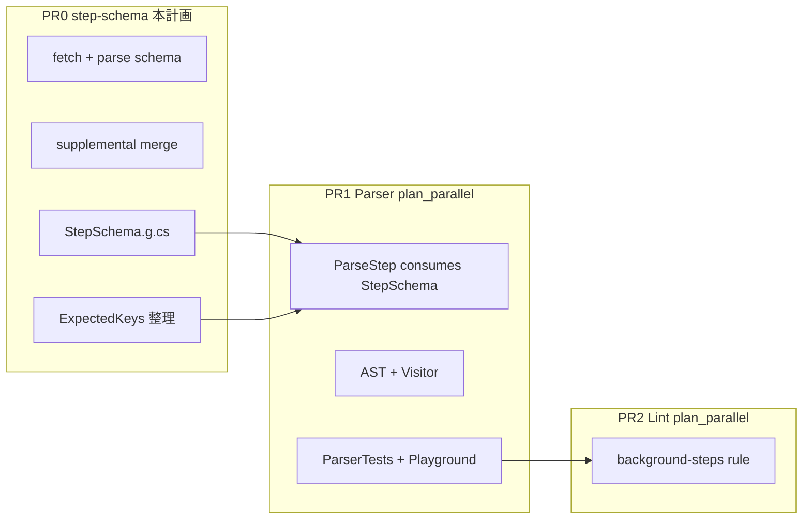

# step-schema データセット — 実装計画

本書は GitHub Actions の **step キーワード**（形態・許可キー・受理値型）を Seiton.Update の独立データセットとして整備する計画。

**後続**: [plan_parallel.md](./plan_parallel.md)（パーサー / lint）は本データセット **マージ後** に着手する。

## 背景

[Actions steps can now be run in parallel](https://github.blog/changelog/2026-06-25-actions-steps-can-now-be-run-in-parallel/)（2026-06-25）で `background` / `wait` / `wait-all` / `cancel` / `parallel` が追加された。parallel は今後の主要機能になりうるため、パーサー・lint が **手書きのキー集合と値型**に依存し続けるのはメンテ負荷が高い。

現状の問題:

| 層 | 問題 |
|----|------|
| `expected-keys` | **キー名のみ**。`action-step` / `run-step` の導出が `step` 全体から行われ、`wait` 等が run/uses 形態に混入 |
| `webhooks` dataset | `github-workflow.schema.json` に `definitions.step` の型・oneOf があるが **パーサー未使用**。webhook イベント更新と step 構文更新が同一パイプラインに束縛 |
| `WorkflowParser` | 形態・値型を **手書き**。新キー追加のたびに複数箇所を直す |

## ゴールと非ゴール

### ゴール

1. **`step-schema` データセット**を `data/sources/step-schema/` に新設（webhooks とは独立した sync/verify）
2. スナップショットに **step 形態・形態別許可キー・プロパティ値型** を格納
3. `StepSchema.g.cs` を生成し、パーサー / lint の **単一ソース**とする
4. `expected-keys` の step 関連定数（`RunStepKeys` 等）を **step-schema から生成**し二重メンテを廃止
5. test-first で extractor・generator・golden snapshot をテスト

### 非ゴール（本 PR）

- `WorkflowParser.Steps.cs` の変更（→ [plan_parallel.md](./plan_parallel.md) PR1）
- lint ルール追加（→ plan_parallel PR2）
- Playground サンプル追加
- webhook イベント型の変更

---

## 規範ソース（Normative sources）

| 優先 | ソース | 役割 |
|:---:|--------|------|
| 1 | [json.schemastore.org/github-workflow.json](https://json.schemastore.org/github-workflow.json) | `definitions.step` — oneOf・properties・dependencies・型 |
| 2 | `data/sources/expected-keys/github/raw/workflow-syntax.md` | prose 制約・Example の cross-check（fetch は既存 expected-keys と同 URL） |
| 3 | `supplemental-step-schema.json` | スキーマに無い Seiton モデル（`background` = 修飾子、`appliesTo` 等） |

webhooks データセットの merge 成果物には **依存しない**。同じ schemastore URL を **別 dataset が独自に fetch** する（manifest・verify が独立）。

---

## Step モデル（スナップショットが表現するもの）

[plan_parallel.md §Step モデル](./plan_parallel.md#step-モデル公式例に基づく--重要) と同一。

### 実行プライマリ（1 step object に 1 つ）

`run` | `uses` | `wait` | `wait-all` | `cancel` | `parallel` — 同一 mapping 内で相互排他。

### 修飾子

`background` — `run` または `uses` 形態でのみ許可（スキーマ properties にあるが oneOf プライマリではない → supplemental で明示）。

### 適用範囲

`workflow-job-steps` と `action-metadata-steps` の **両方**で同一 step スキーマ（`ParseSteps` 共有と一致）。

---

## データパス

```
data/sources/step-schema/github/
  raw/
    github-workflow.schema.json     ← Stage 1 fetch（schemastore）
    workflow-syntax.md              ← Stage 1 fetch（cross-check 用、expected-keys と同 URL）
  parsed/
    step-schema.json                ← Stage 2: schema 抽出結果
  supplemental-step-schema.json     ← 手書き: 修飾子・appliesTo・診断文言
  step-schema.json                  ← Stage 3: マージ済み canonical snapshot
```

`src/Seiton.Core/Generated/StepSchema.g.cs` — `sync-step-schema` で生成。

---

## スナップショット JSON スキーマ（案）

```json
{
  "schemaVersion": 1,
  "source": "github-workflow-schema+supplemental",
  "rawSources": [
    { "fileName": "github-workflow.schema.json", "sha256": "sha256:..." },
    { "fileName": "workflow-syntax.md", "sha256": "sha256:..." }
  ],
  "appliesTo": ["workflow-job-steps", "action-metadata-steps"],
  "sharedKeys": ["id", "if", "name", "env", "continue-on-error", "timeout-minutes"],
  "forms": [
    {
      "id": "run",
      "primaryKey": "run",
      "unexpectedKeyDescription": "step to run shell command",
      "allowedKeys": ["run", "background", "shell", "working-directory", "id", "if", "name", "env", "continue-on-error", "timeout-minutes"],
      "properties": {
        "run": { "valueKind": "string", "expressionContext": "StepRun" },
        "background": { "valueKind": "boolean" },
        "shell": { "valueKind": "string", "expressionContext": "StepShell" },
        "working-directory": { "valueKind": "string", "expressionContext": "StepWorkingDirectory" }
      }
    },
    {
      "id": "uses",
      "primaryKey": "uses",
      "unexpectedKeyDescription": "step to execute action",
      "allowedKeys": ["uses", "with", "background", "..."],
      "properties": { "...": "..." }
    },
    {
      "id": "wait",
      "primaryKey": "wait",
      "unexpectedKeyDescription": "step to wait for background steps",
      "properties": {
        "wait": { "valueKind": "stringOrNonEmptyStringArray" }
      }
    },
    {
      "id": "wait-all",
      "primaryKey": "wait-all",
      "properties": {
        "wait-all": { "valueKind": "nullary", "alsoAccepts": ["booleanTrue", "null"] }
      }
    },
    {
      "id": "cancel",
      "primaryKey": "cancel",
      "properties": {
        "cancel": { "valueKind": "nonEmptyString" }
      }
    },
    {
      "id": "parallel",
      "primaryKey": "parallel",
      "properties": {
        "parallel": { "valueKind": "nonEmptyStepArray", "itemForm": "any" }
      }
    }
  ],
  "modifiers": [
    { "key": "background", "allowedOnFormIds": ["run", "uses"] }
  ],
  "keyDependencies": [
    { "key": "shell", "requiresPrimary": "run" },
    { "key": "working-directory", "requiresPrimary": "run" }
  ]
}
```

### `valueKind` 列挙（生成コードで使用）

| valueKind | パーサーでの意味（PR1 が消費） |
|-----------|-------------------------------|
| `boolean` | `ParseBool` のみ。式不可 |
| `string` | `ParseString`（式検証は `expressionContext` あれば適用） |
| `nonEmptyString` | 空文字不可の string |
| `stringOrNonEmptyStringArray` | scalar string または `minItems: 1` の string 配列 |
| `nullary` | キー存在のみ（値 null / 空 / `true` を受理） |
| `nonEmptyStepArray` | 非空 sequence of step mapping |
| `floatOrExpression` | 既存 `ParseFloatOrExpression` |
| `boolOrExpression` | 既存 `ParseBoolOrExpression` |
| `envMapping` | 既存 `ParseEnvNode` |

`expressionContext` は既存 `ExpressionValidationContext` 名と一致させる（新規キー `background` / `wait` / `cancel` には付けない）。

---

## Seiton.Update パイプライン

[update-pipeline skill](../.claude/skills/update-pipeline/SKILL.md) に従い、以下を追加する。

### CLI コマンド

| コマンド | 用途 |
|----------|------|
| `fetch-step-schema` | Orchestrator |
| `fetch-step-schema-sources` | Stage 1: raw 取得 |
| `parse-step-schema-sources` | Stage 2: schema 抽出 → `parsed/step-schema.json` |
| `merge-step-schema-sources` | Stage 3: supplemental マージ → `step-schema.json` |
| `sync-step-schema` | `StepSchema.g.cs` 生成 |
| `verify-step-schema` | 生成物が最新か CI 確認 |
| `validate-step-schema` | （任意）workflow-syntax Example と snapshot の整合 |

`fetch --dataset all` / `sync --dataset all` / `verify --dataset all` の dataset 一覧に `step-schema` を追加（`expected-keys` の直前が自然）。

### 新規ファイル（想定）

| パス | 役割 |
|------|------|
| `Sources/GitHubStepSchemaFetcher.cs` | HTTP fetch + manifest |
| `Parsers/GitHubWorkflowStepSchemaParser.cs` | `definitions.step` を JSON から抽出 |
| `Parsers/StepSchemaSourceParser.cs` | canonical snapshot の deserialize |
| `Generators/StepSchemaCSharpGenerator.cs` | `StepSchema.g.cs` |
| `Services/StepSchemaSyncService.cs` | sync / IsUpToDate |
| `Services/StepSchemaSourcePathResolver.cs` | パス解決 |
| `Commands/StepSchemaCommands.cs` | CLI 配線 |
| `Model/StepSchemaModel.cs` | スナップショット型 |

### Stage 2: `GitHubWorkflowStepSchemaParser`

`github-workflow.schema.json` から機械抽出する項目:

1. `definitions.step.oneOf[].required` → **form** 一覧（6 プライマリ）
2. `definitions.step.properties` → 各キーの JSON Schema 型 → `valueKind` へマッピング
3. `definitions.step.dependencies` → `keyDependencies`
4. 各 form の `allowedKeys` = `sharedKeys` + 当 form の `primaryKey` + 当 form で許可する properties + modifier で許可されるキー

マッピングルール（schema → valueKind）:

| JSON Schema | valueKind |
|-------------|-----------|
| `type: boolean` | `boolean` |
| `type: string` | `nonEmptyString` または `string`（キーによる） |
| `oneOf: [string, array items string minItems 1]` | `stringOrNonEmptyStringArray` |
| `type: [boolean, null]`（プライマリ `wait-all`） | `nullary` |
| `type: array`, `items: $ref step`, `minItems: 1` | `nonEmptyStepArray` |
| `oneOf: [number, expressionSyntax]` | `floatOrExpression` |
| `oneOf: [boolean, expressionSyntax]` | `boolOrExpression` |
| `$ref: env` | `envMapping` |

### Stage 3: supplemental

`supplemental-step-schema.json` で上書き・追加:

```json
{
  "modifiers": [
    { "key": "background", "allowedOnFormIds": ["run", "uses"] }
  ],
  "forms": [
    {
      "id": "run",
      "allowedKeysExclude": ["wait", "wait-all", "cancel", "parallel"]
    }
  ]
}
```

`background` を `run`/`uses` の `allowedKeys` に含め、他 form から除外するロジックは **merge ステージ**で確定する（手書き一覧の重複を避ける）。

### 生成物 `StepSchema.g.cs`

パーサー hot path 向けに **const / static readonly** で出力:

| 生成内容 | 用途 |
|----------|------|
| `StepFormId` enum または `byte` 定数 | 形態識別 |
| `RunStepKeys`, `WaitStepKeys`, … const string | unexpected-key 診断（現 `ExpectedKeys` の step 系を置換） |
| `StepFormUnexpectedKeyDescription(formId)` | D11 診断文言 |
| `StepPropertyValueKinds` | キー ordinal → valueKind（PR1 の parse 分岐） |
| `IsModifierAllowed(formId, keyUtf8)` | `background` 修飾子チェック |

**性能**: 生成コードは既存 `ExpectedKeys` と同様、診断 path 以外では UTF-8 span 比較・整数 enum のみ。ルックアップテーブルは compile-time const。

### expected-keys との統合

| 項目 | 方針 |
|------|------|
| `StepKeys`（全 step キー和集合） | 残す（workflow 全体の `step` セクション用） |
| `RunStepKeys`, `ActionStepKeys`, `WaitStepKeys`, … | **削除** → `StepSchema.g.cs` に移行 |
| `ExpectedKeysCSharpGenerator` | step 形態系定数を生成しないよう変更 |
| `WorkflowSyntaxExpectedKeysParser` | `action-step` / `run-step` の誤導出ロジックを **削除** |

パーサーは PR1 で `ExpectedKeys.RunStepKeys` → `StepSchema.RunStepKeys` に切替。

---

## テスト計画（test-first）

プロジェクト: `tests/Seiton.Update.Tests`

### Red → Green の順

1. **`GitHubWorkflowStepSchemaParserTests`**
   - committed `github-workflow.schema.json` から 6 form が抽出される
   - `background` property の valueKind = `boolean`
   - `wait` の valueKind = `stringOrNonEmptyStringArray`
   - `parallel` の valueKind = `nonEmptyStepArray`
   - `dependencies.shell` → `requiresPrimary: run`

2. **`StepSchemaMergeTests`**
   - supplemental 適用後、`background` が `run`/`uses` のみに現れる
   - `wait` form に `run` が含まれない

3. **`StepSchemaCSharpGeneratorTests`**
   - 生成 C# がコンパイル可能
   - `WaitStepKeys` に `wait` を含み `run` を含まない

4. **`StepSchemaGoldenTests`**（任意）
   - `step-schema.json` のハッシュ / 主要フィールド固定

```shell
dotnet test --project tests/Seiton.Update.Tests --treenode-filter /*/*/GitHubWorkflowStepSchemaParserTests/*
dotnet test --project tests/Seiton.Update.Tests --treenode-filter /*/*/StepSchema*
```

### validate ステージ（任意・推奨）

`validate-step-schema`: `workflow-syntax.md` 内の parallel 関連 Example YAML が、抽出された form/property と矛盾しないことを静的に確認（Example ブロックの簡易パース）。

---

## 仕様書更新（本 PR 完了条件）

| ファイル | 内容 |
|----------|------|
| `.github/docs/Seiton_Update_spec.md` | §4.3.x `step-schema` データセット節、コマンドマトリクス行 |
| `.github/docs/Seiton_Parser_spec.md` | §3.12 の前に「step-schema を規範とする」旨を 1 段落（詳細 shape は PR1） |

---

## 実装チェックリスト

- [ ] `data/sources/step-schema/` ディレクトリ・初期 supplemental
- [ ] `GitHubStepSchemaFetcher` + manifest エントリ
- [ ] `GitHubWorkflowStepSchemaParser` + テスト（Red → Green）
- [ ] merge + `step-schema.json` canonical
- [ ] `StepSchemaCSharpGenerator` + `StepSchema.g.cs`
- [ ] `ExpectedKeys` から step 形態定数を分離
- [ ] `Program.cs` / `fetch|sync|verify --dataset all` 配線
- [ ] `Seiton.Update_spec.md` 更新
- [ ] `dotnet test`（Seiton.Update.Tests）+ `verify-step-schema`

---

## 完了の定義

1. `dotnet run --project src/Seiton.Update -- verify-step-schema` が成功
2. `StepSchema.g.cs` がコミット済み
3. `ExpectedKeys.g.cs` から step 形態重複が除去されている
4. **パーサー挙動は未変更**（既存テストが壊れない。生成物は未参照でも可）

---

## 後続 PR との関係



---

## リスクと緩和

| リスク | 緩和 |
|--------|------|
| schemastore が GitHub docs より遅れる | supplemental で先行キーを載せ、次回 fetch で schema に追従 |
| JSON Schema oneOf が修飾子を表現しない | supplemental `modifiers` で明示（恒久） |
| 生成コード肥大化 | form 数は 6 + shared で有界。hot path は const string のみ |
| webhooks と raw 重複 fetch | 同一 URL でも dataset 独立。帯域は許容。将来 shared raw cache は別改善 |

---

## 関連ドキュメント

- [plan_parallel.md](./plan_parallel.md) — パーサー（PR1）・lint（PR2）
- [Seiton_Update_spec.md](./Seiton_Update_spec.md) — パイプライン一般
- [workflow-syntax.md](../data/sources/expected-keys/github/raw/workflow-syntax.md) — prose・Example
- [github-workflow.schema.json](../data/sources/webhooks/github/raw/github-workflow.schema.json) — 抽出元（本 dataset は独自 raw コピーを持つ）
