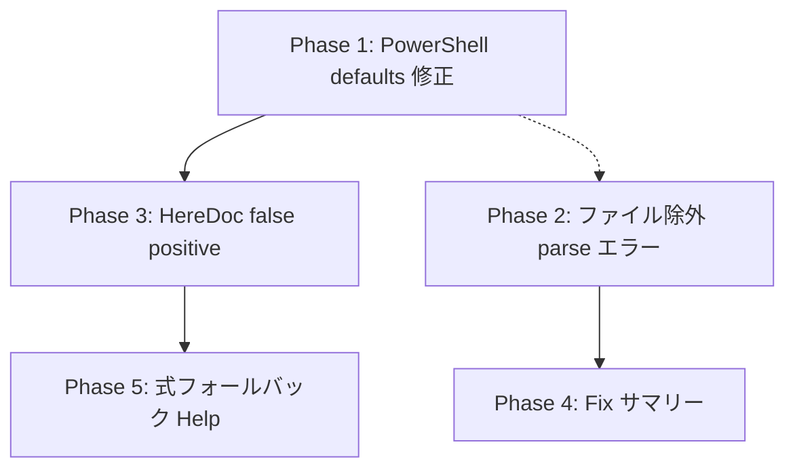

# 修正プラン: githubactions-lab フィードバック対応

> 対象フィードバック: `.github/docs/githubactions-lab_feedback_seiton.md`
> 検証リポジトリ: `.references/githubactions-lab` (master と同期済み)

---

## Phase 1: [Critical] PowerShell defaults.run.shell 解決の修正 ✅ 完了

### 問題

`defaults.run.shell: pwsh` を指定したジョブ内のステップで `run-env-context-direct-use` の auto-fix が bash スタイル `${VAR}` を出力する。正しくは `$env:VAR` であるべき。

**根本原因**: `RunContextDirectUseAnalyzer.IsPowerShell(AstArena, Step, byte[])` が `run.Shell` (ステップレベル) のみを確認し、`job.Defaults?.Run.Shell` や `workflow.Defaults?.Run.Shell` を参照していない。

**影響範囲**:
- `RunEnvContextDirectUseRule` — `TryBuildFix` 内で `IsPowerShell(Arena, run.Shell, ...)` を呼んでいる
- `RunInputsContextDirectUseRule` — `IsPowerShell(Arena, step, ...)` を呼んでいる
- `RunSecretsContextDirectUseRule` — `IsPowerShell(Arena, step, ...)` を呼んでいる
- `TemplateInjectionRule` — `IsPowerShell(Arena, step, ...)` を呼んでいる

### 実装内容

1. `RunContextDirectUseAnalyzer` に `IsPowerShellWithDefaults(arena, step, job?, workflow?, utf8Yaml)` メソッドを追加
   - 解決順序: step.Shell → job.Defaults.Run.Shell → workflow.Defaults.Run.Shell
   - 各レベルで expression (動的値) をスキップする安全性チェック付き
2. `RunEnvContextDirectUseRule` に `_currentWorkflow` / `_currentJob` フィールドを追加し、`VisitWorkflowPre`/`VisitJobPre` で追跡
3. 全4ルール (`RunEnv`, `RunInputs`, `RunSecrets`, `TemplateInjection`) で `IsPowerShell` → `IsPowerShellWithDefaults` に更新

### テスト結果

- `LintEngine_RunEnvContextDirectUse_Fix_UsesJobDefaultsShellForPowerShell` ✅
- `LintEngine_RunEnvContextDirectUse_Fix_UsesWorkflowDefaultsShellForPowerShell` ✅
- `LintEngine_RunEnvContextDirectUse_Fix_StepShellOverridesJobDefaults` ✅
- 全 1748 Core テスト合格、リグレッションなし

### ベンチマーク結果

```
CoreLintBenchmark (BenchmarkDotNet v0.15.8, .NET 10.0.3)
| Size   | FixEnabled | Mean        | Allocated | Ratio | Alloc Ratio |
|--------|------------|-------------|-----------|-------|-------------|
| Small  | False      | 188.8 μs   | 8.7 KB    | 1.01  | 1.00        |
| Small  | True       | 300.0 μs   | 10.15 KB  | 1.00  | 1.00        |
| Medium | False      | 3,409.2 μs | 69.17 KB  | 1.01  | 1.00        |
| Medium | True       | 5,587.6 μs | 82.8 KB   | 1.00  | 1.00        |
| Large  | False      | 63,857 μs  | 353.22 KB | 1.00  | 1.00        |
| Large  | True       | 95,371 μs  | 440.47 KB | 1.00  | 1.00        |
```

**性能影響: なし** (Ratio=1.00, AllocRatio=1.00)
- `IsPowerShellWithDefaults` は fix パスでのみ呼ばれ、追加コストは null チェック 2 回 + HasValue チェック 2 回のみ
- 新規メモリ割り当てなし

---

## Phase 2: [High] ファイル除外が parse エラーに適用されない問題 ✅

### 問題

`exclusions: - file: ...` でファイル全体を除外しても、そのファイルの `parse` エラー (RuleId = null) が出力される。

**根本原因**: `LintEngine.cs` でパーサー診断は `_diagnostics` に無条件で追加される (L272付近)。除外フィルタリング (`TryGetConfigSuppressionRecord`) は `_ruleDiagnostics` のみに適用され、かつ `RuleId is null` のとき即 false を返す。

### 修正方針

**Option A** (推奨・採用): ファイルレベル除外 (rules 指定なし) のとき、`CheckCore` 冒頭で早期リターンし空の LintResult を返す。
- メリット: パース診断の収集もルール実行も完全にスキップ。パフォーマンス劣化なし。
- 実装箇所: `LintEngine.CheckCore` 冒頭に `IsFileFullyExcluded` チェック追加

### 実装結果

**変更ファイル**:
- `src/Seiton.Core/Linting/LintEngine.cs`: `IsFileFullyExcluded` static メソッド追加 + `CheckCore` 冒頭で早期リターン
- `tests/Seiton.Core.Tests/RuleInterfaceTests.LintEngine.cs`: 4 テスト追加 + 1 テスト更新

**追加テスト** (すべて GREEN):
1. `FileLevelExclusion_SuppressesParseErrors` — ファイルレベル除外がパースエラーを抑制
2. `RuleSpecificExclusion_DoesNotSuppressParseErrors` — ルール指定除外はパースエラーを抑制しない
3. `FileLevelWithJobs_DoesNotSuppressParseErrors` — ジョブスコープ付き除外はパースエラーを抑制しない
4. `FileLevelExclusion_NonMatchingFile_DoesNotSuppressParseErrors` — パターン不一致時は抑制しない

**既存テスト更新**:
- `NullRules_SuppressesAllDiagnostics`: 早期リターンにより `SuppressionSummary` が空になるため、アサーション更新

**ベンチマーク** (CoreLintBenchmark):

| Size | FixEnabled | Ratio | AllocRatio |
|------|-----------|-------|------------|
| Small | False | 1.01 | 1.00 |
| Small | True | 1.00 | 1.00 |
| Medium | False | 1.01 | 1.00 |
| Medium | True | 1.00 | 1.00 |
| Large | False | 1.00 | 1.00 |
| Large | True | 1.00 | 1.00 |

**動作確認**:
```shell
dotnet run --project src/Seiton -- --oneline -c seiton.yaml .references/githubactions-lab/.github/workflows/monthly-oss-repo-status.lock.yml
# 出力: 0 issues in 1 file ✅
```

---

## Phase 3: [High] ヒアドキュメント内の false positive 抑制

### 問題

`<< 'EOF'` (シングルクォート) ヒアドキュメント内で `${{ env.* }}` が検出されるが、この文脈ではシェル変数は展開されないため `${{ env.* }}` が唯一の値挿入手段。Fix は既に抑制されているが、**検出自体** が false positive。

**影響ファイル**:
- `.references/githubactions-lab/.github/workflows/crlf-checker.yaml`
- `.references/githubactions-lab/.github/workflows/dotnet-lint.yaml`

### 修正方針

`RunEnvContextDirectUseRule.CheckRunNode` で、`IsInsideNoExpandHereDoc` が true の場合は診断自体をスキップする (AddStepError を呼ばない)。

同じロジックを以下にも適用:
- `RunInputsContextDirectUseRule`
- `RunSecretsContextDirectUseRule`

### テスト計画

- **Red テスト**: `<< 'EOF'` ヒアドキュメント内の `${{ env.* }}` で診断が出ないことを検証
- **Red テスト**: `<< EOF` (クォートなし) ヒアドキュメント内では通常通り検出されることを検証
- 既存テスト `DoesNotAttachFix_InsideSingleQuotedHereDoc` を修正: fix が null ではなく、diagnostic 自体が出ないことに変更

### 検証手順

```shell
# 1. テスト先行 (Red)
dotnet test --filter "HereDoc"

# 2. 実装後 (Green)
dotnet test --filter "HereDoc"

# 3. .references/githubactions-lab で動作確認
dotnet run --project src/Seiton -- --oneline .references/githubactions-lab/.github/workflows/crlf-checker.yaml
# 出力: 0 issues in 1 file

dotnet run --project src/Seiton -- --oneline .references/githubactions-lab/.github/workflows/dotnet-lint.yaml
# 出力: 0 issues in 1 file

# 4. リグレッション確認
dotnet test

# 5. ベンチマーク確認
cd src/Seiton.Benchmark
dotnet run -c Release
```

---

## Phase 4: [Medium] --fix 適用時の修正サマリー表示

### 問題

`--fix` 実行後、修正されたファイル一覧や修正件数が表示されない。ユーザーは何が変わったか把握できない。

### 修正方針

`CheckCommand` (または `FixEngine` 呼び出し後) で、修正が適用された**ファイルごとの詳細**と合計サマリーを表示する。

出力例:
```
  .github/workflows/setenv-script.yaml: fixed 4, remaining 0
  .github/workflows/crlf-checker.yaml: fixed 1, remaining 2
Fixed 5 issues in 2 files (2 remaining)
```

表示要件:
- 修正されたファイルパス (入力パスからの相対パス表示)
- ファイルごとの修正数 (`fixed N`)
- ファイルごとの未修正残数 (`remaining M`) — fix が適用されなかった diagnostic 数
- 全体サマリー行: 合計修正数、対象ファイル数、全体の残存 issue 数
- 修正なし (0 fixes) の場合はファイル詳細を出さず、通常の diagnostic 出力のみ

### テスト計画

- **Red テスト**: `--fix` モードで修正が適用された場合、ファイルパスと修正数/残数が標準出力に含まれることを検証
- **Red テスト**: 複数ファイルで修正が適用された場合、各ファイルが個別に表示されることを検証
- **Red テスト**: 修正なし (0 fixes) の場合はサマリー行が出ないことを検証

### 検証手順

```shell
# 1. テスト先行 (Red)
dotnet test --filter "FixSummary"

# 2. 実装後 (Green)
dotnet test --filter "FixSummary"

# 3. .references/githubactions-lab で動作確認
git -C .references/githubactions-lab checkout -- .
dotnet run --project src/Seiton -- --fix .references/githubactions-lab/.github/workflows/setenv-script.yaml
# ファイルパス、修正数、残数が表示されること

dotnet run --project src/Seiton -- --fix .references/githubactions-lab/.github/workflows/
# 複数ファイルのサマリーが表示されること

# 4. リグレッション確認
dotnet test

# 5. ベンチマーク確認
cd src/Seiton.Benchmark
dotnet run -c Release
```

---

## Phase 5: [Low] 式フォールバックのヘルプメッセージ改善

### 問題

`${{ env.TAG_VALUE || ... }}` のような複合式が検出されるが、fix は付与されない。ユーザーは検出の理由と推奨パターンが不明瞭。

### 修正方針

fix が付与されないケース (TryParseSimpleContextReference が false) で、diagnostic の `Help` フィールドに以下のようなヒントを付与:

> "consider moving the entire expression to an env: block and referencing the shell variable instead"

検出自体は正当 (env に式ごと移動する解決策がある) なので、false positive としてスキップはしない。

### テスト計画

- **Red テスト**: 複合式の env 参照で diagnostic の Help フィールドにヒントが含まれることを検証

### 検証手順

```shell
# 1. テスト先行 (Red)
dotnet test --filter "RunEnvContextDirectUse"

# 2. 実装後 (Green)
dotnet test --filter "RunEnvContextDirectUse"

# 3. .references/githubactions-lab で動作確認
dotnet run --project src/Seiton -- .references/githubactions-lab/.github/workflows/create-release.yaml
# Help メッセージが表示されること

# 4. リグレッション確認
dotnet test

# 5. ベンチマーク確認
cd src/Seiton.Benchmark
dotnet run -c Release
```

---

## 対応しないもの

| フィードバック項目 | 理由 |
|---|---|
| Bug #5: zizmor 互換のインライン抑制 | seiton は独自の `# seiton: disable-next-line` を既にサポートしている。他ツール形式への互換は scope 外 |
| Bug #6 (indent): インデント崩れ | 現バージョンで再現不可。過去バージョンで修正済みと推定 |

---

## 実行順序と依存関係



- Phase 1 と Phase 2 は独立して着手可能
- Phase 3 は Phase 1 と同じファイル (`RunContextDirectUseAnalyzer`) を変更するため、Phase 1 完了後が望ましい
- Phase 4, 5 は他と独立

---

## ベンチマーク基準値

修正前に取得し、各 Phase 完了後に比較する。

```shell
cd src/Seiton.Benchmark
dotnet run -c Release
```

判定基準:
- Mean: ±5% 以内
- Allocated: 増加なし (0 byte 増)
