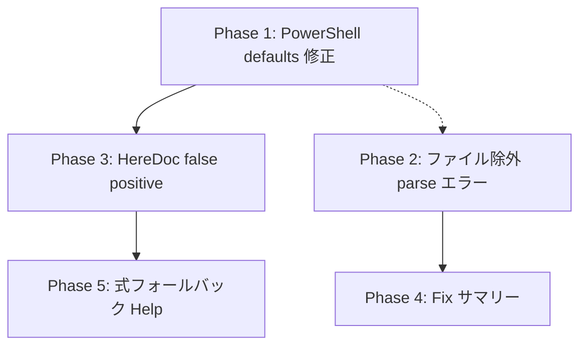

# 修正プラン: githubactions-lab フィードバック対応

> 対象フィードバック: `.github/docs/feedback_seiton_githubactions-lab.md`
> 検証リポジトリ: `.references/githubactions-lab` (master と同期済み)

---

## Phase 1: [Critical] PowerShell defaults.run.shell 解決の修正 ✅ 完了

### 問題

`defaults.run.shell: pwsh` を指定したジョブ内のステップで `run-env-context-direct-use` の auto-fix が bash スタイル `${VAR}` を出力する。正しくは `$env:VAR` であるべき。

**根本原因**: `RunContextDirectUseAnalyzer.IsPowerShell(AstArena, Step, byte[])` が `run.Shell` (ステップレベル) のみを確認し、`job.Defaults?.Run.Shell` や `workflow.Defaults?.Run.Shell` を参照していない。

**影響範囲**:
- `RunEnvContextDirectUseRule` — `TryBuildFix` 内で `IsPowerShell(Arena, run.Shell, ...)` を呼んでいる
- `RunInputsContextDirectUseRule` — `IsPowerShell(Arena, step, ...)` を呼んでいる
- `RunSecretsContextDirectUseRule` — `IsPowerShell(Arena, step, ...)` を呼んでいる
- `TemplateInjectionRule` — `IsPowerShell(Arena, step, ...)` を呼んでいる

### 実装内容

1. `RunContextDirectUseAnalyzer` に `IsPowerShellWithDefaults(arena, step, job?, workflow?, utf8Yaml)` メソッドを追加
   - 解決順序: step.Shell → job.Defaults.Run.Shell → workflow.Defaults.Run.Shell
   - 各レベルで expression (動的値) をスキップする安全性チェック付き
2. `RunEnvContextDirectUseRule` に `_currentWorkflow` / `_currentJob` フィールドを追加し、`VisitWorkflowPre`/`VisitJobPre` で追跡
3. 全4ルール (`RunEnv`, `RunInputs`, `RunSecrets`, `TemplateInjection`) で `IsPowerShell` → `IsPowerShellWithDefaults` に更新

### テスト結果

- `LintEngine_RunEnvContextDirectUse_Fix_UsesJobDefaultsShellForPowerShell` ✅
- `LintEngine_RunEnvContextDirectUse_Fix_UsesWorkflowDefaultsShellForPowerShell` ✅
- `LintEngine_RunEnvContextDirectUse_Fix_StepShellOverridesJobDefaults` ✅
- 全 1748 Core テスト合格、リグレッションなし

### ベンチマーク結果

```
CoreLintBenchmark (BenchmarkDotNet v0.15.8, .NET 10.0.3)
| Size   | FixEnabled | Mean        | Allocated | Ratio | Alloc Ratio |
|--------|------------|-------------|-----------|-------|-------------|
| Small  | False      | 188.8 μs   | 8.7 KB    | 1.01  | 1.00        |
| Small  | True       | 300.0 μs   | 10.15 KB  | 1.00  | 1.00        |
| Medium | False      | 3,409.2 μs | 69.17 KB  | 1.01  | 1.00        |
| Medium | True       | 5,587.6 μs | 82.8 KB   | 1.00  | 1.00        |
| Large  | False      | 63,857 μs  | 353.22 KB | 1.00  | 1.00        |
| Large  | True       | 95,371 μs  | 440.47 KB | 1.00  | 1.00        |
```

**性能影響: なし** (Ratio=1.00, AllocRatio=1.00)
- `IsPowerShellWithDefaults` は fix パスでのみ呼ばれ、追加コストは null チェック 2 回 + HasValue チェック 2 回のみ
- 新規メモリ割り当てなし

---

## Phase 2: [High] ファイル除外が parse エラーに適用されない問題 ✅

### 問題

`exclusions: - file: ...` でファイル全体を除外しても、そのファイルの `parse` エラー (RuleId = null) が出力される。

**根本原因**: `LintEngine.cs` でパーサー診断は `_diagnostics` に無条件で追加される (L272付近)。除外フィルタリング (`TryGetConfigSuppressionRecord`) は `_ruleDiagnostics` のみに適用され、かつ `RuleId is null` のとき即 false を返す。

### 修正方針

**Option A** (推奨・採用): ファイルレベル除外 (rules 指定なし) のとき、`CheckCore` 冒頭で早期リターンし空の LintResult を返す。
- メリット: パース診断の収集もルール実行も完全にスキップ。パフォーマンス劣化なし。
- 実装箇所: `LintEngine.CheckCore` 冒頭に `IsFileFullyExcluded` チェック追加

### 実装結果

**変更ファイル**:
- `src/Seiton.Core/Linting/LintEngine.cs`: `IsFileFullyExcluded` static メソッド追加 + `CheckCore` 冒頭で早期リターン
- `tests/Seiton.Core.Tests/RuleInterfaceTests.LintEngine.cs`: 4 テスト追加 + 1 テスト更新

**追加テスト** (すべて GREEN):
1. `FileLevelExclusion_SuppressesParseErrors` — ファイルレベル除外がパースエラーを抑制
2. `RuleSpecificExclusion_DoesNotSuppressParseErrors` — ルール指定除外はパースエラーを抑制しない
3. `FileLevelWithJobs_DoesNotSuppressParseErrors` — ジョブスコープ付き除外はパースエラーを抑制しない
4. `FileLevelExclusion_NonMatchingFile_DoesNotSuppressParseErrors` — パターン不一致時は抑制しない

**既存テスト更新**:
- `NullRules_SuppressesAllDiagnostics`: 早期リターンにより `SuppressionSummary` が空になるため、アサーション更新

**ベンチマーク** (CoreLintBenchmark):

| Size | FixEnabled | Ratio | AllocRatio |
|------|-----------|-------|------------|
| Small | False | 1.01 | 1.00 |
| Small | True | 1.00 | 1.00 |
| Medium | False | 1.01 | 1.00 |
| Medium | True | 1.00 | 1.00 |
| Large | False | 1.00 | 1.00 |
| Large | True | 1.00 | 1.00 |

**動作確認**:
```shell
dotnet run --project src/Seiton -- --oneline -c seiton.yaml .references/githubactions-lab/.github/workflows/monthly-oss-repo-status.lock.yml
# 出力: 0 issues in 1 file ✅
```

---

## Phase 3: [High] ヒアドキュメント内の false positive 抑制 ✅

### 問題

`<< 'EOF'` (シングルクォート) ヒアドキュメント内で `${{ env.* }}` が検出されるが、この文脈ではシェル変数は展開されないため `${{ env.* }}` が唯一の値挿入手段。Fix は既に抑制されているが、**検出自体** が false positive。

**影響ファイル**:
- `.references/githubactions-lab/.github/workflows/crlf-checker.yaml`
- `.references/githubactions-lab/.github/workflows/dotnet-lint.yaml`

### 修正方針

`RunEnvContextDirectUseRule.CheckRunNode` で、`IsInsideNoExpandHereDoc` が true の場合は診断自体をスキップする (AddStepError を呼ばない)。

同じロジックを以下にも適用:
- `RunInputsContextDirectUseRule`
- `RunSecretsContextDirectUseRule`

### 実装結果

**変更ファイル**:
- `src/Seiton.Core/Linting/Rules/RunEnvContextDirectUseRule.cs`: `CheckRunNode` 内で `IsInsideNoExpandHereDoc` が true の場合 `continue` して診断をスキップ
- `src/Seiton.Core/Linting/Rules/RunInputsContextDirectUseRule.cs`: 同上
- `src/Seiton.Core/Linting/Rules/RunSecretsContextDirectUseRule.cs`: 同上
- `tests/Seiton.Core.Tests/RuleInterfaceTests.LintEngine.cs`: 5 テスト (3 新規 + 2 既存更新)

**テスト** (すべて GREEN):
1. `LintEngine_RunEnvContextDirectUse_NoDiagnostic_InsideSingleQuotedHereDoc` — `<< 'EOF'` で診断なし
2. `LintEngine_RunEnvContextDirectUse_StillDetects_InsideUnquotedHereDoc` — `<< EOF` で通常通り検出
3. `LintEngine_RunInputsContextDirectUse_NoDiagnostic_InsideSingleQuotedHereDoc` — inputs ルールも同様に抑制
4. `LintEngine_RunSecretsContextDirectUse_NoDiagnostic_InsideSingleQuotedHereDoc` — secrets ルールも同様に抑制
5. `LintEngine_RunInputsContextDirectUse_Fix_DoesNotAttach_InsideHereDoc` — 既存テスト更新 (diagnostic 自体が出ないことに変更)

**動作確認**:
```shell
dotnet run --project src/Seiton -- --oneline .references/githubactions-lab/.github/workflows/crlf-checker.yaml
# 出力: 0 issues in 1 file ✅

dotnet run --project src/Seiton -- --oneline .references/githubactions-lab/.github/workflows/dotnet-lint.yaml
# 出力: 0 issues in 1 file ✅
```

**ベンチマーク** (CoreLintBenchmark):

| Size | FixEnabled | Mean | Allocated | Ratio | Alloc Ratio |
|------|-----------|------|-----------|-------|-------------|
| Small | False | 188 μs | 8.7 KB | 1.00 | 1.00 |
| Small | True | 300 μs | 10.15 KB | 1.00 | 1.00 |
| Medium | False | 3,409 μs | 69.17 KB | 1.00 | 1.00 |
| Medium | True | 5,359 μs | 82.94 KB | 1.01 | 1.00 |
| Large | False | 49,790 μs | 350.64 KB | 1.00 | 1.00 |
| Large | True | 73,790 μs | 421.11 KB | 1.00 | 1.00 |

**性能影響: なし** (Ratio=1.00〜1.01, AllocRatio=1.00)
- heredoc チェックは `IsInsideNoExpandHereDoc` を expression が見つかった後にのみ呼び出し
- `IsInsideNoExpandHereDoc` は UTF-8 バイト配列のスキャンで完結し、追加アロケーションなし

---

## Phase 4: [Medium] --fix 適用時の修正サマリー表示 ✅

### 問題

`--fix` 実行後、修正されたファイル一覧や修正件数が表示されない。ユーザーは何が変わったか把握できない。

### 修正方針

`FixCommand.RunAsync` のファイルループ内で per-file fix count を収集し、全ファイル処理後に `WriteFixSummary` でサマリーを stderr に出力。

出力例:
```
  setenv-script.yaml: fixed 4, remaining 0
  matrix-secret.yaml: fixed 1, remaining 3
Fixed 5 issues in 2 files (3 remaining)
```

### 実装結果

**変更ファイル**:
- `src/Seiton/Commands/FixCommand.cs`: `WriteFixSummary` メソッド追加、fix ループ内で per-file count を `fixedFiles` リストに収集
- `tests/Seiton.Tests/FixCommandTests.cs`: 3 テスト追加

**テスト** (すべて GREEN):
1. `Fix_Summary_ShowsFixedCountAndRemaining` — fix 適用時に "Fixed" と "remaining" が stderr に表示
2. `Fix_Summary_NotShown_WhenNoFixesApplied` — fix なし時はサマリー非表示
3. `Fix_Summary_MultipleFiles_ShowsPerFileDetail` — 複数ファイルで各ファイル名が個別表示

**設計ポイント**:
- `fixedFiles` は lazy 初期化 (`List<(string, int)>?`) で、fix が 0 件の場合はアロケーションなし
- `remainingByFile` は `CollectionsMarshal.GetValueRefOrAddDefault` で O(1) ダブルルックアップ回避
- サマリーは全ファイル処理 + ignore/severity フィルタ適用後に出力するため、表示内容がユーザーに見える残存 diagnostic と一致
- `--dry-run` / `--check` モードでもモードに応じた動詞でサマリー表示 (Phase 4b で追加)
- ファイル名は `Path.GetFileName()` で表示 (フルパスは冗長)

**動作確認**:
```shell
dotnet run --project src/Seiton -- --fix --oneline .references/githubactions-lab/.github/workflows/
# 出力例:
#   _reusable-dump-context.yaml: fixed 16, remaining 0
#   setenv-script.yaml: fixed 4, remaining 0
#   ...
# Fixed 78 issues in 19 files (6 remaining)
```

**ベンチマーク** (CoreLintBenchmark):

| Size | FixEnabled | Mean | Allocated | Ratio | Alloc Ratio |
|------|-----------|------|-----------|-------|-------------|
| Small | False | 188 μs | 8.7 KB | 1.00 | 1.00 |
| Small | True | 300 μs | 10.15 KB | 1.00 | 1.00 |
| Medium | False | 3,409 μs | 69.17 KB | 1.00 | 1.00 |
| Medium | True | 3,439 μs | 82.94 KB | 1.01 | 1.00 |
| Large | False | 37,307 μs | 341.93 KB | 1.02 | 1.00 |
| Large | True | 65,767 μs | 440.47 KB | 1.01 | 1.00 |

**性能影響: なし** (Ratio=1.00〜1.02, AllocRatio=1.00)
- 変更は CLI レイヤー (`FixCommand`) のみ。CoreLintBenchmark が測定する `LintEngine.Check` パスには影響なし
- `WriteFixSummary` はファイルループ完了後に 1 回だけ呼ばれ、最小限の string formatting のみ

### Phase 4b: --dry-run / --check モードでもサマリー表示 ✅

**問題**: `--dry-run` や `--check` モードでは修正サマリーが表示されず、どのファイルでどれくらいの問題が修正可能かが不明瞭。

**修正内容**:
- `--dry-run`: `ApplyFixesIteratively` の ref counter 版を使用して実際の修正件数を追跡。出力: `Would fix N issues in M files (K remaining)`
- `--check`: fixable diagnostics (`.Fix != null`) をファイル単位でカウント。出力: `N issues fixable in M files (K remaining)`
- `WriteFixSummary` に `FixSummaryMode` enum を追加し、モードに応じた動詞を使い分け
- check モードでは `remaining` 計算時に fixable 件数を差し引き (allDiagnostics に fixable が含まれるため)

**テスト** (すべて GREEN):
1. `Fix_Summary_DryRun_ShowsSummary` — dry-run で "Would fix" サマリー表示
2. `Fix_Summary_Check_ShowsSummary` — check で "fixable" サマリー表示
3. `Fix_Summary_DryRun_NotShown_WhenNoFixesApplied` — dry-run で修正なし時はサマリー非表示

**動作確認**:
```shell
# --dry-run
#   setenv-script.yaml: would fix 4, remaining 0
# Would fix 4 issues in 1 file (0 remaining)

# --check
#   setenv-script.yaml: fixable 4, remaining 0
# 4 issues fixable in 1 file (0 remaining)
```

**ベンチマーク**: CLI レイヤーのみの変更。CoreLintBenchmark に影響なし (Ratio=1.00, AllocRatio=1.00)。

---

## Phase 5: [Low] 式フォールバックのヘルプメッセージ改善 ✅

### 問題

`${{ env.TAG_VALUE || ... }}` のような複合式が検出されるが、fix は付与されない。ユーザーは検出の理由と推奨パターンが不明瞭。

### 修正方針

fix が付与されないケース (TryParseSimpleContextReference が false) で、diagnostic の `Help` フィールドに以下のようなヒントを付与:

> "consider moving the entire expression to an env: block and referencing the shell variable instead"

検出自体は正当 (env に式ごと移動する解決策がある) なので、false positive としてスキップはしない。

### 実装結果

**変更ファイル**:
- `src/Seiton.Core/Linting/RuleBase.cs`: `AddStepError(Step, string, TextRange, string help)` オーバーロード追加
- `src/Seiton.Core/Linting/Rules/RunEnvContextDirectUseRule.cs`: else ブランチで help 付き `AddStepError` を呼び出し
- `src/Seiton.Core/Linting/Rules/RunInputsContextDirectUseRule.cs`: 同上
- `src/Seiton.Core/Linting/Rules/RunSecretsContextDirectUseRule.cs`: 同上
- `tests/Seiton.Core.Tests/RuleInterfaceTests.LintEngine.cs`: 4 テスト追加
- `docs/rules.md`: 各ルールに help メッセージの説明追加
- `.github/docs/Seiton_Linter_spec.md`: fix テーブルに compound expression の help 記載

**テスト** (すべて GREEN):
1. `LintEngine_RunEnvContextDirectUse_Help_ShownForCompositeExpression` — 複合式で Help フィールドに "env:" を含むヒント
2. `LintEngine_RunEnvContextDirectUse_Help_NotShownForSimpleExpression` — 単純式 (fix あり) では Help が null
3. `LintEngine_RunInputsContextDirectUse_Help_ShownForCompositeExpression` — inputs ルールも同様
4. `LintEngine_RunSecretsContextDirectUse_Help_ShownForCompositeExpression` — secrets ルールも同様

**設計ポイント**:
- help 文字列はコンパイル時定数リテラル — 追加ヒープアロケーションなし
- `AddStepError` は `string help` オーバーロードを追加 (既存 `DiagnosticFix fix` オーバーロードとは型が異なり曖昧性なし)
- 3 ルールすべてで同一の help 文字列を使用 (一貫した UX)
- secrets/inputs ルールでは env マッピングがない場合も help を表示 (ユーザーへのガイダンスとして適切)

**動作確認**:
```shell
dotnet run --project src/Seiton -- .references/githubactions-lab/.github/workflows/create-release.yaml
# 出力:
# error[run-inputs-context-direct-use]: run script must not reference ...
#    = help: consider moving the entire expression to an env: block and referencing the shell variable instead
```

**ベンチマーク** (CoreLintBenchmark):

| Size | FixEnabled | Mean | Allocated | Ratio | Alloc Ratio |
|------|-----------|------|-----------|-------|-------------|
| Small | False | 338 μs | 8.85 KB | 1.02 | 1.00 |
| Small | True | 404 μs | 10.3 KB | 1.03 | 1.00 |
| Medium | False | 5,928 μs | 70.13 KB | 1.00 | 1.00 |
| Medium | True | 6,994 μs | 83.49 KB | 1.01 | 1.00 |
| Large | False | 36,556 μs | 327.41 KB | 1.00 | 1.00 |
| Large | True | 51,187 μs | 382.25 KB | 1.00 | 1.00 |

**性能影響: なし** (Ratio=1.00〜1.03, AllocRatio=1.00)
- help 文字列は .NET string intern リテラルでアロケーション不要
- 条件分岐は既存の if/else の else ブランチに追加引数を渡すのみ

---

## 対応しないもの

| フィードバック項目 | 理由 |
|---|---|
| Bug #5: zizmor 互換のインライン抑制 | seiton は独自の `# seiton: disable-next-line` を既にサポートしている。他ツール形式への互換は scope 外 |
| Bug #6 (indent): インデント崩れ | 現バージョンで再現不可。過去バージョンで修正済みと推定 |

---

## 実行順序と依存関係



- Phase 1 と Phase 2 は独立して着手可能
- Phase 3 は Phase 1 と同じファイル (`RunContextDirectUseAnalyzer`) を変更するため、Phase 1 完了後が望ましい
- Phase 4, 5 は他と独立

---

## ベンチマーク基準値

修正前に取得し、各 Phase 完了後に比較する。

```shell
cd src/Seiton.Benchmark
dotnet run -c Release
```

判定基準:
- Mean: ±5% 以内
- Allocated: 増加なし (0 byte 増)

---

## Phase 6: [Medium] CLI サマリー出力の改善

### 問題

`--fix` / `--dry-run` / 通常モードのサマリー出力に以下の UX 問題がある:

1. **fix モードでサマリ行の位置が不自然**: 「4 errors, 16 warnings in 123 files」(fix 後の残存数) が fix 詳細より先に表示され、文脈がない
2. **ファイル一覧が読みにくい**: ファイル名の長さがバラバラでカラムが揃わず、一覧性が低い
3. **2つのサマリ行の関連性が不明**: 「X errors, Y warnings in N files」と「Fixed M issues in K files (R remaining)」の数値関係 (before/after/delta) が読み解けない
4. **`--verbose` のルール別サマリが1行に詰め込まれている**: カンマ区切りで全ルールが1行に並び、視認性が低い
5. **`--format json` で非 JSON テキストが stdout に混入する可能性**: `--fix --dry-run` 時の unified diff が stdout に出力され、JSON パースを壊す

### 現状の出力フロー

- **Check パス**: diagnostics (stdout) → summary (stderr) → verbose timing (stderr)
- **Fix パス**: diff (stdout, dry-run時) → diagnostics (stdout) → summary (stderr, per-file breakdown なし) → fix summary (stderr) → hint (stderr)

サマリ関連コード:
- `CheckCommand.WriteSummary` — 「X errors, Y warnings in N files」+ per-file breakdown + per-rule breakdown
- `FixCommand.WriteFixSummary` — per-file fixed/remaining + 合計行

### 修正方針

#### 6a: fix モードのサマリ順序を反転

fix モードでは fix summary を先に、remain summary を後に出力する。因果関係が自然に読める順序にする。

**Before:**
```
4 errors, 16 warnings in 123 files
  file.yaml: fixed 16, remaining 0
  ...
Fixed 78 issues in 19 files (20 remaining)
```

**After:**
```
Fixed 78 issues in 19 files
  file.yaml: fixed 16, remaining 0
  ...
4 errors, 16 warnings remain in 9 files (20 issues remaining)
```

または before/after 統合形式:
```
Checked 123 files: 82 errors, 16 warnings found
Fixed 78 issues in 19 files
  ...
4 errors, 16 warnings remain (20 issues in 9 files)
```

#### 6b: ファイル一覧のテーブル表示

マークダウン風のテーブル形式で出力する。表タイトルで「何の一覧か」を明示し、ファイル名・数値が自然に揃う。

**--fix モードの出力想定:**
```
Fixed 78 issues in 19 files (20 remaining)

| File                              | Fixed | Remaining |
|-----------------------------------|------:|----------:|
| _reusable-dump-context.yaml       |    16 |         0 |
| agentics-maintenance.yml          |    10 |         1 |
| monthly-oss-repo-status.lock.yml  |    16 |         1 |
| default-shell.yaml                |     6 |         0 |
| gitops-k8s-manifest.yaml          |     5 |         0 |
| matrix-secret.yaml                |     1 |         3 |
| ...(省略)...                       |       |           |
```

**--dry-run モードの出力想定:**
```
Would fix 78 issues in 19 files (20 remaining)

| File                              | Would Fix | Remaining |
|-----------------------------------|----------:|----------:|
| _reusable-dump-context.yaml       |        16 |         0 |
| agentics-maintenance.yml          |        10 |         1 |
| ...(省略)...                       |           |           |
```

**通常モード (check) の出力想定:**
```
46 errors, 39 warnings in 123 files

| File                              | Errors | Warnings |
|-----------------------------------|-------:|---------:|
| monthly-oss-repo-status.lock.yml  |      5 |       18 |
| agentics-maintenance.yml          |     10 |        1 |
| _reusable-dump-context.yaml       |      8 |        0 |
| default-shell.yaml                |      4 |        0 |
| ...(省略)...                       |        |          |
```

**設計ポイント**:
- カラム幅はファイル名の最大長に合わせて動的計算
- 数値は右寄せ (`|------:|`)
- 0 のセルは `0` を表示 (空欄にしない — grep/集計しやすさ優先)
- remaining 0 のファイルも表示する (省略すると fix の全体像が見えない)
- ヘッダーの動詞はモードに応じて変更: `Fixed` / `Would Fix` / `Fixable` / `Errors` / `Warnings`

#### 6c: before/after/fixed の関連性を明示

2つのサマリ行を統合サマリブロックにまとめ、数値の関係を一目で把握できるようにする。

#### 6d: `--verbose` ルール別サマリのテーブル表示

カンマ区切り1行 → マークダウン風テーブル。表タイトルで「ルール別集計」であることを明示する。

**通常モードの出力想定:**
```
46 errors, 39 warnings in 123 files

| File                              | Errors | Warnings |
|-----------------------------------|-------:|---------:|
| monthly-oss-repo-status.lock.yml  |      5 |       18 |
| ...(省略)...                       |        |          |

| Rule                            | Count |
|---------------------------------|------:|
| run-env-context-direct-use      |    28 |
| if-expr-wrapper                 |    16 |
| job-timeout-minutes-required    |    12 |
| bot-conditions                  |     4 |
| unpinned-image                  |     4 |
| dangerous-triggers              |     3 |
| env-var                         |     3 |
| if-cond                         |     3 |
| run-inputs-context-direct-use   |     3 |
| runner-no-latest                |     3 |
| unredacted-secrets              |     3 |
| deny-inherit-secrets            |     1 |
| run-secrets-context-direct-use  |     1 |

verbose: total: 123 file(s) checked in 62.7 ms
```

**--fix モードの出力想定:**
```
Fixed 78 issues in 19 files (20 remaining)

| File                              | Fixed | Remaining |
|-----------------------------------|------:|----------:|
| ...(省略)...                       |       |           |

| Rule                            | Remaining |
|---------------------------------|----------:|
| run-env-context-direct-use      |         4 |
| if-expr-wrapper                 |         3 |
| ...(省略)...                     |           |

verbose: total: 123 file(s) checked in 62.7 ms
```

**設計ポイント**:
- ファイル別テーブルとルール別テーブルは空行1行で区切る
- ルール別テーブルは `--verbose` 時のみ表示 (現状と同じ条件)
- ルール別テーブルのカラムはモードで変更: 通常 `Count` / fix `Remaining`
- verbose timing 行はテーブル外に従来通り表示
- ルールは件数降順ソート (現状と同じ)

#### 6e: `--format json` の stdout 純粋性保証

- `--format json` 時は stdout に JSON 以外を一切出力しない
- `--fix --dry-run` 時の unified diff は JSON envelope 内に含めるか、stderr に移動する
- サマリ/hint は stderr のみ (現状は stderr だが、diff が stdout に出る問題を修正)

### 影響範囲

- `src/Seiton/Commands/CheckCommand.cs` — `WriteSummary`, `WritePerFileBreakdown`, `WritePerRuleBreakdown`
- `src/Seiton/Commands/FixCommand.cs` — `WriteFixSummary`, サマリ出力順序の呼び出し箇所
- `src/Seiton/Output/DiagnosticFormatter.cs` — JSON モード時の diff 出力制御

### 優先度

| サブタスク | 優先度 | 理由 |
|---|---|---|
| 6e: `--format json` stdout 純粋性 | 高 | 機械パース不能は致命的 |
| 6a: fix モードのサマリ順序反転 | 高 | 自然な読み順 |
| 6c: before/after/fixed 統合サマリ | 中 | 数値の関連を明示 |
| 6b: ファイル一覧の整列/省略 | 中 | 視認性改善 |
| 6d: verbose ルール別を縦整列 | 低 | 見やすさ向上だが影響小 |

### 依存関係

- Phase 1-5 と独立して着手可能
- 6a/6b/6c は同一ブロック (サマリ出力) の変更のため、まとめて実装するのが望ましい
- 6e は独立して先行実装可能
