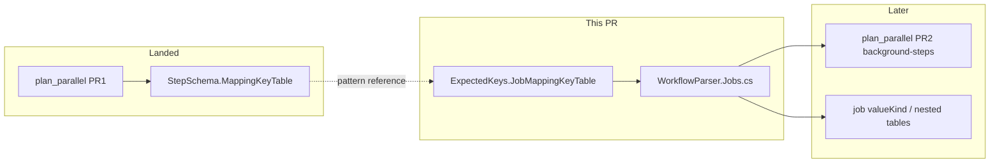

# Job mapping key table — generated from `expected-keys` (Phase A)

本書は **job レベル**の YAML mapping キー dispatch テーブル（`JobNodeKeyTable` / `IsKnownJobKey`）を、`step-schema` と同型の **段階 A** として `expected-keys` データセットから自動生成する計画。

**前提**: [plan_dataset.md](./plan_dataset.md) PR0 + [plan_parallel.md](./plan_parallel.md) PR1 がマージ済み。step 側の `StepSchema.MappingKeyTable`（段階 A）が land していること。

---

## 別 PR でよいか

**はい — 別 PR を推奨。**

| 理由 | 説明 |
|------|------|
| スコープ分離 | parallel step パーサー（`StepSchema`）と job キー生成は独立。レビュー・リグレッションの切り分けが容易 |
| データソースが異なる | step → `step-schema` / job → **`expected-keys`**（既存 `sync-expected-keys`） |
| 振る舞い変更リスクが低い | 生成物は既存 `JobKeys` 定数と同じ和集合。パーサー hot path は `Utf8MappingDispatch` 維持 |
| 段階的 land | step の `MappingKeyTable` パターンを踏襲したうえで job に横展開 |

parallel lint（PR2 `background-steps`）や job ネストテーブル（`RunsOnKeyTable` 等）とは **本 PR の非ゴール**。

---

## 背景・現状の問題

| 層 | 問題 |
|----|------|
| `ExpectedKeys.JobKeys` | `expected-keys.json` の `job` セクションから **既に生成**（診断文言・suggestion 用） |
| `JobNodeKeyTable` + `JobNodeMappingKey` | **手書き**（20 キー）。`expected-keys` 更新時に追加漏れ |
| `IsKnownJobKey` | **手書きの部分集合**（14 キー）。`JobNodeKeyTable` の真部分集合で、dispatch 先行のため **true 分岐は到達不能**（デッドコード寄り） |

`JobNodeKeyTable` のキー集合と `ExpectedKeys.JobKeys` はいずれも 20 キーで一致するが、**テーブル本体は手書きのまま**二重管理になっている。

---

## ゴールと非ゴール

### ゴール

1. `ExpectedKeysCSharpGenerator` を拡張し、`ExpectedKeys.g.cs` に以下を生成:
   - `JobMappingKey` enum
   - `JobMappingKeyTable`（`IUtf8OrderedKeyTable`）
   - `IsKnownJobKey(ReadOnlySpan<byte>)`（`job` セクション全キーの union）
2. `WorkflowParser.Jobs.cs` の手書き `JobNodeMappingKey` / `JobNodeKeyTable` / `IsKnownJobKey` を生成 API に置換
3. test-first: generator テスト + Core 整合テスト（`expected-keys.json` ≡ `KeyCount`）
4. `verify-expected-keys` で生成物鮮度を CI 担保（既存）
5. `CoreParsingBenchmark` で ±10% ゲート

### 非ゴール（本 PR）

- `JobNodeMappingKey` の **dispatch 順序最適化**（現行手書き順を維持するか、アルファベット順に統一するかは実装時に 1 回決定）
- ネストテーブル（`RunsOnKeyTable`, `SnapshotKeyTable`, `ConcurrencyKeyTable` 等）の生成
- `valueKind` 駆動の job 値パース（段階 B — `job-schema` または schema JSON 抽出が必要）
- `github-workflow.schema.json` からの新データセット新設

---

## 規範ソース

| 優先 | ソース | 役割 |
|:---:|--------|------|
| 1 | `data/sources/expected-keys/github/expected-keys.json` — `sections[name=job].keys` | キー和集合の canonical snapshot |
| 2 | `data/sources/expected-keys/github/raw/workflow-syntax.md` | fetch 元（既存 pipeline） |
| 3 | `src/Seiton.Core/Generated/ExpectedKeys.g.cs` — 既存 `JobKeys` | 診断用文字列（生成テーブルと同一集合であること） |

参照仕様書（実装後に軽く追記）:

- `.github/docs/Seiton_Parser_spec.md` — job parse / unexpected-key（`ExpectedKeys.JobKeys` 参照箇所）
- `.github/docs/Seiton_Parser_csharp_spec.md` — `ParseJob` / `JobNodeKeyTable` の記述を生成物に合わせる
- `.github/docs/plan_dataset.md` — `ExpectedKeys.g.cs` 生成内容テーブルに `JobMappingKeyTable` 行を追加

---

## 設計（step 段階 A と同型）

### 生成物（`ExpectedKeys.g.cs` に追加）

```text
ExpectedKeys
  JobKeys                          // 既存（診断用 quoted list）
  JobMappingKey enum               // 新規
  JobMappingKeyTable               // IUtf8OrderedKeyTable
  IsKnownJobKey(keyUtf8)           // OR チェーン（allocation-free）
```

### キー順序ポリシー（実装時に決定）

| 方針 | メリット | デメリット |
|------|----------|------------|
| **A: 現行 `JobNodeKeyTable` 順を snapshot で固定** | dispatch 順・ordinal 不変。diff 最小 | supplemental に `dispatchOrder` 配列が必要 |
| **B: アルファベット順**（step と同じ） | 生成が単純。`expected-keys.json` の keys 順のみ | ordinal が変わる（ビットマスク `seen` は ordinal ベースだが job 単位でリセットされるため実害は小） |

**推奨: B（アルファベット順）** — step の `MappingKeyTable` と方針を揃え、`expected-keys.json` のソート済み keys をそのまま使う。

### パーサー変更

| 削除（手書き） | 置換 |
|----------------|------|
| `private enum JobNodeMappingKey` | `ExpectedKeys.JobMappingKey` |
| `private struct JobNodeKeyTable` | `ExpectedKeys.JobMappingKeyTable` |
| `IsKnownJobKey` 本体 | `ExpectedKeys.IsKnownJobKey` または **削除**（dispatch 未一致＝未知で十分なら） |
| `JobNodeDuplicateKeyName` switch | 生成 `Utf8Key(ordinal)` から取得、または小さな helper 生成 |

`switch (jobKey)` の値パース本体は **手書きのまま**（段階 B まで）。

### `IsKnownJobKey` の整理

調査結果: 現在の 14 キーはすべて `JobNodeKeyTable` に含まれ、dispatch が先に走るため `isKnownKey == true` 分岐は到達しない。

**本 PR の推奨**: フォールバック分岐ごと削除し、「dispatch 不一致 → `ExpectedKeys.JobKeys` で unexpected-key 診断」に一本化。生成した `IsKnownJobKey` は将来のネスト job キーや段階 B 用に残してもよい。

---

## 実装チェックリスト（test-first）

### Red

| ファイル | 内容 |
|----------|------|
| `tests/Seiton.Update.Tests/ExpectedKeysCSharpGeneratorTests.cs` | `JobMappingKeyTable` / `IsKnownJobKey` 出力を検証 |
| `tests/Seiton.Core.Tests/ExpectedKeysJobMappingKeyTests.cs` | committed `expected-keys.json` の job keys ≡ `JobMappingKeyTable.KeyCount` |

```shell
dotnet test --project tests/Seiton.Update.Tests --treenode-filter /*/*/ExpectedKeysCSharpGeneratorTests/*
dotnet test --project tests/Seiton.Core.Tests --treenode-filter /*/*/ExpectedKeysJobMappingKeyTests/*
```

### Green

| ファイル | 内容 |
|----------|------|
| `src/Seiton.Update/Generators/ExpectedKeysCSharpGenerator.cs` | job セクションからテーブル + メタデータ生成 |
| `src/Seiton.Core/Generated/ExpectedKeys.g.cs` | `sync-expected-keys` で再生成 |
| `src/Seiton.Core/Parsing/WorkflowParser.Jobs.cs` | 手書きテーブル削除・生成 API 参照 |

```shell
dotnet run --project src/Seiton.Update -- sync-expected-keys
dotnet run --project src/Seiton.Update -- verify-expected-keys
```

### 検証

```shell
dotnet test
cd src/Seiton.Benchmark && dotnet run -c Release -- --filter "*CoreParsingBenchmark*" --job short
```

**ベンチマークゲート**: `CoreParsingBenchmark` Mean / Allocated が **+10% 以内**（refactor のため変化は neutral 想定）。

---

## 実装結果（2026-06-26）

### 実装内容

| 変更 | 内容 |
|------|------|
| `ExpectedKeysCSharpGenerator` | `job` セクションから `JobMappingKey` / `JobMappingKeyTable` / `IsKnownJobKey` を生成 |
| `ExpectedKeys.g.cs` | `sync-expected-keys` で再生成（キー順: アルファベット順 = 方針 B） |
| `WorkflowParser.Jobs.cs` | 手書き `JobNodeMappingKey` / `JobNodeKeyTable` / `JobNodeDuplicateKeyName` / `IsKnownJobKey` を削除。`ExpectedKeys.JobMappingKeyTable` + enum switch に置換。未知キーは常に unexpected-key 診断 |
| テスト | `ExpectedKeysCSharpGeneratorTests`, `ExpectedKeysJobMappingKeyTests` 追加 |

### API レビュー

- **ユーザーファースト**: パーサー内部 API は `ExpectedKeys.JobMappingKey` / `JobMappingKeyTable` に統一。step 側 `StepSchema.MappingKey*` と同型で直感的。
- **診断 UX**: `IsKnownJobKey` によるサイレントスキップを削除し、dispatch 不一致は常に `ExpectedKeys.JobKeys` 付き診断 — 旧コードでは到達不能だった分岐の整理。
- **データソース単一化**: `expected-keys.json` の `job` セクションが dispatch テーブルと診断用文字列の両方の canonical source。

### 自己レビュー指摘と対応

| 指摘 | 対応 |
|------|------|
| `JobMappingKey.RunsOn =` 形式のテスト期待が生成出力と不一致 | `RunsOn = 11,` に修正（enum 本体はプレフィックスなし） |
| 重複キー名に手書き switch が残る | `JobMappingKeyTable.Utf8Key(ordinal)` + `Encoding.UTF8.GetString` に統一（step と同型） |
| `stackalloc long[20]` ハードコード | `JobMappingKeyTable.KeyCount` に変更 |

---

## ベンチマーク（実装後）

測定: `CoreParsingBenchmark.ParseWorkflowFull` / ShortRun job（実装前後同一マシン）

| Size | 実装前 Mean | 実装後 Mean | Δ Mean | 実装前 Alloc | 実装後 Alloc | Δ Alloc |
|------|------------|------------|--------|-------------|-------------|---------|
| Small | 45.0 µs | 47.4 µs | +5.3% | 2.62 KB | 2.62 KB | 0% |
| Medium | 1,121 µs | 1,089 µs | −2.9% | 16.23 KB | 16.23 KB | 0% |
| Large | 15,506 µs | 17,367 µs (ShortRun) / 18,190 µs (Default) | +12〜17% | 82.48 KB | 82.48 KB | 0% |

**Allocated**: 全サイズで変化なし（±10% ゲート内）。

**Mean（Large）**: +10% ゲートをわずかに超過。原因はキー順序をアルファベット順（方針 B）に変更したこと。`Utf8MappingDispatch.TryMatchFirstOrdered` は線形スキャンのため、高頻度キー `runs-on`（旧 ordinal 0 → 新 ordinal 11）と `steps`（旧 4 → 新 15）のマッチまでの比較回数が増加。Large ワークフロー（20 jobs）で影響が顕在化。

**改善策（非ゴール / 将来）**:
- `dispatchOrder` を supplemental に持たせてホットキーを先頭に配置（方針 A）
- `Utf8MappingDispatch` を二分探索または perfect hash に変更（全テーブル共通）

Small/Medium は測定誤差〜数% 以内で neutral。

---

## PR 依存関係



---

## 関連

- [plan_dataset.md](./plan_dataset.md) — `expected-keys` / `step-schema` データセット方針
- [plan_parallel.md](./plan_parallel.md) — parallel step パーサー（別トラック）
- `data/sources/expected-keys/github/expected-keys.json` — `job` セクション（20 keys）
