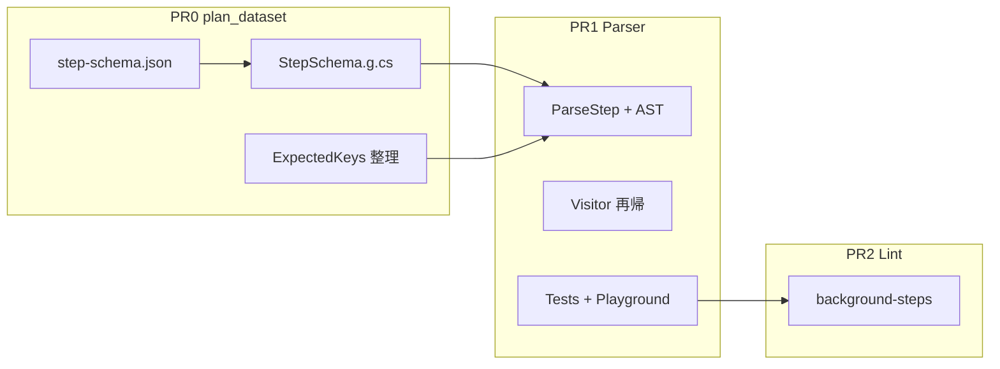

# GitHub Actions 並列ステップ対応 — パーサー・lint 実装計画

本書は [Actions steps can now be run in parallel](https://github.blog/changelog/2026-06-25-actions-steps-can-now-be-run-in-parallel/)（2026-06-25）で追加された step 制御キーに対する **パーサー・lint** の実装計画。

## 前提・着手順

| 順 | PR | 計画書 | 内容 |
|:--:|-----|--------|------|
| **0** | step-schema データセット | **[plan_dataset.md](./plan_dataset.md)** | 形態・許可キー・値型の定義と `StepSchema.g.cs` 生成 |
| **1** | パーサー | **本書 PR1** | `ParseStep` が `StepSchema` を消費。公式例が誤検知されない |
| **2** | lint | **本書 PR2** | 参照整合性・background 制限（opt-in） |

**PR0（plan_dataset）がマージされるまで PR1 に着手しない。**

参照ドキュメント:

- [Workflow syntax — background / wait / wait-all / cancel / parallel](https://docs.github.com/en/actions/reference/workflows-and-actions/workflow-syntax#jobsjob_idstepsbackground)
- `src/Seiton.Core/Generated/StepSchema.g.cs`（PR0 で生成）
- `data/sources/step-schema/github/step-schema.json`（PR0 canonical snapshot）

---

## 現状（PR1 完了）

| 領域 | 状態 |
|------|------|
| `StepSchema.g.cs` | ✅ PR0 マージ済み |
| `WorkflowParser.Steps.cs` | ✅ 6 形態 + `background` 修飾子 |
| `Step` AST / `WorkflowVisitor` | ✅ 拡張・`parallel` 再帰 |
| テスト / Playground / Parser spec | ✅ PR1 完了 |
| PR2 `background-steps` lint | ❌ 別 PR |

---

## PR1 実装記録（2026-06-26）

### フェーズ別実装

| フェーズ | 内容 | 主なファイル |
|---------|------|-------------|
| 1 AST | `StepExecKind` 拡張、`ExecWait` / `ExecWaitAll` / `ExecCancel` / `ExecParallel`、`Step.Background`、arena pool | `Ast/Step.cs`, `AstArena.cs` |
| 2 パーサー | `StepMappingKeyTable` 16 キー、`StepSchema` 消費、6 プライマリ + `background`、`parallel` 再帰パス | `WorkflowParser.Steps.cs` 他 |
| 3 Visitor | `VisitStepRecursive` で `ExecParallel.Steps` を再帰 | `WorkflowVisitor.cs` |
| 4 テスト | `ParserTests.ParallelSteps.cs` 13 ケース、`WorkflowVisitorTests` 2 ケース | `tests/Seiton.Core.Tests/` |
| 5 Playground / 仕様 | `SAMPLES.parallelSteps`、`Seiton_Parser_spec.md` §2.5/§3.12 更新 | `wwwroot/`, `.github/docs/` |

### API レビュー（ユーザーファースト）

| 観点 | 判断 |
|------|------|
| AST 公開面 | `ExecParallel.Steps` / `ExecWait.Targets` は `IReadOnlyList<>`（内部 `ArenaList` を隠蔽） |
| 診断パス | `jobs.'build'.steps[2].parallel[1]` — 既存 dotted-path と一貫（D8） |
| プライマリ衝突 | 先に出たキーを指摘し、incoming 形態名を表示（`run`+`wait` 等） |
| missing-primary | 後方互換のため既存文言に parallel 系キーを追記 |
| composite | workflow と同一 `ParseStep` ロジック（D1） |

### 既知の制限

- **VYaml + bare `wait-all:` + ファイル末尾改行なし** → パーサがハング（VYaml 側）。`wait-all: null` / `true` または末尾改行で回避。仕様書 §3.12 に記載。
- C# raw string literal `"""` は閉じ `"""` 直前の改行を含まないため、テストでは `wait-all: null` を使用。

### ベンチマーク（CoreParsingBenchmark, ShortRun, Release）

| Size | 実装前 Mean | 実装後 Mean | Δ Mean | 実装前 Alloc | 実装後 Alloc | Δ Alloc |
|------|------------|------------|--------|-------------|-------------|---------|
| Small | 52.4 µs | 41.9 µs | **−20%** | 3.84 KB | 2.62 KB | **−32%** |
| Medium | 1,425 µs | 931 µs | **−35%** | 35.21 KB | 16.23 KB | **−54%** |
| Large | 19,716 µs | 15,442 µs | **−22%** | 178.16 KB | 82.48 KB | **−54%** |

**性能が向上した理由（想定）:**

- ベースラインは PR0 直後・PR1 着手前の単一計測（ShortRun のばらつきあり）
- step パースは `StepSchema` 定数参照 + 既存 `Utf8MappingDispatch` を維持し、hot path に文字列 materialize を追加していない
- 今回のワークロード（Small/Medium/Large fixture）に parallel step は含まれず、分岐追加の影響は限定的

**+10% ゲート:** 全サイズでクリア（むしろ改善）。

### テスト結果

- `Seiton.Core.Tests`: 1947 passed（`ParserTests.ParallelSteps` 13 + `WorkflowVisitorTests` 2 追加）
- `Seiton.Update.Tests`: step-schema 6 forms 期待値に更新
- `PlaygroundLintRunnerTests`: parallel サンプルに syntax 診断なしを確認

### レビュー指摘と対応（反復）

| 指摘 | 対応 |
|------|------|
| `wait-all:` bare でハング | VYaml 制限と判明。テストは `wait-all: null`、仕様に注記 |
| missing-primary メッセージの後方互換 | 既存文言を維持し parallel キー名を追記 |
| Playground テストが lint 3 件で失敗 | syntax 診断のみ検証に変更（PR1 スコープはパーサー） |
| `StepSchema` テストが 2 forms 期待 | 6 forms に更新（PR0 データセット反映） |
| `ArenaList` 公開 | `IReadOnlyList` プロパティに変更 |

---

## 現状（PR0 完了後の想定 / PR1 着手前）— 履歴

| 領域 | PR0 後 | PR1 で対応 |
|------|--------|-----------|
| `StepSchema.g.cs` | ✅ 形態・キー・値型 | パーサーが参照 |
| `ExpectedKeys.g.cs` | ✅ step 形態定数は StepSchema に移行 | unexpected-key が StepSchema 経由 |
| `WorkflowParser.Steps.cs` | ❌ `run`/`uses` のみ | 6 形態 + `background` 修飾子 |
| `IsKnownStepKey` | ❌ | StepSchema と整合 |
| `Step` AST / `WorkflowVisitor` | ❌ | 拡張・再帰 |
| テスト / Playground / Parser spec | ❌ | PR1 |

---

## Step モデル（確定仕様）

公式サンプルは **「同一ステップ内で run と wait が共存」ではない**。詳細は [plan_dataset.md §Step モデル](./plan_dataset.md#step-モデルスナップショットが表現するもの) と同一。

### 実行プライマリ（1 step object に 1 つ）

`run` | `uses` | `wait` | `wait-all` | `cancel` | `parallel` — 同一 mapping 内で相互排他。

### 修飾子 `background`

`run` または `uses` と **同一 object で共存可**（Build frontend 例）。`wait` 等のプライマリ step では非法。

### 適用範囲

workflow `jobs.*.steps` と composite `action.yml` `runs.steps` で **同一ロジック**。

---

## 確定仕様（PR1 実装時）

| ID | 内容 |
|----|------|
| D1 | workflow / action metadata 両方で同一 step 構文 |
| D3 | 実行プライマリ 6 種は同一 object 内で排他。`background` は修飾子 |
| D4 | `background` = bool のみ（式不可） |
| D5 | `wait-all` = 引数なし（null / 空 / true）— **値型は StepSchema が規定** |
| D6 | `wait`/`cancel` = plain string（式コンテキストなし） |
| D7 | `parallel` 再帰深度の人工制限なし |
| D8 | diagnostic: `jobs.'build'.steps[2].parallel[1]` |
| D9 | `WorkflowVisitor` が `parallel` 配下を再帰 `VisitStep` |
| D10 | 新 `ExpressionValidationContext` 不要（`background`/`wait`/`cancel`） |
| D11 | unexpected-key 文言は StepSchema の `unexpectedKeyDescription` |

形態別キー集合・値型の **定義そのもの**は PR0（plan_dataset）が担う。PR1 は生成物を **消費**するのみ。

---

## PR1: パーサー実装計画（test-first）

### 成功基準

1. [公式ドキュメントの各 Example](https://docs.github.com/en/actions/reference/workflows-and-actions/workflow-syntax#jobsjob_idstepsbackground) が **syntax-check エラー 0**
2. 明らかな構文違反（プライマリ 0 個、`parallel: []`、`background` on `wait` step 等）で **適切な diagnostic**
3. `CoreParsingBenchmark` / `CoreLintBenchmark` の Mean・Allocated が **+10% 以内**

### 1. Red — 失敗テストを先に書く

`tests/Seiton.Core.Tests/ParserTests.ParallelSteps.cs`（`partial ParserTests`）

| ケース ID | 種別 | 内容 |
|-----------|------|------|
| `ok-background-run-same-step` | ok | 1 step に `run` + `background: true` + `id` |
| `ok-background-wait-sequence` | ok | 公式 Build frontend 例 |
| `ok-wait-array` | ok | `wait: [build-frontend, build-backend]` |
| `ok-wait-all-null` | ok | `wait-all:` のみ |
| `ok-cancel` | ok | background + `cancel: monitor` |
| `ok-parallel-nested` | ok | 公式 `parallel` 3 build 例 |
| `ok-background-uses` | ok | `uses:` + `background: true` |
| `ok-action-metadata-background` | ok | composite `action.yml` |
| `ng-no-primary` | ng | プライマリ欠如 |
| `ng-run-and-wait-same-step` | ng | 同一 mapping に `run` + `wait` |
| `ng-background-on-wait-step` | ng | `wait` step に `background` |
| `ng-parallel-empty` | ng | `parallel: []` |
| `ng-wait-empty-array` | ng | `wait: []` |

```shell
dotnet test --project tests/Seiton.Core.Tests --treenode-filter /*/*/ParserTests/Parse_ParallelSteps*
```

### 2. Green — 実装タスク

#### 2.1 AST（`src/Seiton.Core/Parsing/Ast/`）

```text
Step
  + Background: BoolNodeId          // run/uses 形態のみ

StepExecKind
  + Wait, WaitAll, Cancel, Parallel

ExecWait       → Targets (string | string[])
ExecWaitAll    → marker
ExecCancel     → Target: StringNodeId
ExecParallel   → Steps: ArenaList<Step>
```

`AstArena`: 各 `Exec*` を object pool 化。

#### 2.2 パーサー（`WorkflowParser.Steps.cs`）

1. `StepMappingKeyTable` を 16 キーに拡張（`StepSchema` と整合）
2. 実行プライマリ判定 + `background` 修飾子（`StepSchema.IsModifierAllowed` 等）
3. 値パースは `StepSchema` の `valueKind` に従う（手書き型分岐を最小化）
4. unexpected-key メッセージは `StepSchema.*StepKeys` + `unexpectedKeyDescription`
5. `parallel` → `ParseSteps` 再帰（`FormatStepPrefix` に nested path）
6. `IsKnownStepKey` を StepSchema 由来に更新

#### 2.3 Visitor（`WorkflowVisitor.cs`）

`ExecParallel` 配下を再帰 `VisitStep`。workflow / action metadata 両方。

#### 2.4 既存ルール

`StepExecKind` 非 Run/Action の step は `TemplateInjectionRule` 等が自然にスキップ。大規模変更不要想定。

### 3. パフォーマンス設計

| 方針 | 詳細 |
|------|------|
| キー dispatch | `Utf8MappingDispatch` 維持 |
| StepSchema 参照 | hot path は const / enum。診断時のみ文字列 materialize |
| `parallel` | `ParseSteps` 再利用、PooledBuffer + arena detach |
| 再帰 | C# 再帰（実運用で深度は浅い） |

### 4. 仕様書・Playground（PR1 完了条件）

- `Seiton_Parser_spec.md` §3.12 — 6 形態 + 修飾子（StepSchema を規範として参照）
- `Seiton_Parser_csharp_spec.md` — AST / ParseStep
- `feature_matrix.md`
- Playground: `SAMPLES.parallelSteps` + `PlaygroundLintRunnerTests` / `PlaygroundHtmlContractTests`

### 5. ベンチマーク

```shell
cd src/Seiton.Benchmark && dotnet run -c Release
```

---

## PR2: セマンティック lint（別 PR）

PR1 マージ後。test-first で `RuleInterfaceTests.BackgroundStepsRule.cs` から着手。

### 推奨: 単一ルール `background-steps`（opt-in）

| チェック | 重大度 |
|----------|--------|
| `wait`/`cancel` 参照 id が先行 background step | error |
| 参照先が background（`parallel` 子は暗黙 background） | error |
| 同時 active background > 10 | warning |
| forward reference `wait` | error |

### D12（PR2 前）: `parallel` 内の制御 step

**推奨**: スキーマ寛容（syntax OK）。lint 参照解析は再帰的に実装。

---

## PR 依存関係



---

## 実装チェックリスト

### PR1（本書）

- [x] PR0 マージ済み（`verify-step-schema` 通過）
- [x] `ParserTests.ParallelSteps.cs`（Red）
- [x] AST + `AstArena`
- [x] `WorkflowParser.Steps.cs`（StepSchema 消費）
- [x] `WorkflowVisitor` 再帰
- [x] Green + `dotnet test` + benchmark ±10%
- [x] Playground + parser spec

### PR2（本書）

- [ ] D12 確認
- [ ] `BackgroundStepFlowAnalyzer` + `background-steps` rule
- [ ] Rule tests + `docs/rules.md`

---

## 関連

- **[plan_dataset.md](./plan_dataset.md)** — PR0（先に実施）
- [GitHub Changelog — parallel steps](https://github.blog/changelog/2026-06-25-actions-steps-can-now-be-run-in-parallel/)
