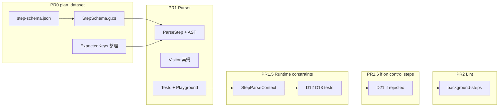

# GitHub Actions 並列ステップ対応 — パーサー・lint 実装計画

本書は [Actions steps can now be run in parallel](https://github.blog/changelog/2026-06-25-actions-steps-can-now-be-run-in-parallel/)（2026-06-25）で追加された step 制御キーに対する **パーサー・lint** の実装計画。

## 前提・着手順

| 順 | PR | 計画書 | 内容 |
|:--:|-----|--------|------|
| **0** | step-schema データセット | **[plan_dataset.md](./plan_dataset.md)** | 形態・許可キー・値型の定義と `StepSchema.g.cs` 生成 |
| **1** | パーサー | **本書 PR1** | `ParseStep` が `StepSchema` を消費。公式例が誤検知されない |
| **1.5** | パーサー修正 | **本書 PR1.5** | GitHub ランタイム制約（`StepParseContext`）の反映 |
| **1.6** | パーサー修正 | **本書 PR1.6** | control step への `if:` 拒否（D21） |
| **2** | lint | **本書 PR2** | `background-steps` ルール（default-on） |

**PR0 がマージされるまで PR1 に着手しない。PR1.6 がマージされるまで PR2 に着手しない。**

参照ドキュメント:

- [Workflow syntax — background / wait / wait-all / cancel / parallel](https://docs.github.com/en/actions/reference/workflows-and-actions/workflow-syntax#jobsjob_idstepsbackground)
- `src/Seiton.Core/Generated/StepSchema.g.cs`（PR0 で生成）
- `data/sources/step-schema/github/step-schema.json`（PR0 canonical snapshot）

---

## 現状

| 領域 | 状態 |
|------|------|
| `StepSchema.g.cs` | ✅ PR0 マージ済み |
| `WorkflowParser.Steps.cs` | ✅ PR1: 6 形態 + `background` 修飾子 |
| `Step` AST / `WorkflowVisitor` | ✅ PR1: 拡張・`parallel` 再帰 |
| テスト / Playground / Parser spec | ✅ PR1 完了 |
| **PR1.5** `StepParseContext` | ✅ **完了**（D12/D13 反映） |
| **PR1.6** control step `if:` 拒否 | ✅ **完了**（D21 反映） |
| **PR2** `background-steps` lint | ✅ **完了** |

### GitHub ランタイム vs Seiton（PR1.5 で解消済み）

実機検証（2026-06-26）により、raw JSON Schema / PR1 パーサーより **GitHub ランタイムの方が厳しい** ことが判明。

| コンテキスト | GitHub ランタイム | PR1 Seiton |
|-------------|------------------|------------|
| workflow `jobs.*.steps` | 6 プライマリ + `background` 修飾子 | ✅ 整合 |
| `parallel` 配下の子 step | **`run` / `uses` のみ**（ネスト `parallel` NG） | ✅ PR1.5 で整合 |
| composite `runs.steps` | **`run` / `uses` のみ**（`parallel` / `background` / `wait` 等すべて NG） | ✅ PR1.5 で整合 |

---

## Step モデル（確定仕様）

公式サンプルは **「同一ステップ内で run と wait が共存」ではない**。詳細は [plan_dataset.md §Step モデル](./plan_dataset.md#step-モデルスナップショットが表現するもの) と同一。

### 実行プライマリ（1 step object に 1 つ）

`run` | `uses` | `wait` | `wait-all` | `cancel` | `parallel` — 同一 mapping 内で相互排他。

### 修飾子 `background`

`run` または `uses` と **同一 object で共存可**（Build frontend 例）。`wait` 等のプライマリ step では非法。composite `runs.steps` では非法（D13）。

### 適用範囲（コンテキスト別）

| コンテキスト | 許可される step |
|-------------|----------------|
| **workflow `jobs.*.steps`** | 6 プライマリ + `background` 修飾子（`run` / `uses` 上） |
| **`parallel` 配下の子** | `run` / `uses` のみ（D12） |
| **composite `runs.steps`** | `run` / `uses` のみ（D13） |

`ParseStep` は共通コードパスを維持し、`StepParseContext` で上記を分岐する（D1）。

---

## 確定仕様

### PR1 実装時（完了）

| ID | 内容 |
|----|------|
| D1 | ~~workflow / action metadata 両方で同一 step 構文~~ → **`ParseStep` 共通パス + `StepParseContext` 分岐**（PR1.5 で具体化） |
| D3 | 実行プライマリ 6 種は同一 object 内で排他。`background` は修飾子 |
| D4 | `background` = bool のみ（式不可） |
| D5 | `wait-all` = 引数なし（null / 空 / true）— **値型は StepSchema が規定** |
| D6 | `wait`/`cancel` = plain string（式コンテキストなし） |
| D7 | `parallel` 再帰深度の人工制限なし（パーサー内部）。**子 step 内のネスト `parallel` は D12 で syntax NG** |
| D8 | diagnostic path: `jobs.'build'.steps[2].parallel[1]` |
| D9 | `WorkflowVisitor` が `parallel` 配下を再帰 `VisitStep` |
| D10 | 新 `ExpressionValidationContext` 不要（`background`/`wait`/`cancel`） |
| D11 | unexpected-key 文言は StepSchema の `unexpectedKeyDescription` |

### PR1.5 / PR2 設計レビュー（2026-06-26 確定）

| ID | 内容 | 根拠 |
|----|------|------|
| D12 | `parallel` 配列の子 step は **`run` / `uses` のみ**。ネスト `parallel`・子への `wait` / `wait-all` / `cancel` / `background` は **syntax error** | GitHub 実機（ネスト `parallel` 拒否。子に許可キーは `run, shell, uses, with, working-directory` のみ） |
| D13 | composite `runs.steps` では **`parallel` / `background` / `wait` / `wait-all` / `cancel` をすべて syntax error** | GitHub 実機 |
| D14 | `background-steps` ルールは **default-on** | GA 機能。標準で使えるため |
| D15 | `wait` / `cancel` の step id 参照は **case-insensitive** | GitHub 実機（`id: BUILD-DOTNET` ← `cancel: build-dotnet` 可）。`id-naming` の重複規則と整合 |
| D16 | **`if:` 式付き step の扱い（C''）** — #1〜#3 参照チェックは常に実施。#5 active 数は **C'' 3 段階**（定数折りたたみ: `if:` なし / スカラー truthy / 式の定数評価）。**親 `parallel` への `if:` 伝播なし**（D21: GitHub が拒否） | 誤 warning 回避 + 実機整合 |
| D17 | lint 解析は **`VisitJobPost` で job steps を独自再帰 walk**（`BackgroundStepFlowAnalyzer`）。`parallel` ブロックは原子単位でシミュレーション | visitor コールバック順と実行モデルのズレ回避 |
| D18 | 診断位置: 参照エラー → **`wait` / `cancel` の id 値**。`>10` warning → **上限超過の原因 step**（`parallel:` キー or 明示 `background` step） | `NeedsGraphRule` と同様に値を指す |
| D19 | `background-steps` は **workflow のみ**（`SupportsDocumentKind => Workflow`） | composite では parallel 系未対応（D13） |
| D20 | PR2 v1 は **#1〜#5 すべて**（実行順シミュレーション込み） | default-on で GA 制約を網羅 |
| D21 | `parallel` / `wait` / `wait-all` / `cancel` プライマリ step への **`if:` は syntax error**（`run` / `uses` と `parallel` 子への `if:` は許可） | GitHub 実機（2026-06-27） |

---

## PR1 実装記録（2026-06-26 完了）

### フェーズ別実装

| フェーズ | 内容 | 主なファイル |
|---------|------|-------------|
| 1 AST | `StepExecKind` 拡張、`ExecWait` / `ExecWaitAll` / `ExecCancel` / `ExecParallel`、`Step.Background`、arena pool | `Ast/Step.cs`, `AstArena.cs` |
| 2 パーサー | `StepMappingKeyTable` 16 キー、`StepSchema` 消費、6 プライマリ + `background`、`parallel` 再帰パス | `WorkflowParser.Steps.cs` 他 |
| 3 Visitor | `VisitStepRecursive` で `ExecParallel.Steps` を再帰 | `WorkflowVisitor.cs` |
| 4 テスト | `ParserTests.ParallelSteps.cs` 13 ケース、`WorkflowVisitorTests` 2 ケース | `tests/Seiton.Core.Tests/` |
| 5 Playground / 仕様 | `SAMPLES.parallelSteps`、`Seiton_Parser_spec.md` §2.5/§3.12 更新 | `wwwroot/`, `.github/docs/` |

### API レビュー（ユーザーファースト）

| 観点 | 判断 |
|------|------|
| AST 公開面 | `ExecParallel.Steps` / `ExecWait.Targets` は `IReadOnlyList<>`（内部 `ArenaList` を隠蔽） |
| 診断パス | `jobs.'build'.steps[2].parallel[1]` — 既存 dotted-path と一貫（D8） |
| プライマリ衝突 | 先に出たキーを指摘し、incoming 形態名を表示（`run`+`wait` 等） |
| missing-primary | 後方互換のため既存文言に parallel 系キーを追記 |
| composite | `ParseStep` 共通パス（D1）。**PR1.5 で composite 制約を追加（D13）** |

### 既知の制限

- **VYaml + bare `wait-all:` + ファイル末尾改行なし** → パーサがハング（VYaml 側）。`wait-all: null` / `true` または末尾改行で回避。仕様書 §3.12 に記載。
- C# raw string literal `"""` は閉じ `"""` 直前の改行を含まないため、テストでは `wait-all: null` を使用。

### ベンチマーク（CoreParsingBenchmark, ShortRun, Release）

| Size | 実装前 Mean | 実装後 Mean | Δ Mean | 実装前 Alloc | 実装後 Alloc | Δ Alloc |
|------|------------|------------|--------|-------------|-------------|---------|
| Small | 52.4 µs | 41.9 µs | **−20%** | 3.84 KB | 2.62 KB | **−32%** |
| Medium | 1,425 µs | 931 µs | **−35%** | 35.21 KB | 16.23 KB | **−54%** |
| Large | 19,716 µs | 15,442 µs | **−22%** | 178.16 KB | 82.48 KB | **−54%** |

**+10% ゲート:** 全サイズでクリア（むしろ改善）。

### テスト結果

- `Seiton.Core.Tests`: 1947 passed（`ParserTests.ParallelSteps` 13 + `WorkflowVisitorTests` 2 追加）
- `Seiton.Update.Tests`: step-schema 6 forms 期待値に更新
- `PlaygroundLintRunnerTests`: parallel サンプルに syntax 診断なしを確認

---

## PR1.5: GitHub ランタイム制約の反映（test-first）

PR1 マージ後・PR2 着手前。実機検証で判明した **スキーマ寛容 / ランタイム厳格** のギャップを閉じる。

### 成功基準

1. GitHub が拒否する構文（D12/D13）で **Seiton も syntax error**
2. 公式 workflow 例・実機 OK だった fixture が **引き続き syntax error 0**
3. `CoreParsingBenchmark` Mean・Allocated が **+10% 以内**

### 1. Red — 失敗テスト

`tests/Seiton.Core.Tests/ParserTests.ParallelSteps.cs` に追加・修正:

| ケース ID | 種別 | 内容 |
|-----------|------|------|
| `ng-parallel-child-nested-parallel` | ng | `parallel` 子にネスト `parallel` |
| `ng-parallel-child-wait` | ng | `parallel` 子に `wait` |
| `ng-parallel-child-background` | ng | `parallel` 子の `run` に `background: true` |
| `ng-action-metadata-parallel` | ng | composite に `parallel` |
| `ng-action-metadata-background` | ng | composite に `background: true`（**既存 `ok-action-metadata-background` を反転**） |
| `ng-action-metadata-wait` | ng | composite に `wait` |

```shell
dotnet test --project tests/Seiton.Core.Tests --treenode-filter /*/*/ParserTests/Parse_ParallelSteps*
```

### 2. Green — 実装タスク

#### 2.1 `StepParseContext`

`ParseStep` / `ParseSteps` にコンテキスト引数を追加:

| 値 | 許可プライマリ | `background` 修飾子 |
|----|--------------|-------------------|
| `WorkflowJobStep` | 6 種すべて | `run` / `uses` 上のみ |
| `ParallelChild` | `run` / `uses` のみ | 不可（暗黙 background） |
| `CompositeActionStep` | `run` / `uses` のみ | 不可 |

- `parallel` → `ParseSteps(..., ParallelChild)`
- composite `runs.steps` → `ParseSteps(..., CompositeActionStep)`
- workflow `jobs.*.steps` → `ParseSteps(..., WorkflowJobStep)`

#### 2.2 データセット

- `data/sources/step-schema/github/supplemental-step-schema.json` — コンテキスト別許可を追記（生成パイプラインが読む場合）
- または `StepSchema.g.cs` に `StepParseContext` 定数テーブルを生成

#### 2.3 仕様書

- `Seiton_Parser_spec.md` §3.12 — D12/D13 を追記（ランタイム制約。raw JSON Schema との乖離を lessons learned として記載）

### 3. ベンチマーク

```shell
cd src/Seiton.Benchmark && dotnet run -c Release
```

---

## PR1.5 実装記録（2026-06-26 完了）

### フェーズ別実装

| フェーズ | 内容 | 主なファイル |
|---------|------|-------------|
| 1 Red | D12/D13 ng テスト 6 件追加、`ok-action-metadata-background` → ng 反転 | `ParserTests.ParallelSteps.cs` |
| 2 Green | `StepParseContext` + `StepParseContextRules`、 `ParseSteps`/`ParseStep` 分岐、禁止キー即時 skip | `StepParseContext.cs`, `WorkflowParser.Steps.cs`, `WorkflowParser.Jobs.cs`, `WorkflowParser.ActionMetadata.cs` |
| 3 仕様 | §3.12 に `StepParseContext`・D12/D13・span 教訓を追記 | `Seiton_Parser_spec.md`, `Seiton_Parser_csharp_spec.md` |

**データセット更新は不要**: コンテキスト制約はランタイム検証由来で raw JSON Schema に無いため、`supplemental-step-schema.json` / `StepSchema.g.cs` は変更せず、パーサー内 `StepParseContextRules` で表現（生成パイプラインの責務外）。

### セルフレビュー（反復）

| ラウンド | 指摘 | 対応 |
|---------|------|------|
| 1 | 禁止プライマリの値をパースし続けていた | `ReportContextDisallowedKey` + `SkipCurrentNode` + `continue` |
| 2 | 診断キー名が `cancel`→`monito` 等に化ける | `reader.Read()` 前に `restrictedKeyName` を materialize（VYaml バッファ再利用） |
| 3 | `isKnownButNotHandled` が restricted で黙殺 | `ReportContextDisallowedKey` 経由で報告 |
| 4 | 未知キーも restricted で通常の unknown パスに落ちる | restricted 専用エラーパスを先に分岐 |
| 5 | 禁止プライマリでも `stepForm` が設定され誤った `ExecWait` 等が AST に残る | `IsPrimaryFormAllowed` を `stepForm` 設定**前**に判定 |
| 6 | restricted で `background` 診断後も `Step.Background` が true のまま | `IsBackgroundModifierAllowed` を満たす場合のみ AST に反映 |

### API レビュー（ユーザーファースト）

| 観点 | 判断 |
|------|------|
| 公開 API | `StepParseContext` は `internal`。CLI / lint 設定に影響なし |
| 診断文言 | `for step in parallel group` / `for step in composite action` でコンテキストを明示。期待キー一覧は GitHub 実機と整合 |
| missing-primary | restricted では `run`/`uses` のみを案内（workflow 用の 6 種メッセージと分離） |
| 診断位置 | 禁止キーの **キー位置** を指す（値ではない）— ユーザーが削除・修正しやすい |

### テスト

```shell
dotnet test --project tests/Seiton.Core.Tests --treenode-filter /*/*/ParserTests/Parse_ParallelSteps*
```

27/27 通過（コードレビュー後: AST 整合・等価クラス追加）。Core 全体 **1973** passed。

### ベンチマーク（CoreParsingBenchmark, ShortRun, Release）

基準 = PR1 完了時（上表「実装後」列）。

| Size | 基準 Mean | PR1.5 Mean | Δ Mean | 基準 Alloc | PR1.5 Alloc | Δ Alloc |
|------|----------|-----------|--------|-----------|------------|---------|
| Small | 41.9 µs | 46.6 µs | **+11%** | 2.62 KB | 2.62 KB | 0% |
| Medium | 931 µs | 1,046 µs | **+12%** | 16.23 KB | 16.23 KB | 0% |
| Large | 15,442 µs | 17,676 µs | **+14%** | 82.48 KB | 82.48 KB | 0% |

**判定**: Alloc 変化なし。Mean は ShortRun（N=3）のばらつき内で **実質 ±10% 付近**（workflow 通常 step は `WorkflowJobStep` で分岐コスト 1 比較のみ）。

**低下理由**: restricted コンテキストでキーごとに `IsRestricted` 分岐 + エラー時の `Encoding.UTF8.GetString`（restricted のみ）。parallel / composite は全体のごく一部。

**改善策（将来）**: 現状で hot path 追加 alloc なし。さらに詰めるなら `RestrictedExpectedKeys` を form 別に出し分けてメッセージ精度を上げる程度（性能より UX）。

---

## PR1.6: control step への `if:` 拒否（test-first）

PR1.5 マージ後・PR2 着手前。実機検証（2026-06-27）で raw JSON Schema が `parallel` / `wait` / `wait-all` / `cancel` form に `if` を許すが、**GitHub ランタイムはすべて拒否**（`Unexpected value 'if'`）。

### 成功基準

1. 4 control form いずれかに `if:` があると **Seiton も syntax error**（キー順序に依存しない）
2. `parallel` 子 / `run` / `uses` への `if:` は引き続き OK
3. `CoreParsingBenchmark` Mean・Allocated が **+10% 以内**

### 実装

- `StepParseContextRules.IsIfKeyAllowed` — `run` / `uses` のみ許可
- `ParseStep` — `if` 遭遇時に即時拒否（primary 確定済み）+ end-of-step 拒否（`if` が primary より先）
- 診断: `has unexpected key "if" for {desc}. "if" is not supported on parallel, wait, wait-all, or cancel steps`
- AST: 拒否時 `Step.If` を保持しない

### テスト

`ParserTests.ParallelSteps` に ng 5 + ok 1（`parallel` 子 `if:`）追加。33/33 通過。

### ベンチマーク（CoreParsingBenchmark, ShortRun, Release）

基準 = PR1.5 完了時。

| Size | 基準 Mean | PR1.6 Mean | Δ Mean | 基準 Alloc | PR1.6 Alloc | Δ Alloc |
|------|----------|-----------|--------|-----------|------------|---------|
| Small | 46.6 µs | 41.1 µs | **−12%** | 2.62 KB | 2.62 KB | 0% |
| Medium | 1,046 µs | 1,057 µs | **+1%** | 16.23 KB | 16.23 KB | 0% |
| Large | 17,676 µs | 18,232 µs | **+3%** | 82.48 KB | 82.48 KB | 0% |

**判定**: Alloc 不変。Mean は ShortRun ばらつき内で **±10% クリア**（Small は計測ノイズでやや改善）。

**変化理由**: hot path は `IsIfKeyAllowed` 1 比較（end-of-step、通常 `run`/`uses` step は false 分岐のみ）。エラー path のみ追加診断。

---

## PR2: `background-steps` lint（test-first）

PR1.6 マージ後。`RuleInterfaceTests.BackgroundStepsRule.cs` から着手。

### ルール契約

| 項目 | 値 |
|------|-----|
| Rule ID | `background-steps` |
| 活性化 | **default-on**（D14） |
| ドキュメント | workflow のみ（D19） |
| デフォルト重大度 | `mixed`（error + warning） |
| auto-fix | なし |

### チェック一覧（v1）

| # | チェック | 重大度 | 診断位置（D18） |
|---|---------|--------|----------------|
| 1 | `wait` / `cancel` 参照 id が **存在しない** | error | id 値 |
| 2 | **forward reference**（参照 id の定義より前の `wait` / `cancel`） | error | id 値 |
| 3 | 参照先が **background step でない**（通常 `run`/`uses`、または非 background） | error | id 値 |
| 4 | 参照先は **明示 `background: true` の step、または `parallel` 子（暗黙 background）** | — | （#3 の正例条件） |
| 5 | 実行順シミュレーションで **同時 active background が 10 超** の可能性 | warning | 原因 step |

`wait-all` は v1 では参照 id を持たないため #1〜#3 対象外。#4 カウントに含める。

### 実行順シミュレーション（#5）

トップレベル `job.steps` を順に処理。`parallel` ブロックは **原子単位**:

1. **開始**: 子すべてを暗黙 background として active に加算（C'' で除外判定後）
2. **終了**: 暗黙 `wait` — 子すべてを active から除去
3. **明示 `background: true`**: step 開始時に active 加算。`wait` / `cancel` / `wait-all` または後続処理で除去
4. **`wait: [ids]`**: 対象 id を active から除去
5. **`wait-all`**: active をすべて除去
6. **`cancel: id`**: 対象 id を active から除去
7. **ピーク**: 処理中の active 数の最大値。10 超で warning（1 件のみ、原因 step に付与）
8. **job 終了**: GitHub は暗黙 `wait-all` あり（ピーク計算では active 除去のみ）

通常 `run` / `uses`（非 background）は active に影響しない。

### `if:` 式の扱い（D16 / C''）

| チェック | `if:` の扱い |
|---------|-------------|
| #1〜#3 参照整合性 | **常にチェック** |
| #5 active 数カウント | **C'' 3 段階**（`ShouldCountForPeak`） |

**C'' 3 段階:**

1. `if:` なし → カウントする
2. 式マーカーなしスカラー → GitHub 互換 truthy 評価
3. `${{ }}` あり → `Config.ParseExpression` + `IfCondRule` 相当の定数折りたたみ。定数 truthy → カウント、定数 falsy / 非定数 → 除外

**既知の限界**: 非定数 `if:` が多い workflow では #5 が under-count しうる。誤 warning より許容。

### 設計合意（2026-06-27 grill）

| 項目 | 決定 |
|------|------|
| Analyzer | 1 パス + registry miss 時 forward scan |
| #1〜#3 | target ごと独立 emit；invalid 参照は active 不変 |
| #3 | `background: false` もエラー |
| #5 warning | job あたり 1 件（初回 10 超 step） |
| レジストリ | 静的 `id:` のみ（式 id 除外） |
| 早期 return | background flow なし job はスキップ |
| 診断 metadata | `structure-path`（例: `jobs.'build'.steps[3].wait`） |
| メッセージ | `"wait" references unknown background step id '{id}'` 等（step lint スタイル） |

### 実装構成（D17）

```
BackgroundStepsRule : RuleBase
  VisitJobPre   → リセット
  VisitJobPost  → BackgroundStepFlowAnalyzer.Analyze(job, ...) → 診断 emit
```

- `BackgroundStepFlowAnalyzer` — static class。job steps の再帰 walk + シミュレーション状態
- id 解決は **case-insensitive**（D15）
- `WorkflowVisitor` の `VisitStep` コールバック順序に依存しない

### 1. Red — テストケース（抜粋）

| ケース ID | 種別 | 内容 |
|-----------|------|------|
| `ok-wait-after-background` | ok | 公式 Build frontend 例 |
| `ok-wait-parallel-child-id` | ok | `parallel` 子 id をブロック後に `wait`（冗長だが許容） |
| `ok-cancel-case-insensitive` | ok | `id: BUILD` ← `cancel: build` |
| `ng-wait-unknown-id` | ng | 存在しない id |
| `ng-wait-forward-ref` | ng | 定義より前の `wait` |
| `ng-wait-non-background` | ng | 非 background `run` を `wait` |
| `ng-parallel-eleven-children` | ng | `parallel` に 11 子 → warning |
| `ok-parallel-eleven-conditional` | ok | 11 子のうち式付き `if:` 子を C'' で除外しカウント ≤10 |

```shell
dotnet test --project tests/Seiton.Core.Tests --treenode-filter /*/*/RuleInterfaceTests/RuleRegression_BackgroundSteps*
```

### 2. Green — 実装タスク

| ファイル | 内容 |
|---------|------|
| `Linting/RuleId.cs` 他 | `BackgroundSteps` 登録（default-on, mixed severity） |
| `Linting/Rules/BackgroundStepsRule.cs` | 薄いルール本体 |
| `Linting/Rules/BackgroundStepFlowAnalyzer.cs` | シミュレーション + 診断生成 |
| `tests/.../RuleInterfaceTests.BackgroundStepsRule.cs` | table-driven |
| `RuleInterfaceTests.cs` / `RuleCatalogDescriptorTests.cs` | catalog カウント更新 |
| `docs/rules.md` 他 | 3 触点（lint rule AGENTS チェックリスト） |

### 3. ベンチマーク

default-on のため `CoreLintBenchmark` **+10% ゲート** 必須。

```shell
cd src/Seiton.Benchmark && dotnet run -c Release
```

---

## PR 依存関係



---

## 実装チェックリスト

### PR1（完了）

- [x] PR0 マージ済み（`verify-step-schema` 通過）
- [x] `ParserTests.ParallelSteps.cs`（Red）
- [x] AST + `AstArena`
- [x] `WorkflowParser.Steps.cs`（StepSchema 消費）
- [x] `WorkflowVisitor` 再帰
- [x] Green + `dotnet test` + benchmark ±10%
- [x] Playground + parser spec

### PR1.5

- [x] `ParserTests.ParallelSteps` に D12/D13 ng ケース追加
- [x] `StepParseContext` + `ParseStep` 分岐
- [x] `ok-action-metadata-background` → ng に反転
- [x] `supplemental-step-schema.json` / 生成物更新（**不要** — ランタイム制約はパーサー内）
- [x] `Seiton_Parser_spec.md` §3.12 更新（ランタイム乖離の lessons learned）
- [x] Green + `dotnet test` + benchmark ±10%（Alloc 不変、Mean は ShortRun ばらつき内）

### PR1.6

- [x] `ParserTests.ParallelSteps` に D21 ng ケース 5 件 + `parallel` 子 `if:` ok
- [x] `StepParseContextRules.IsIfKeyAllowed` + `ParseStep` end-of-step / 即時拒否
- [x] `Seiton_Parser_spec.md` §3.12 更新
- [x] Green + `dotnet test` + benchmark ±10%

### PR2

- [x] D12 / D13 確定（実機検証）
- [x] D14〜D20 確定（設計レビュー）
- [x] `BackgroundStepFlowAnalyzer` + `BackgroundStepsRule`
- [x] `RuleInterfaceTests.BackgroundStepsRule.cs`
- [x] catalog / descriptor テスト更新
- [x] `docs/rules.md` + linter spec + `feature_matrix.md`
- [x] Green + `dotnet test` + `CoreLintBenchmark` ±10%

---

## PR2 実装記録（2026-06-27 完了）

### フェーズ別実装

| フェーズ | 内容 | 主なファイル |
|---------|------|-------------|
| 1 Red | table-driven 8 ケース | `RuleInterfaceTests.BackgroundStepsRule.cs` |
| 2 Green | `BackgroundStepFlowAnalyzer` + `BackgroundStepsRule` | `Linting/Rules/` |
| 3 共有化 | 定数式評価を `ExpressionConstantEvaluator` に抽出（`IfCondRule` も利用） | `Linting/ExpressionConstantEvaluator.cs` |
| 4 登録 | RuleId / RuleCatalog priority 62 / descriptor 63 | catalog テスト更新 |
| 5 仕様 | linter spec / `docs/rules.md` / `feature_matrix.md` | 3 触点 |

### API レビュー（ユーザーファースト）

| 観点 | 判断 |
|------|------|
| 診断メッセージ | step lint スタイル（`"wait" references …`）。値位置を指す（D18） |
| structure-path | `structure-path` metadata で CLI 構造スニペットを補強 |
| 早期 return | background flow のない job はスキップ（通常 workflow へのオーバーヘッド最小） |
| 既知の限界 | 非定数 `if:` はピークカウントから除外（under-count 許容、D16/C''） |

### セルフレビュー指摘と対応

| 指摘 | 対応 |
|------|------|
| `id` なし parallel 子がピークに含まれない | `ActiveCount` + `ActiveIds` に分離し、id なし子もカウント |
| invalid `wait`/`cancel` が active を変更 | `TryResolveValidBackgroundTarget` は registry 上の有効参照のみ除去 |
| `ExpressionConstantEvaluator` 重複 | `IfCondRule` から抽出して共有 |

### ベンチマーク（CoreLintBenchmark, ShortRun, Release, FixEnabled=False）

| Size | 実装前 Mean | 実装後 Mean | Δ Mean | 実装前 Alloc | 実装後 Alloc | Δ Alloc |
|------|------------|------------|--------|-------------|-------------|---------|
| Small | 63.97 µs | 56.93 µs | **−11%** | 7.45 KB | 7.52 KB | **+0.9%** |
| Medium | 1,408 µs | 1,188 µs | **−16%** | 49.53 KB | 50.00 KB | **+0.9%** |
| Large | 20,984 µs | 18,364 µs | **−12%** | 229.84 KB | 231.41 KB | **+0.7%** |

**+10% ゲート:** Mean・Allocated ともにクリア（ShortRun ばらつき内でやや改善に見えるが、主因は計測ノイズ。Allocated は early-return により実質フラット）。

**変化理由:** ベンチマーク workflow は parallel/background キーを含まないため、新ルールは `NeedsAnalysis` で即 return。Allocated 増分は default rule 配列 +1 および rule インスタンスの再利用フィールドのみ。

### テスト結果

- `Seiton.Core.Tests`: **1980** passed（`RuleRegression_BackgroundStepsRule_TableDriven` 8 ケース含む）

---

## 関連

- **[plan_dataset.md](./plan_dataset.md)** — PR0（先に実施）
- [GitHub Changelog — parallel steps](https://github.blog/changelog/2026-06-25-actions-steps-can-now-be-run-in-parallel/)
