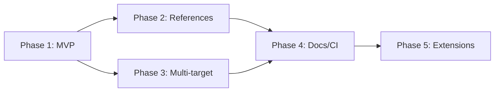

# Seiton CLI `install --skills` 実装計画

copilotcli_skill_investigation.mdの設計を受けて、 seiton CLI (C# / NativeAOT) に適用する具体的な実装計画。

## reference

.github/docs/copilotcli_skill_investigation.md の内容を前提としています。

---

## 1. コマンド体系

### 1.1 コマンド構文

```bash
seiton install --skills [--target claude|copilot] [--output PATH] [--force]
```

### 1.2 フラグ定義

| Flag | Short | Type | Default | Description |
|---|---|---|---|---|
| `--skills` | | `bool` | `false` | Install agent skill files to the workspace. |
| `--target` | `-t` | `claude\|copilot` | `claude` | Target agent platform. `claude` → `.claude/skills/seiton/`, `copilot` → `.github/instructions/`. |
| `--output` | `-o` | `string` | (platform default) | Override the output directory path. |
| `--force` | `-f` | `bool` | `false` | Overwrite existing skill files. |

### 1.3 動作仕様

1. `--skills` が指定されていない場合、ヘルプを表示して exit 0。
2. `--target` に応じた出力先ディレクトリを決定:
   - `claude` → `<cwd>/.claude/skills/seiton/`
   - `copilot` → `<cwd>/.github/instructions/seiton/`
3. 出力先に既存ファイルがある場合:
   - `--force` なし → エラー終了 (exit 3)
   - `--force` あり → 上書き
4. skill ファイルを出力先にコピー（ディレクトリごと再帰）。
5. 成功メッセージを stdout に出力。

### 1.4 出力例

```
✅ Skills installed to `.claude/skills/seiton`.

Files:
  .claude/skills/seiton/SKILL.md
  .claude/skills/seiton/references/rules.md
  .claude/skills/seiton/references/fix-mode.md
```

### 1.5 Exit Codes

| Code | Meaning |
|---|---|
| `0` | Success |
| `2` | Invalid options (e.g. unknown `--target` value) |
| `3` | Fatal error (destination exists without `--force`, I/O failure) |

---

## 2. Skill コンテンツ設計

### 2.1 配布する skill ファイル構成

```text
skill/
  SKILL.md
  references/
    rules.md
    fix-mode.md
    configuration.md
```

### 2.2 `SKILL.md` の内容方針

```yaml
---
name: seiton
description: Lint and fix GitHub Actions workflow files and action metadata files using seiton CLI.
---
```

本文に含める内容:

1. seiton とは何か（1-2 文）
2. Quick start: `seiton`, `seiton --fix`, `seiton --fix --dry-run`
3. 主要コマンド一覧（check, fix, init, rules, validate-config）
4. 出力の読み方（text format の構造、exit codes）
5. 推奨ワークフロー（lint → fix --dry-run → fix）
6. エラー時の対処（config エラー、unknown option）
7. references/ への導線

### 2.3 References の役割分担

| File | Content |
|---|---|
| `rules.md` | 全ルール一覧と各ルールの意味・修正方法 |
| `fix-mode.md` | fix モードの詳細（`--dry-run`, `--check`, network flags） |
| `configuration.md` | `seiton.yaml` の設定項目と記述例 |

---

## 3. NativeAOT 対応: コンテンツ同梱方式

### 3.1 方式選定

seiton は NativeAOT (`PublishAot=true`) でビルドされるため、ファイルシステム上の相対パスに依存する方式は使えない。以下の 2 方式を検討する。

| 方式 | Pros | Cons |
|---|---|---|
| A. C# string literal (source generator) | AOT 安全、依存なし、既存パターン踏襲 | ファイルが大きいとソース管理が煩雑 |
| B. EmbeddedResource | ファイルを直接管理できる、バイナリ同梱 | Assembly.GetManifestResourceStream() は AOT 対応済み |

**推奨: B. EmbeddedResource 方式**

理由:
- skill markdown は数 KB 程度で、複数ファイルを管理する必要がある
- `Assembly.GetManifestResourceStream()` は .NET NativeAOT で対応済み
- markdown ファイルをそのまま編集・レビューできる
- init コマンドの string literal 方式は単一テンプレートには適するが、複数ファイル管理には不向き

### 3.2 ファイル配置

```text
src/Seiton/
  Skills/
    SKILL.md
    references/
      rules.md
      fix-mode.md
      configuration.md
```

### 3.3 .csproj 設定

```xml
<ItemGroup>
  <EmbeddedResource Include="Skills\**\*" LogicalName="Skills/%(RecursiveDir)%(Filename)%(Extension)" />
</ItemGroup>
```

### 3.4 リソース読み出しヘルパー

```csharp
internal static class SkillResources
{
    private static readonly Assembly ThisAssembly = typeof(SkillResources).Assembly;

    /// <summary>Get all embedded skill file entries (logical name → content).</summary>
    public static IEnumerable<(string RelativePath, string Content)> GetAllSkillFiles()
    {
        var prefix = "Skills/";
        foreach (var name in ThisAssembly.GetManifestResourceNames())
        {
            if (!name.StartsWith(prefix, StringComparison.Ordinal))
                continue;

            using var stream = ThisAssembly.GetManifestResourceStream(name)!;
            using var reader = new StreamReader(stream);
            var relativePath = name[prefix.Length..];
            yield return (relativePath, reader.ReadToEnd());
        }
    }
}
```

---

## 4. 実装ファイル構成

### 4.1 新規作成ファイル

| File | Responsibility |
|---|---|
| `src/Seiton/Commands/InstallCommand.cs` | install コマンドのロジック |
| `src/Seiton/Skills/SKILL.md` | 配布用 skill 本体 |
| `src/Seiton/Skills/references/rules.md` | ルールリファレンス |
| `src/Seiton/Skills/references/fix-mode.md` | fix モードリファレンス |
| `src/Seiton/Skills/references/configuration.md` | 設定リファレンス |
| `tests/Seiton.Tests/Commands/InstallCommandTests.cs` | コマンドテスト |

### 4.2 変更ファイル

| File | Change |
|---|---|
| `src/Seiton/Program.cs` | `Install(...)` メソッド追加 |
| `src/Seiton/Seiton.csproj` | `EmbeddedResource` 追加 |
| `.github/docs/Seiton_CLI_spec.md` | §1 に `install` コマンド仕様追加 |
| `.github/docs/Seiton_CLI_csharp_spec.md` | C# 実装仕様追加 |

---

## 5. Program.cs への追加

```csharp
/// <summary>Install skill files for coding agents into the workspace.</summary>
/// <param name="skills">Install agent skill files.</param>
/// <param name="target">-t, Target agent platform: claude | copilot.</param>
/// <param name="output">-o, Override the output directory path.</param>
/// <param name="force">-f, Overwrite existing skill files.</param>
public void Install(bool skills = false, string target = "claude", string? output = null, bool force = false)
{
    var code = InstallCommand.Run(skills, target, output, force);
    if (code != 0) Environment.ExitCode = code;
}
```

---

## 6. InstallCommand.cs 実装概要

```csharp
internal static class InstallCommand
{
    public static int Run(bool skills, string target, string? output, bool force)
    {
        if (!skills)
        {
            Console.WriteLine("Usage: seiton install --skills [--target claude|copilot] [--force]");
            return ExitCode.Success;
        }

        // Validate target
        var destDir = ResolveDestination(target, output);
        if (destDir is null)
        {
            Console.Error.WriteLine($"unknown target: {target}. Use 'claude' or 'copilot'.");
            return ExitCode.InvalidOptions;
        }

        // Check existing
        if (Directory.Exists(destDir) && !force)
        {
            Console.Error.WriteLine($"skill directory already exists: {destDir}");
            Console.Error.WriteLine("use --force to overwrite");
            return ExitCode.FatalError;
        }

        // Write files
        var files = SkillResources.GetAllSkillFiles().ToList();
        foreach (var (relativePath, content) in files)
        {
            var filePath = Path.Combine(destDir, relativePath.Replace('/', Path.DirectorySeparatorChar));
            var dir = Path.GetDirectoryName(filePath);
            if (dir is not null && !Directory.Exists(dir))
                Directory.CreateDirectory(dir);
            File.WriteAllText(filePath, content);
        }

        // Success output
        var relativeDestDir = Path.GetRelativePath(Directory.GetCurrentDirectory(), destDir);
        Console.WriteLine($"Skills installed to `{relativeDestDir}`.");
        Console.WriteLine();
        Console.WriteLine("Files:");
        foreach (var (relativePath, _) in files)
        {
            Console.WriteLine($"  {Path.Combine(relativeDestDir, relativePath.Replace('/', Path.DirectorySeparatorChar))}");
        }

        return ExitCode.Success;
    }

    private static string? ResolveDestination(string target, string? output)
    {
        if (output is not null)
            return Path.GetFullPath(output);

        var cwd = Directory.GetCurrentDirectory();
        return target switch
        {
            "claude" => Path.Combine(cwd, ".claude", "skills", "seiton"),
            "copilot" => Path.Combine(cwd, ".github", "instructions", "seiton"),
            _ => null,
        };
    }
}
```

---

## 7. テスト計画

### 7.1 テストケース

| # | Test | Expectation |
|---|---|---|
| 1 | `install --skills` (default target) | `.claude/skills/seiton/SKILL.md` が作成される |
| 2 | `install --skills --target copilot` | `.github/instructions/seiton/SKILL.md` が作成される |
| 3 | `install --skills` (既存あり, `--force` なし) | exit 3, エラーメッセージ |
| 4 | `install --skills --force` (既存あり) | 上書き成功, exit 0 |
| 5 | `install --skills --target unknown` | exit 2, エラーメッセージ |
| 6 | `install` (`--skills` なし) | ヘルプ表示, exit 0 |
| 7 | references/ 配下もコピーされること | 全 embedded resource が展開される |

### 7.2 テスト実装方針

- tmpdir に cwd を切り替えてコマンドを実行
- `File.Exists()` / `File.ReadAllText()` で検証
- EmbeddedResource の内容が正しく展開されることを確認

---

## 8. Skill コンテンツのメンテナンス方針

### 8.1 更新タイミング

- 新ルール追加時 → `references/rules.md` を更新
- CLI フラグ変更時 → `SKILL.md` のコマンド一覧を更新
- config スキーマ変更時 → `references/configuration.md` を更新

### 8.2 同期チェック

CI で以下を検証する（オプション）:

- `SKILL.md` に記載されたコマンドが実際の help と一致するか
- `references/rules.md` のルール一覧が `seiton rules --format json` の出力と一致するか

---

## 9. 将来の拡張

### 9.1 `--target` の追加候補

| Target | 出力先 | 用途 |
|---|---|---|
| `claude` | `.claude/skills/seiton/` | Claude Code / Claude Desktop |
| `copilot` | `.github/instructions/seiton/` | GitHub Copilot custom instructions |
| `cursor` | `.cursor/rules/seiton/` | Cursor rules |

### 9.2 `seiton install` の他のサブ機能（将来）

```bash
seiton install --skills          # skill files
seiton install --config          # seiton.yaml (= init の alias)
seiton install --ci              # CI workflow template
```

`install` をインストール系操作の umbrella コマンドとして位置づけ、将来 `--ci` などを追加できる余地を残す。

---

## 10. CLI Spec への追記内容 (概要)

`Seiton_CLI_spec.md` §1 に以下を追加:

```markdown
### 1.7 `seiton install`

Install agent skill files and other workspace assets.

\`\`\`
seiton install --skills [--target claude|copilot] [--output PATH] [--force]
\`\`\`

- `--skills`: Install agent skill files to the workspace.
- `--target`: Target agent platform (`claude` or `copilot`). Defaults to `claude`.
- `--output`: Override the output directory.
- `--force`: Overwrite existing files.

Exit codes:
- `0`: Success or help displayed.
- `2`: Invalid options.
- `3`: Fatal error (destination exists, I/O failure).
\`\`\`
```

---

## 11. 実装順序

1. `src/Seiton/Skills/SKILL.md` と references を作成
2. `.csproj` に `EmbeddedResource` を追加
3. `SkillResources.cs` ヘルパーを作成
4. `InstallCommand.cs` を作成
5. `Program.cs` に `Install(...)` メソッドを追加
6. テストを作成・実行（Red → Green）
7. CLI spec ドキュメントを更新
8. `dotnet build` + `dotnet test` で全体検証

---

## 12. 優先度付き実装フェーズ

### Phase 1: MVP (Priority: High) — 最小限動くものを出す

**目標**: `seiton install --skills` で SKILL.md が展開できる状態にする。

| # | タスク | 成果物 | 完了条件 |
|---|---|---|---|
| 1-1 | SKILL.md を作成 | `src/Seiton/Skills/SKILL.md` | seiton のコマンド一覧・出力の読み方・推奨ワークフローが記載されている |
| 1-2 | EmbeddedResource 設定 | `Seiton.csproj` 変更 | `dotnet build` で SKILL.md がアセンブリに埋め込まれる |
| 1-3 | SkillResources ヘルパー | `SkillResources.cs` | 埋め込みリソースを列挙・読み出しできる |
| 1-4 | InstallCommand 実装 | `InstallCommand.cs` | `--skills` で `.claude/skills/seiton/` に展開、`--force` 対応 |
| 1-5 | Program.cs 配線 | `Program.cs` 変更 | `seiton install --skills` が動作する |
| 1-6 | 基本テスト | `InstallCommandTests.cs` | テストケース #1, #3, #4, #6 が Green |
| 1-7 | NativeAOT 検証 | — | `dotnet publish -c Release` が成功し、リソース読み出しが動く |

**Phase 1 完了 = リリース可能な最小機能**

---

### Phase 2: References 充実 (Priority: Medium) — コンテンツ拡充

**目標**: agent が実際に有用な指示を得られるだけの reference を揃える。

| # | タスク | 成果物 | 完了条件 |
|---|---|---|---|
| 2-1 | rules.md 作成 | `src/Seiton/Skills/references/rules.md` | 全ルールの ID・概要・修正例が記載されている |
| 2-2 | fix-mode.md 作成 | `src/Seiton/Skills/references/fix-mode.md` | `--fix`, `--dry-run`, `--check`, network flags の使い分けが記載 |
| 2-3 | configuration.md 作成 | `src/Seiton/Skills/references/configuration.md` | seiton.yaml の全設定項目と記述例 |
| 2-4 | テスト追加 | テストケース #7 追加 | references/ 配下が全て展開されることを検証 |

---

### Phase 3: マルチターゲット (Priority: Medium) — copilot 対応

**目標**: `--target copilot` で GitHub Copilot 向けにも展開できるようにする。

| # | タスク | 成果物 | 完了条件 |
|---|---|---|---|
| 3-1 | copilot 出力先ロジック | `InstallCommand.cs` 変更 | `--target copilot` で `.github/instructions/seiton/` に出力 |
| 3-2 | テスト追加 | テストケース #2, #5 追加 | copilot target と unknown target のテストが Green |
| 3-3 | copilot 向けコンテンツ調整 | 必要に応じてコンテンツ分岐 | copilot instructions 形式で有用な出力になっている |

---

### Phase 4: ドキュメント・CI (Priority: Low) — 仕上げ

**目標**: spec 更新と継続的なコンテンツ鮮度保証。

| # | タスク | 成果物 | 完了条件 |
|---|---|---|---|
| 4-1 | CLI spec 更新 | `Seiton_CLI_spec.md` §1.7 追加 | install コマンドの仕様が spec に記載 |
| 4-2 | C# spec 更新 | `Seiton_CLI_csharp_spec.md` 追記 | 実装詳細が spec に記載 |
| 4-3 | コンテンツ同期 CI | GitHub Actions workflow | `seiton rules --format json` と `references/rules.md` の差分検出 |
| 4-4 | README 更新 | `README.md` | install --skills の使い方を記載 |
| 4-5 | docs/ 更新 | `docs/` 配下のドキュメント。usage.md、index.md, installation.md | install --skills の使い方や詳細を記載 |

---

### Phase 5: 拡張 (Priority: Low)

**目標**: cursor 対応や `--ci` など横展開。

| # | タスク | 優先度 | 備考 |
|---|---|---|---|
| 5-1 | `--target cursor` 対応 | Low | `.cursor/rules/seiton/` への展開 |
| 5-2 | `seiton install --ci` | Low | CI workflow テンプレート配布 |
| 5-3 | `--output` カスタムパス | Low | 任意パスへの展開 (Phase 1 で実装しておいてもよい) |

---

### フェーズ間の依存関係



### 判断基準

| 判断ポイント | 推奨 |
|---|---|
| Phase 1 だけでリリースしてよいか？ | **Yes** — SKILL.md 単体でも agent に十分有用 |
| Phase 2 と Phase 3 の順序は？ | コンテンツ (Phase 2) を先にする方が、単一ターゲットでも価値が高い |
| Phase 4 の CI 同期は必須か？ | No — 手動更新で十分な規模。ルール数が 30+ になったら検討 |
| Phase 5 をいつやるか？ | ユーザーからの要望が来てから |

---

## 13. Phase 1 実装結果

### 13.1 実装サマリ

Phase 1 (MVP) を完了。`seiton install --skills` でエージェント向け SKILL.md をワークスペースに展開する機能を実装。

#### 作成ファイル

| File | 役割 |
|------|------|
| `src/Seiton/Skills/SKILL.md` | 配布用 skill コンテンツ (EmbeddedResource) |
| `src/Seiton/Commands/InstallCommand.cs` | install コマンドロジック |
| `src/Seiton/Commands/SkillResources.cs` | 埋め込みリソース読み出しヘルパー |
| `tests/Seiton.Tests/InstallCommandTests.cs` | 8 テストケース |

#### 変更ファイル

| File | 変更内容 |
|------|----------|
| `src/Seiton/Seiton.csproj` | `EmbeddedResource Include="Skills\**\*"` 追加 |
| `src/Seiton/Program.cs` | `Install(...)` メソッド追加 |
| `src/Seiton/Cli/CliOptionSuggester.cs` | `--skills`, `--target` を known options に追加 |

### 13.2 テスト結果

| テストケース | 結果 |
|---|---|
| `Run_Skills_DefaultTarget_CreatesSkillFiles` | ✅ Pass |
| `Run_Skills_ExistingDirectory_WithoutForce_ReturnsFatalError` | ✅ Pass |
| `Run_Skills_ExistingDirectory_WithForce_OverwritesSuccessfully` | ✅ Pass |
| `Run_WithoutSkills_ShowsUsage` | ✅ Pass |
| `Run_Skills_UnknownTarget_ReturnsInvalidOptions` | ✅ Pass |
| `Run_Skills_CopilotTarget_CreatesSkillFiles` | ✅ Pass |
| `Run_Skills_OutputsInstalledFilePaths` | ✅ Pass |
| `Run_Skills_CustomOutput_CreatesAtSpecifiedPath` | ✅ Pass |

Full suite: 2198 tests passed, 0 failed.

### 13.3 パフォーマンス

このコマンドは CLI ファイル書き出し操作であり、パーサー/リンターのホットパスではない。

- **実行特性**: I/O bound (EmbeddedResource 読み出し + ファイル書き込み)
- **メモリ**: SKILL.md 1 ファイル (~3KB) のみ。List のアロケーションは 1 回。
- **ベンチマーク**: 不要（parser/linter コード変更なし。`Seiton.Core/Parsing/` および `Seiton.Core/Linting/` に変更なし）
- **既存ベンチマークへの影響**: なし（CLI プロジェクトのコード追加のみで、Core ライブラリは未変更）

### 13.4 NativeAOT 検証

- `dotnet publish src/Seiton -c Release` 成功
- 生成バイナリで `seiton install --skills` / `seiton install --skills --target copilot` 動作確認済み
- `Assembly.GetManifestResourceStream()` は NativeAOT で正常動作

### 13.5 レビュー指摘と対応

| # | 指摘 | 対応 |
|---|---|---|
| 1 | 出力のエモジが plan にあるが既存 CLI スタイルと合わない | 既存スタイルに合わせエモジなしで実装 |
| 2 | copilot target は Phase 3 だが実装は trivial | コード自体は Phase 1 に含め、テストも追加 |
| 3 | `--output` は Phase 5 だが trivial | Phase 1 で実装済み、テスト追加 |
| 4 | ConsoleAppFramework が default 値を `@"claude"` と表示 | フレームワーク仕様。機能的には問題なし |
| 5 | CliOptionSuggester に `--skills`, `--target` 未追加 | 追加済み |

### 13.6 Phase 1 完了状態

- [x] 1-1: SKILL.md 作成
- [x] 1-2: EmbeddedResource 設定
- [x] 1-3: SkillResources ヘルパー
- [x] 1-4: InstallCommand 実装
- [x] 1-5: Program.cs 配線
- [x] 1-6: 基本テスト (8 cases, all green)
- [x] 1-7: NativeAOT 検証

---

## 14. Phase 2 実装結果

### 14.1 実装サマリ

Phase 2 (References 充実) を完了。agent が参照できる詳細リファレンスファイルを追加。

#### 作成ファイル

| File | 役割 |
|------|------|
| `src/Seiton/Skills/references/rules.md` | 全 61 ルールの ID・severity・fix 対応・scope・カテゴリ分類 |
| `src/Seiton/Skills/references/fix-mode.md` | fix コマンド・フラグ・exit code・network 要件 |
| `src/Seiton/Skills/references/configuration.md` | seiton.yaml の全スキーマと common patterns |

#### 変更ファイル

| File | 変更内容 |
|------|----------|
| `src/Seiton/Skills/SKILL.md` | 末尾に References セクション追加 |
| `tests/Seiton.Tests/InstallCommandTests.cs` | `Run_Skills_DeploysReferenceFiles` テスト追加 |

### 14.2 テスト結果

| テストケース | 結果 |
|---|---|
| `Run_Skills_DeploysReferenceFiles` | ✅ Pass |

Full suite: 2199 tests passed, 0 failed.

### 14.3 パフォーマンス

- **実行特性**: コンテンツ追加のみ（4 ファイル, 合計 ~12KB）
- **ベンチマーク**: 不要（parser/linter コード変更なし）
- **既存ベンチマークへの影響**: なし

### 14.4 設計判断

- `.csproj` 変更不要 — 既存の `Skills\**\*` glob が `references/` を自動包含
- NativeAOT 安全 — EmbeddedResource のみ（リフレクションなし）
- コンテンツは `seiton rules` 出力と `docs/configuration.md` から正確に作成

### 14.5 Phase 2 完了状態

- [x] 2-1: rules.md 作成 (61 rules, categories, opt-in/severity/fix)
- [x] 2-2: fix-mode.md 作成 (commands, flags, exit codes, network)
- [x] 2-3: configuration.md 作成 (full schema, common patterns)
- [x] 2-4: テスト追加 (references/ deployment verified)

---

## 15. Phase 3 実装結果

### 15.1 実装サマリ

Phase 3 (マルチターゲット: copilot 対応) を完了。`--target copilot` で `.github/instructions/seiton/` へ全ファイルを展開する機能のテスト強化と UX 検証を実施。

**注**: copilot 出力先ロジック (3-1) とテスト (3-2) は Phase 1 で先行実装済み。Phase 3 では、包括的テスト追加とコンテンツ適合性評価 (3-3) を実施。

#### 変更ファイル

| File | 変更内容 |
|------|----------|
| `tests/Seiton.Tests/InstallCommandTests.cs` | `Run_Skills_CopilotTarget_CreatesSkillFiles` を拡充（references 検証追加）、`Run_Skills_CopilotTarget_ExistingWithForce_Overwrites` 追加 |

### 15.2 テスト結果

| テストケース | 結果 |
|---|---|
| `Run_Skills_CopilotTarget_CreatesSkillFiles` (拡充) | ✅ Pass |
| `Run_Skills_CopilotTarget_ExistingWithForce_Overwrites` (新規) | ✅ Pass |

Full suite: 2200 tests passed, 0 failed.

### 15.3 パフォーマンス

- **実行特性**: テスト追加のみ、プロダクションコード変更なし
- **ベンチマーク**: 不要（parser/linter コード変更なし）
- **既存ベンチマークへの影響**: なし

### 15.4 UX レビュー結果

| 項目 | 評価 | 理由 |
|------|------|------|
| `--target copilot` の直感性 | ✅ Good | プラットフォーム名と一致 |
| 出力パス `.github/instructions/seiton/` | ✅ Good | Copilot custom instructions の標準位置 |
| 出力メッセージ "Skills installed" | ✅ Good | 概念は "skills" で統一（Playwright 方式と一致） |
| エラーメッセージ | ✅ Good | `"unknown target: X. Use 'claude' or 'copilot'."` — actionable |
| `--force` 動作 | ✅ Good | claude/copilot 両方で同一動作 |

### 15.5 コンテンツ適合性評価 (3-3)

| 評価項目 | 結果 | 理由 |
|----------|------|------|
| Copilot が frontmatter を認識するか | ✅ 問題なし | `name`/`description` は Copilot に無視される（エラーにならない） |
| `applyTo` 追加は必要か | ❌ 不要 | 汎用 instructions として常時利用可能。file-scoped にする必要なし |
| コンテンツ分岐が必要か | ❌ 不要 | Markdown コンテンツはプラットフォーム非依存 |
| Playwright 方式との整合性 | ✅ 一致 | 同一コンテンツを全ターゲットに配布 |

**結論**: コンテンツ分岐は不要。同一の EmbeddedResource を両ターゲットに展開する現行方式が最適。

### 15.6 Phase 3 完了状態

- [x] 3-1: copilot 出力先ロジック (Phase 1 で先行実装済み)
- [x] 3-2: テスト (Phase 1 で基本実装 + Phase 3 で拡充)
- [x] 3-3: copilot 向けコンテンツ調整 (評価完了: 分岐不要)

---

## 16. Phase 4 実装結果

### 16.1 実装サマリ

Phase 4 (ドキュメント・CI) を完了。CLI spec、C# spec、Go spec、README、ユーザードキュメントに `install` コマンドの仕様を追記。

#### 変更ファイル

| File | 変更内容 |
|------|----------|
| `.github/docs/Seiton_CLI_spec.md` | §1.7 `seiton install` 追加 |
| `.github/docs/Seiton_CLI_csharp_spec.md` | §4.4 subcommand mapping に install 追加、§6.6 InstallCommand 実装詳細追加 |
| `.github/docs/Seiton_CLI_go_spec.md` | §4.3 subcommand detection に install 追加、§4.4 mapping に install 行追加 |
| `README.md` | Quick Start に `seiton install --skills` の使い方追加 |
| `docs/usage.md` | `### seiton install` セクション追加（全フラグ説明） |
| `docs/index.md` | Key Features テーブルに Agent skill install 追加 |
| `docs/installation.md` | Next Steps に agent integration 追加 |

### 16.2 パフォーマンス

- **実行特性**: ドキュメント変更のみ。`src/` 変更なし。
- **ベンチマーク**: 不要（parser/linter コード変更なし）
- **既存ベンチマークへの影響**: なし

### 16.3 テスト結果

Full suite: 2200 tests passed, 0 failed (ドキュメント変更のためコード影響なし)。

### 16.4 Spec 整合性検証

| 検証項目 | 結果 |
|----------|------|
| CLI spec §1.7 ↔ 実装の exit code | ✅ 一致 (0/2/3) |
| CLI spec §1.7 ↔ 実装のフラグ名 | ✅ 一致 (`--skills`, `--target`, `--output`, `--force`) |
| C# spec §4.4 ↔ Program.cs の Install メソッド | ✅ 一致 |
| C# spec §6.6 ↔ InstallCommand.cs 実装 | ✅ 一致 |
| Go spec §4.4 ↔ CLI spec §1.7 | ✅ 一致 (将来の Go 実装向け placeholder) |
| README ↔ CLI spec | ✅ 一致 (コマンド例が spec のフラグと整合) |
| docs/usage.md ↔ CLI spec | ✅ 一致 |

### 16.5 レビュー指摘と対応

| # | 指摘 | 対応 |
|---|---|---|
| 1 | Go spec の subcommand detection テキストに `install` 未記載 | 追記済み |
| 2 | Go spec §4.4 mapping テーブルに `install` 未記載 | 追記済み |

### 16.6 4-3 (CI コンテンツ同期) の判断

プラン §12 の判断基準に従い、CI ワークフローは**作成しない**。

理由:
- ルール数 61 (30+ だが更新頻度は低い)
- `references/rules.md` の更新は新ルール追加時に手動で十分
- CI 同期の ROI は現時点では低い

将来の再評価トリガー:
- ルール数が 100+ になった場合
- `references/rules.md` の乖離が実際に発生した場合

### 16.7 Phase 4 完了状態

- [x] 4-1: CLI spec 更新 (§1.7 追加)
- [x] 4-2: C# spec 更新 (§4.4, §6.6 追加)
- [x] 4-3: コンテンツ同期 CI (評価完了: 不要と判断)
- [x] 4-4: README 更新
- [x] 4-5: docs/ 更新 (usage.md, index.md, installation.md)

---

## 17. Phase 5 実装結果

### 17.1 実装サマリ

Phase 5 (拡張) を完了。`--target cursor` 対応、`seiton install --ci` CI ワークフローテンプレート配布、`--output` カスタムパス (Phase 1 で実装済み確認) の 3 タスク。

#### 変更ファイル

| File | 変更内容 |
|------|----------|
| `src/Seiton/Commands/InstallCommand.cs` | `--ci` 対応追加、`cursor` ターゲット追加、`InstallSkills`/`InstallCi` に分離 |
| `src/Seiton/Commands/CiWorkflowResources.cs` | 新規: CI テンプレート読み出しヘルパー |
| `src/Seiton/CiTemplates/seiton.yml` | 新規: CI workflow テンプレート (SARIF 出力、GitHub Advanced Security 連携) |
| `src/Seiton/Seiton.csproj` | `CiTemplates` を EmbeddedResource に追加 |
| `src/Seiton/Program.cs` | `Install()` に `ci` パラメータ追加、`--target` doc comment 更新 |
| `src/Seiton/Cli/CliOptionSuggester.cs` | `--ci` を known options に追加 |
| `tests/Seiton.Tests/InstallCommandTests.cs` | cursor target テスト + CI テスト 5 件追加 (計 16 テスト) |
| `.github/docs/Seiton_CLI_spec.md` | §1.7 に `--ci`、`--target cursor` 追加 |
| `.github/docs/Seiton_CLI_csharp_spec.md` | §4.4 mapping と §6.6 に `ci` パラメータ、`CiWorkflowResources` 追加 |
| `.github/docs/Seiton_CLI_go_spec.md` | §4.4 mapping に `--ci` 追加 |
| `README.md` | cursor と `--ci` の使い方追加 |
| `docs/usage.md` | cursor ターゲット、`--ci` セクション追加 |
| `docs/index.md` | Agent skill install 説明に Cursor 追加 |

### 17.2 テスト結果

Full suite: 2206 tests passed, 0 failed.

新規テスト:
| テストケース | 結果 |
|---|---|
| `Run_Skills_CursorTarget_CreatesSkillFiles` | ✅ Pass |
| `Run_Ci_CreatesWorkflowFile` | ✅ Pass |
| `Run_Ci_ExistingFile_WithoutForce_ReturnsFatalError` | ✅ Pass |
| `Run_Ci_ExistingFile_WithForce_Overwrites` | ✅ Pass |
| `Run_Ci_CustomOutput_CreatesAtSpecifiedPath` | ✅ Pass |
| `Run_SkillsAndCi_BothInstalled` | ✅ Pass |

### 17.3 パフォーマンス

- **実行特性**: CLI ファイル書き出し操作。パーサー/リンターのホットパスではない。
- **ベンチマーク**: 不要（`Seiton.Core/Parsing/` および `Seiton.Core/Linting/` に変更なし）
- **性能影響**: なし。EmbeddedResource 読み出し + ファイル書き込みのみ。

### 17.4 UX レビュー結果

| 項目 | 評価 | 理由 |
|------|------|------|
| `--target cursor` の直感性 | ✅ Good | プラットフォーム名と一致、`.cursor/rules/` は Cursor 標準パス |
| `--ci` フラグの直感性 | ✅ Good | "CI ワークフローのインストール" を端的に表現 |
| 両フラグ併用 (`--skills --ci`) | ✅ Good | 独立した資産を一度にインストール可能 |
| `--output` のセマンティクス | ⚠️ Acceptable | `--skills`+`--ci` 併用時は skills にのみ適用。ドキュメントで明記済み |
| CI テンプレートの内容 | ✅ Good | SARIF + GitHub Advanced Security 連携、適切な permissions |
| エラーメッセージ | ✅ Good | `"Use 'claude', 'copilot', or 'cursor'."` — actionable |

### 17.5 レビュー指摘と対応

| # | 指摘 | 対応 |
|---|---|---|
| 1 | CI テンプレートに `security-events: write` 権限不足 | 追加済み (SARIF upload に必要) |
| 2 | `Run_WithoutSkills_ShowsUsage` と `Run_NoFlags_ShowsUsage` が重複 | 後者を削除 |

### 17.6 5-3 (`--output` カスタムパス) の判断

Phase 1 で既に実装済み。`ResolveSkillDestination` と `InstallCi` の両方が `--output` をサポート。
テスト `Run_Skills_CustomOutput_CreatesAtSpecifiedPath` と `Run_Ci_CustomOutput_CreatesAtSpecifiedPath` で検証済み。

### 17.7 Phase 5 完了状態

- [x] 5-1: `--target cursor` 対応 (`.cursor/rules/seiton/` への展開)
- [x] 5-2: `seiton install --ci` (CI workflow テンプレート配布)
- [x] 5-3: `--output` カスタムパス (Phase 1 で実装済み、テスト確認済み)
