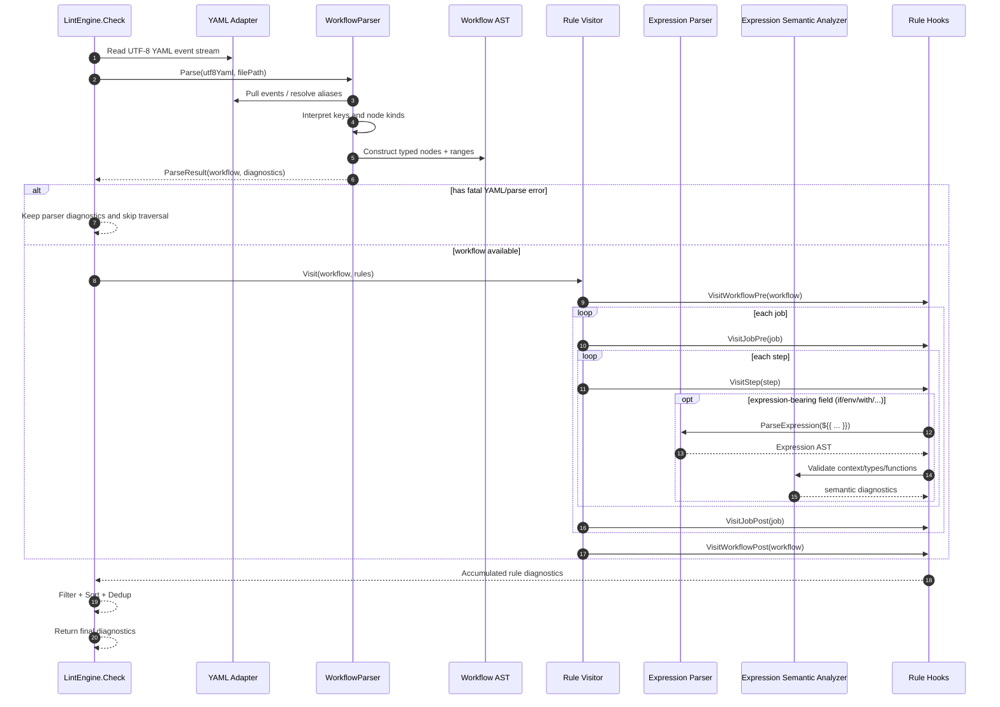

# Seiton Parser Specification

> Defines the specification for syntactic analysis, AST construction, Visitor traversal, and expression validation of GitHub Actions workflow YAML.
> This document is a language-agnostic parser specification. For C# implementation details, see `Seiton_Parser_csharp_spec.md`.
>
> **Cross-document rule**: This spec is the source of truth. When revised, also review and update `Seiton_Parser_csharp_spec.md`, `Seiton_Parser_go_spec.md`, and `parser_implementation_csharp_plan.md` for consistency.

---

## 1. Overall Parser Flow

```
  ┌───────────────────────────────────────────────────────────────┐
  │                     Linter.Check()                            │
  │                                                               │
  │  1. Parse(utf8Yaml)                                           │
  │     1a. Read events via YAML Adapter Layer                    │
  │     1b. Resolve aliases                                       │
  │     1c. Parser.parse() -> Workflow AST                        │
  │     1d. Collect syntax diagnostics                            │
  │  2. Construct Rule set                                        │
  │  3. Visitor.Visit(workflow)                                   │
  │     WorkflowPre -> JobPre -> Step -> JobPost -> WorkflowPost  │
  │  4. Collect diagnostics from each Rule                        │
  │  5. FilterErrors -> Sort + Dedup -> Output                    │
  └───────────────────────────────────────────────────────────────┘
```

### 1.1 Entry Point

```
Parse(utf8Yaml, filePath) -> ParseResult
```

- Return: `ParseResult { Workflow?, Diagnostic[], HasFatalError }`
- Returns `Diagnostic[]` even if YAML parsing itself fails; `Workflow` is null in that case
- Errors during AST construction are accumulated, not immediately fatal

### 1.2 Reference Implementation Correspondence

| actionlint (Go) | seiton |
|---|---|
| `yaml.Unmarshal` -> `yaml.Node` tree | Reads event stream via YAML adapter |
| `parser.resolveAliases()` | Handled in adapter layer or YAML library internals |
| `parser.parse()` -> `*Workflow` | `Parser.parse()` -> `Workflow` AST node |
| `linter.check()` constructs Rules + Visitor | `LintEngine.Check()` with equivalent structure |

### 1.3 End-to-End Call Sequence (Parse -> Interpret -> Evaluate -> Hooks)



---

## 2. AST Definitions

### 2.1 Design Principles

1. All major nodes carry source position (range)
2. Scalar values are stored as UTF-8 byte-sequence offset/length pairs by default; materialized to strings only when needed
3. Nullable fields represent "omitted in YAML"
4. Locations where expressions are allowed have an Expression field
5. Variable-length elements are stored as arrays

### 2.2 Workflow (Root)

| Field | Type | Required | Description |
|---|---|---|---|
| Name | StringNode? | - | `name:` |
| RunName | StringNode? | - | `run-name:` |
| On | Event[] | ✓ | `on:` section |
| Permissions | Permissions? | - | `permissions:` |
| Env | Env? | - | `env:` |
| Defaults | Defaults? | - | `defaults:` |
| Concurrency | Concurrency? | - | `concurrency:` |
| Jobs | map[string, Job] | ✓ | `jobs:` mapping |
| Range | TextRange | ✓ | Source range |

### 2.3 Event (`on:` Section)

Event has the following derived types:

- **WebhookEvent**: Webhook events such as `push`, `pull_request`
- **ScheduledEvent**: `schedule` event
- **WorkflowDispatchEvent**: `workflow_dispatch` event
- **WorkflowCallEvent**: `workflow_call` event
- **RepositoryDispatchEvent**: `repository_dispatch` event

All Events have `EventName` and `Range`.

#### 2.3.1 WebhookEvent

| Field | Type | Description |
|---|---|---|
| Hook | StringNode | Event name |
| Types | StringNode[]? | Activity types |
| Branches | WebhookEventFilter? | `branches:` filter |
| BranchesIgnore | WebhookEventFilter? | `branches-ignore:` filter |
| Tags | WebhookEventFilter? | `tags:` filter |
| TagsIgnore | WebhookEventFilter? | `tags-ignore:` filter |
| Paths | WebhookEventFilter? | `paths:` filter |
| PathsIgnore | WebhookEventFilter? | `paths-ignore:` filter |
| Workflows | StringNode[]? | `workflows:` for `workflow_run` |

WebhookEventFilter has `Name` (filter name) and `Values` (string array).

#### 2.3.2 ScheduledEvent

| Field | Type | Description |
|---|---|---|
| Schedules | ScheduleEntry[] | List of cron entries |

ScheduleEntry: `Cron` (StringNode?, required), `Timezone` (StringNode?)

#### 2.3.3 WorkflowDispatchEvent

| Field | Type | Description |
|---|---|---|
| Inputs | map[string, DispatchInput]? | Input definitions |

DispatchInput: `Name`, `Description?`, `Required?`, `Default?`, `Type` (None/String/Number/Boolean/Choice/Environment), `Options?`

#### 2.3.4 WorkflowCallEvent

| Field | Type | Description |
|---|---|---|
| Inputs | WorkflowCallEventInput[]? | Input definitions |
| Secrets | map[string, Secret]? | Secret definitions |
| Outputs | map[string, Output]? | Output definitions |

WorkflowCallEventInput: `Name`, `Id` (lower-case), `Description?`, `Required?`, `Default?`, `Type` (Invalid/Boolean/Number/String, required)

WorkflowCallEventSecret: `Name`, `Description?`, `Required?`

WorkflowCallEventOutput: `Name`, `Description?`, `Value` (required)

#### 2.3.5 RepositoryDispatchEvent

| Field | Type | Description |
|---|---|---|
| Types | StringNode[]? | Custom event types |

### 2.4 Job

| Field | Type | Required | Description |
|---|---|---|---|
| Id | StringNode | ✓ | Job ID |
| Name | StringNode? | - | `name:` |
| Needs | StringNode[]? | - | `needs:` |
| RunsOn | Runner? | ※ | `runs-on:` (required for normal jobs) |
| Permissions | Permissions? | - | `permissions:` |
| Environment | Environment? | - | `environment:` |
| Concurrency | Concurrency? | - | `concurrency:` |
| Outputs | map[string, Output]? | - | `outputs:` |
| Env | Env? | - | `env:` |
| Defaults | Defaults? | - | `defaults:` |
| If | StringNode? | - | `if:` |
| Steps | Step[]? | ※ | `steps:` (required for normal jobs) |
| TimeoutMinutes | FloatNode? | - | `timeout-minutes:` (> 0) |
| Strategy | Strategy? | - | `strategy:` |
| ContinueOnError | BoolNode? | - | `continue-on-error:` |
| Container | Container? | - | `container:` |
| Services | Services? | - | `services:` |
| WorkflowCall | WorkflowCall? | ※ | `uses:` reusable workflow call |

### 2.5 Step

| Field | Type | Required | Description |
|---|---|---|---|
| Id | StringNode? | - | `id:` |
| If | StringNode? | - | `if:` |
| Name | StringNode? | - | `name:` |
| Exec | ExecRun or ExecAction | ✓ | Execution content |
| Env | Env? | - | `env:` |
| ContinueOnError | BoolNode? | - | `continue-on-error:` |
| TimeoutMinutes | FloatNode? | - | `timeout-minutes:` (> 0) |

**ExecRun**: `Run` (required), `Shell?`, `WorkingDirectory?`
**ExecAction**: `Uses` (required), `Inputs?` (`with:`), `Entrypoint?` (docker only), `Args?` (docker only)

### 2.6 Common Node Types

| Node | Fields | Description |
|---|---|---|
| **StringNode** | Value, Quoted, Range | Positioned string value. Can determine whether it contains `${{` |
| **BoolNode** | Value, Expression?, Range | Boolean literal or expression |
| **IntNode** | Value, Expression?, Range | Integer literal or expression |
| **FloatNode** | Value, Expression?, Range | Floating-point literal or expression |

### 2.7 Permissions

- **scalar form**: `read-all` / `write-all` / `{}`
- **mapping form**: scope -> value dictionary

### 2.8 Env

- **expression form**: Entire `env` is `${{ }}`
- **mapping form**: variable name -> value dictionary

### 2.9 Defaults

- Only `run` key (required)
- Inside `run`: `shell?`, `working-directory?`

### 2.10 Concurrency

- **scalar form**: group name only
- **mapping form**: `group` (required), `cancel-in-progress?`

### 2.11 Environment

- **scalar form**: name only
- **mapping form**: `name` (required), `url?`, `deployment?`

### 2.12 Runner (runs-on)

- **scalar / sequence**: label specification
- **mapping**: `labels` + `group`
- **expression**: labels specified via `${{ }}`

### 2.13 Strategy / Matrix

Strategy: `matrix?`, `fail-fast?`, `max-parallel?` (> 0)

Matrix:
- **expression form**: Entire value is `${{ }}`
- **mapping form**: `include?`, `exclude?`, custom rows
- Custom row: expression or array of values

### 2.14 Container / Services

Container: `image` (required), `credentials?`, `env?`, `ports?`, `volumes?`, `options?`

- **scalar form**: image name only
- **mapping form**: all fields above

Services: Dictionary of named Services. Each Service has a Container.

Credentials: `username` + `password` (both required), or expression.

### 2.15 WorkflowCall (job-level reusable workflow)

`uses` (required), `inputs?` (`with:`), `secrets?` (mapping or `"inherit"`)

---

## 3. Parse Algorithms

### 3.1 Basic Design

- **Hand-written recursive descent** over YAML event stream
- Parser depends only on the YAML adapter's read contract
- Errors are accumulated; **parsing does not abort** (multi-error recovery)

### 3.2 Workflow Top-Level Parse

```
ParseWorkflow(utf8Yaml) -> ParseResult
  1. reader.SkipHeader()
  2. expect MappingStart -> workflow root
  3. mapping traversal:
     switch by key:
       "name"         -> parseString -> workflow.Name
       "run-name"     -> parseString -> workflow.RunName
       "on"           -> ParseEvents -> workflow.On
       "permissions"  -> ParsePermissions -> workflow.Permissions
       "env"          -> ParseEnv -> workflow.Env
       "defaults"     -> ParseDefaults -> workflow.Defaults
       "concurrency"  -> ParseConcurrency -> workflow.Concurrency
       "jobs"         -> ParseJobs -> workflow.Jobs
       other          -> UnexpectedKey error + SkipValue
  4. Required key validation: error if "on" or "jobs" missing
  5. return ParseResult(workflow, diagnostics, hasFatalError)
```

### 3.3 Mapping Traversal Pattern

Generic routine:

```
ParseMapping(sectionName, allowEmpty, caseSensitive):
  1. null scalar -> allowEmpty ? ok : error "should not be empty"
  2. expect MappingStart
  3. duplicate detection via seen keys (lower-case if case-insensitive)
  4. for each key:
     a. parseString to read key
     b. "<<" (YAML merge key) -> error
     c. duplicate check -> error if dup
     d. yield (id, keyNode, valueEvent) to caller
  5. if not allowEmpty and 0 entries -> error
```

### 3.4 Events Parse (`on:` Section)

`on:` takes 3 forms:

1. **scalar**: `on: push` -> single event
2. **sequence**: `on: [push, pull_request]` -> multiple events
3. **mapping**: `on: { push: { branches: [main] } }` -> events with config

```
ParseEvents(node):
  switch kind:
    Scalar  -> parseEventWithNoConfig(scalar) -> [Event]
    Sequence -> for each item: parseEventWithNoConfig(scalar) -> [Event]
    Mapping  -> for each entry:
      switch eventName:
        "schedule"            -> ParseScheduleEvent
        "workflow_dispatch"   -> ParseWorkflowDispatchEvent
        "repository_dispatch" -> ParseRepositoryDispatchEvent
        "workflow_call"       -> ParseWorkflowCallEvent
        "image_version"       -> ParseImageVersionEvent
        other                 -> ParseWebhookEvent
```

#### 3.4.1 parseEventWithNoConfig

When the scalar is an event name:
- `"schedule"` -> error (mapping required)
- `"repository_dispatch"` / `"workflow_dispatch"` / `"workflow_call"` -> empty typed event
- other -> `WebhookEvent { Hook = name }`

#### 3.4.2 WebhookEvent Parse

```
ParseWebhookEvent(name, configNode):
  mapping traversal:
    "types"            -> parseStringOrStringSequence
    "branches"         -> parseWebhookEventFilter
    "branches-ignore"  -> parseWebhookEventFilter
    "tags"             -> parseWebhookEventFilter
    "tags-ignore"      -> parseWebhookEventFilter
    "paths"            -> parseWebhookEventFilter
    "paths-ignore"     -> parseWebhookEventFilter
    "workflows"        -> parseStringOrStringSequence   (workflow_run only)
    other              -> unexpectedKey
```

#### 3.4.3 Exclusive Filter Validation

Validate after mapping traversal:
- `branches` and `branches-ignore` are mutually exclusive
- `tags` and `tags-ignore` are mutually exclusive
- `paths` and `paths-ignore` are mutually exclusive

#### 3.4.4 Activity Types Validation

Validate against the per-event allowed activity type table.

### 3.5 Permissions Parse

```
ParsePermissions(node):
  if Scalar -> All = parseString
  if Mapping -> for each entry:
    Scopes[id] = { Name = key, Value = parseString(val) }
```

### 3.6 Env Parse

```
ParseEnv(node):
  if Scalar -> Expression = parseExpression (verify entire value is ${{ }})
  if Mapping -> for each entry: Vars[id] = { Name = key, Value = parseString(val, allowEmpty) }
```

**Note**: If the `env:` value is a plain string (not `${{ }}`), it is an error ("expecting ${{ }} expression or mapping").

### 3.7 Defaults Parse

```
ParseDefaults(node):
  mapping traversal:
    "run" -> ParseDefaultsRun(val):
      "shell" -> parseString
      "working-directory" -> parseString
      other -> unexpectedKey
    other -> unexpectedKey
  run is nil -> error "defaults should have run"
```

### 3.8 Concurrency Parse

```
ParseConcurrency(node):
  if Scalar -> group = parseString
  if Mapping:
    "group" -> parseString
    "cancel-in-progress" -> parseBool
    other -> unexpectedKey
  group is nil -> error
```

### 3.9 Jobs Parse

```
ParseJobs(node):
  mapping traversal (case-insensitive):
    for each entry: jobs[id] = ParseJob(keyNode, valNode)
```

### 3.10 Job Parse

```
ParseJob(id, node):
  mapping traversal:
    "name"             -> parseString
    "needs"            -> scalar or sequence of strings
    "runs-on"          -> ParseRunsOn
    "permissions"      -> ParsePermissions
    "environment"      -> ParseEnvironment
    "concurrency"      -> ParseConcurrency
    "outputs"          -> ParseOutputs
    "env"              -> ParseEnv
    "defaults"         -> ParseDefaults
    "if"               -> parseString
    "steps"            -> ParseSteps
    "timeout-minutes"  -> parseTimeoutMinutes (Float, > 0)
    "strategy"         -> ParseStrategy
    "continue-on-error" -> parseBool
    "container"        -> ParseContainer
    "services"         -> ParseServices
    "uses"             -> parseString -> WorkflowCall.Uses
    "with"             -> mapping -> WorkflowCall.Inputs
    "secrets"          -> "inherit" or mapping -> WorkflowCall.Secrets
    other              -> unexpectedKey

  Post-validation:
    if uses present:
      if stepsOnlyKey present -> error
        (runs-on, environment, outputs, env, defaults, steps,
         timeout-minutes, continue-on-error, container are invalid for reusable workflows)
    else:
      steps missing -> error "steps is missing"
      runs-on missing -> error "runs-on is missing"
      callOnlyKey (with, secrets) present -> error
```

#### 3.10.1 Allowed Keys for Reusable Workflow Calls

Keys allowed when calling via `uses`:
- `name`, `uses`, `with`, `secrets`, `needs`, `if`, `permissions`, `concurrency`, `strategy`

All other keys produce a `stepsOnlyKey` error.

### 3.11 Steps Parse

```
ParseSteps(node):
  expect SequenceStart, not empty
  for each item: ParseStep(item)
```

### 3.12 Step Parse

```
ParseStep(node):
  collect all mapping entries (2-pass design):
    Pass 1: determine kind
      "uses" -> if value has "docker://" prefix -> isDocker, else -> isAction
      "run"  -> isRun
      common: "id", "if", "name", "env", "continue-on-error", "timeout-minutes"
    Pass 2: build ExecAction or ExecRun depending on kind
      isAction/isDocker -> parseStepExecAction(entries, isDocker)
      isRun             -> parseStepExecRun(entries)
      unknown           -> error "step must have run or uses"
```

#### 3.12.1 ExecAction Parse

```
parseStepExecAction(entries, isDocker):
  "uses" -> parseString
  "with" -> mapping:
    if isDocker:
      "entrypoint" -> Entrypoint
      "args"       -> Args
      other        -> Inputs[id]
    else:
      all          -> Inputs[id]
  other than common keys -> unexpectedKey
```

#### 3.12.2 ExecRun Parse

```
parseStepExecRun(entries):
  "run"               -> parseString
  "shell"             -> parseString
  "working-directory" -> parseString
  other than common keys -> unexpectedKey
```

### 3.13 RunsOn Parse

```
ParseRunsOn(node):
  if expression(${{ }}) -> Runner { LabelsExpr }
  if Scalar or Sequence -> labels = parseStringOrStringSequence
  if Mapping:
    "labels" -> expression or stringOrSeq
    "group"  -> parseString
    other    -> unexpectedKey
```

### 3.14 Environment Parse

```
ParseEnvironment(node):
  if Scalar -> Name = parseString
  if Mapping:
    "name"       -> parseString (required)
    "url"        -> parseString
    "deployment" -> parseBool
    other -> unexpectedKey
  name is nil -> error
```

### 3.15 Strategy / Matrix Parse

```
ParseStrategy(node):
  "matrix"       -> ParseMatrix
  "fail-fast"    -> parseBool
  "max-parallel" -> parseInt (> 0)
  other -> unexpectedKey

ParseMatrix(node):
  if Scalar -> expression
  if Mapping:
    "include" -> parseMatrixCombinations
    "exclude" -> parseMatrixCombinations
    other     -> custom row:
      if Scalar -> expression
      if Sequence -> [parseRawYAMLValue(item)]
```

### 3.16 Container Parse

```
ParseContainer(section, node):
  if Scalar -> Image = parseString
  if Mapping:
    "image"       -> parseString (required)
    "credentials" -> ParseCredentials
    "env"         -> ParseEnv
    "ports"       -> stringSequence
    "volumes"     -> stringSequence
    "options"     -> parseString
    other -> unexpectedKey
  image nil -> error
```

### 3.17 Services Parse

```
ParseServices(node):
  if expression -> Services { Expression }
  if Mapping:
    for each entry:
      services[id] = Service { name, ParseContainer("services", val) }
```

### 3.18 Credentials Parse

```
ParseCredentials(node):
  if expression -> Credentials { Expression }
  if Mapping:
    "username" -> parseString (required)
    "password" -> parseString (required)
    other -> unexpectedKey
  both nil -> error
```

---

## 4. Scalar Parsing Helpers

### 4.1 parseString

```
parseString(node, allowEmpty):
  expect Scalar
  if !allowEmpty && value == "" -> error
  return StringNode { Value, Quoted, Range }
```

### 4.2 parseBool

```
parseBool(node):
  if tag == !!str -> parseExpression -> BoolNode { Expression }
  if tag == !!bool -> BoolNode { value == "true" }
  else -> error
```

### 4.3 parseInt

```
parseInt(node):
  if tag == !!str -> parseExpression -> IntNode { Expression }
  if tag == !!int -> parse int literal -> IntNode { Value }
  else -> error
```

### 4.4 parseFloat

```
parseFloat(node):
  if tag == !!str -> parseExpression -> FloatNode { Expression }
  if tag == !!int or !!float -> parse float literal -> FloatNode { Value }
  else -> error
```

### 4.5 parseExpression

```
parseExpression(node, expecting):
  verify value matches ${{ ... }} form
  if not -> error "expecting ${{ }} or {expecting}"
  return StringNode
```

### 4.6 mayParseExpression

```
mayParseExpression(node):
  if tag is !!str and value is ${{ ... }} -> return StringNode
  otherwise -> return null
```

### 4.7 parseStringOrStringSequence

```
parseStringOrStringSequence(section, node, allowEmpty, allowElemEmpty):
  if Scalar:
    if null tag && allowEmpty -> []
    else -> [parseString]
  if Sequence:
    for each item: parseString
```

### 4.8 Scalar Tag Information

The parser uses tag information (`!!str`, `!!bool`, `!!int`, `!!float`, `!!null`) obtained from the YAML library, normalized into a custom enum. For libraries that do not provide tag information, fallback estimation is performed based on value content (`"true"` / `"false"` / numeric patterns).

---

## 5. Error Recovery Strategy

### 5.1 Basic Policy

1. Do **not stop** parsing on a single error
2. Errors beyond mapping/sequence boundaries are recovered via subtree skip
3. Return as many diagnostics as possible

### 5.2 Recovery by Pattern

| Situation | Recovery |
|---|---|
| Unknown key | error + SkipCurrentNode for value |
| Type mismatch | error + SkipCurrentNode |
| Missing required key | aggregate error after mapping traversal |
| Exclusive constraint violation | aggregate error after mapping traversal |
| YAML parse failure | Convert to `Diagnostic[]`, `Workflow = null` |
| Duplicate key | error + ignore the later key (first wins) |

---

## 6. Expression Parser Specification

### 6.1 Overview

A recursive descent parser for GitHub Actions `${{ }}` expressions.

### 6.2 Grammar (EBNF)

```
Expression    := LogicalOr
LogicalOr     := LogicalAnd ( "||" LogicalAnd )*
LogicalAnd    := Equality ( "&&" Equality )*
Equality      := Comparison ( ( "==" | "!=" ) Comparison )*
Comparison    := Primary ( ( "<" | "<=" | ">" | ">=" ) Primary )*
Primary       := UnaryExpr
UnaryExpr     := "!" UnaryExpr | Postfix
Postfix       := Atom ( "." Ident | "." "*" | "[" Index "]" | "(" ArgList ")" )*
Atom          := Ident | StringLit | IntLit | FloatLit | "true" | "false" | "null" | "(" Expression ")"
ArgList       := Expression ( "," Expression )*
Index         := Expression
```

**Note**: The GitHub Actions expression specification does not include arithmetic operators (`+`, `-`, `*`, `/`, `%`). actionlint does not parse these either.

### 6.3 Token Types

| Token | Symbol |
|---|---|
| `Ident` | alphanumeric + `_` + `-` |
| `String` | `'...'` (single-quoted, `''` for escape) |
| `Int` | integer literal (decimal / `0x` hex) |
| `Float` | floating-point literal |
| `(` `)` `[` `]` `.` `!` | symbols |
| `<` `<=` `>` `>=` `==` `!=` | comparison operators |
| `&&` `\|\|` | logical operators |
| `*` | wildcard (`*` in `foo.*`) |
| `,` | function argument separator |

### 6.4 Expression AST Nodes

| Node Type | Description |
|---|---|
| `VariableNode` | Context variables such as `github`, `env`, `secrets` |
| `ObjectDerefNode` | `foo.bar` — property access |
| `ArrayDerefNode` | `foo.*` — wildcard access |
| `IndexAccessNode` | `foo['bar']` or `foo[0]` — index access |
| `NotOpNode` | `!expr` |
| `CompareOpNode` | `==`, `!=`, `<`, `<=`, `>`, `>=` |
| `LogicalOpNode` | `&&`, `\|\|` |
| `FuncCallNode` | `contains(...)`, `startsWith(...)`, etc. |
| `NullNode` | `null` literal |
| `BoolNode` | `true` / `false` literal |
| `IntNode` | Integer literal |
| `FloatNode` | Floating-point literal |
| `StringNode` | String literal |

### 6.5 Expression Visitor

The expression AST is traversed using the `VisitExprNode(node, parent, entering)` pattern. `entering = true` fires before visiting children; `entering = false` fires after visiting children.

---

## 7. Expression Semantic Analysis

### 7.1 Built-in Function Signatures

| Function | Parameters | Return | Variadic |
|---|---|---|---|
| `contains` | (string, string) or (array, any) | bool | No |
| `startsWith` | (string, string) | bool | No |
| `endsWith` | (string, string) | bool | No |
| `format` | (string, any...) | string | Yes |
| `join` | (array\|string, string?) | string | No |
| `toJSON` | (any) | string | No |
| `fromJSON` | (string) | any | No |
| `hashFiles` | (string...) | string | Yes |
| `success` | () | bool | No |
| `always` | () | bool | No |
| `failure` | () | bool | No |
| `cancelled` | () | bool | No |

### 7.2 Context Availability Validation

The root identifiers of expressions (`github`, `env`, `steps`, `job`, `runner`, `secrets`, `strategy`, `matrix`, `needs`, `inputs`, `vars`) have different availability depending on usage location (workflow, job, step).

| Context | workflow level | job level | step level |
|---|---|---|---|
| `github` | ✓ | ✓ | ✓ |
| `env` | ✓ | ✓ | ✓ |
| `vars` | ✓ | ✓ | ✓ |
| `job` | - | ✓ | ✓ |
| `steps` | - | - | ✓ |
| `runner` | - | ✓ | ✓ |
| `secrets` | - | ✓ | ✓ |
| `strategy` | - | ✓ | ✓ |
| `matrix` | - | ✓ | ✓ |
| `needs` | - | ✓ | ✓ |
| `inputs` | ✓ | ✓ | ✓ |
| `hashFiles` | - | ✓ | ✓ |
| `success`/`failure`/`always`/`cancelled` | - | ✓ | ✓ |

**Note**: This is a simplified table. Strictly, availability differs by key position (`if:` / `env:` / `with:`, etc.). The complete availability table is managed as generated data.

### 7.3 Type Validation

Expression type system:
- `AnyType` / `NullType` / `BoolType` / `NumberType` / `StringType`
- `ObjectType` (properties map) / `ArrayType` (element type)
- `EmptyObjectType` / `EmptyArrayType`

Type inference is performed bottom-up while traversing the expression.

---

## 8. Visitor / Pass Specification

### 8.1 Pass Interface

A Pass has the following callbacks:

- `VisitWorkflowPre(workflow)` — Start of Workflow traversal
- `VisitWorkflowPost(workflow)` — End of Workflow traversal
- `VisitJobPre(job)` — Start of Job traversal
- `VisitJobPost(job)` — End of Job traversal
- `VisitStep(step)` — Step visit

### 8.2 Traversal Order

```
VisitWorkflowPre(workflow)
  for each job in workflow.Jobs:
    VisitJobPre(job)
    for each step in job.Steps:
      VisitStep(step)
    VisitJobPost(job)
VisitWorkflowPost(workflow)
```

This depth-first order is identical to actionlint.

### 8.3 Rule Interface

Rule extends Pass and adds:

- `Id` — Rule identifier
- `Name` — Display name
- `GetDiagnostics()` — Returns accumulated diagnostics
- `SetConfig(config)` — Configuration injection

Each Rule inspects the AST within Pass callbacks and accumulates diagnostics internally.

---

## 9. Generated Data Specification

### 9.1 Targets

| Data | Source |
|---|---|
| Webhook event + activity types | GitHub Docs |
| Context availability table | GitHub Docs |
| Special function names | GitHub Docs |
| Popular actions metadata | Fetched from action.yml |

### 9.2 Update Policy

- Fetch external data via update command or script
- Commit generated results; CI detects diffs -> auto PR
- Parser and rules do not make network requests at runtime

---

## 10. Diagnostic Specification

### 10.1 Diagnostic Structure

| Field | Type | Description |
|---|---|---|
| Severity | enum | Info / Warning / Error |
| Message | string | Human-readable error message |
| Location | TextRange | Source position |
| RuleId | string? | Applicable rule ID (for rule-originated diagnostics) |
| RelatedLocations | TextRange[]? | Related positions (e.g., opposing side of exclusive constraint) |
| Help | string? | Fix suggestion |
| FilePath | string? | Source file path propagated from Parse/Lint entrypoint |

### 10.2 Location Policy

| Situation | Primary location |
|---|---|
| Unknown key | Key position |
| Type mismatch | Value position |
| Missing required key | Section start position |
| Exclusive constraint violation | Position of the causative key |
| Duplicate key | Position of the 2nd key |
| Expression error | Offset within expression mapped to source position |

---

## 11. Allowed Keys

Below is the complete list of allowed keys for each mapping section. All unknown keys produce a diagnostic error.

### 11.1 Workflow Top-Level

```
name, run-name, on, permissions, env, defaults, concurrency, jobs
```

### 11.2 Job

```
name, needs, runs-on, permissions, environment, concurrency, outputs,
env, defaults, if, steps, timeout-minutes, strategy, continue-on-error,
container, services, uses, with, secrets, snapshot
```

### 11.3 Step

```
id, if, name, uses, run, with, env, shell, working-directory,
continue-on-error, timeout-minutes
```

### 11.4 Strategy

```
matrix, fail-fast, max-parallel
```

### 11.5 Defaults

```
run
```

### 11.6 defaults.run

```
shell, working-directory
```

### 11.7 Concurrency

```
group, cancel-in-progress
```

### 11.8 Container

```
image, credentials, env, ports, volumes, options
```

### 11.9 Credentials

```
username, password
```

### 11.10 Environment

```
name, url, deployment
```

### 11.11 runs-on (mapping form)

```
labels, group
```

### 11.12 workflow_dispatch

```
inputs
```

### 11.13 workflow_dispatch input

```
description, required, default, type, options
```

### 11.14 workflow_call

```
inputs, secrets, outputs
```

### 11.15 workflow_call input

```
description, required, default, type
```

### 11.16 workflow_call secret

```
description, required
```

### 11.17 workflow_call output

```
description, value
```

### 11.18 repository_dispatch

```
types
```

### 11.19 schedule entry

```
cron, timezone
```

### 11.20 Webhook event options

Allowed options per event are defined in the event spec table. Common candidates:
```
types, branches, branches-ignore, tags, tags-ignore,
paths, paths-ignore, workflows, inputs, secrets, outputs
```

---

## 12. Mutual Constraints and Conditional Requirements

| Section | Constraint |
|---|---|
| Workflow | `on` required, `jobs` required |
| Job (normal) | `steps` required, `runs-on` required |
| Job (reusable) | `uses` required; `steps` / `runs-on` / `environment` / `outputs` / `env` / `defaults` / `timeout-minutes` / `continue-on-error` / `container` are forbidden |
| Job | `uses` and `steps` are mutually exclusive |
| Job | `with` / `secrets` allowed only when `uses` is present |
| Step | `run` and `uses` are mutually exclusive; one is required |
| Webhook event | `branches` and `branches-ignore` are mutually exclusive |
| Webhook event | `tags` and `tags-ignore` are mutually exclusive |
| Webhook event | `paths` and `paths-ignore` are mutually exclusive |
| Concurrency | `group` is required |
| Container | `image` is required |
| Credentials | Both `username` and `password` are required |
| Environment | `name` is required |
| workflow_call input | `type` is required |
| workflow_call output | `value` is required |
| Defaults | `run` is required |
| max-parallel | > 0 |
| timeout-minutes | > 0 |
| schedule | `cron` is required |

---

## 13. Case Sensitivity Rules

| Section | Key comparison | Notes |
|---|---|---|
| Workflow top-level keys | case-sensitive | |
| Job ID | case-insensitive | duplicate detection |
| Job internal keys | case-sensitive | |
| Step internal keys | case-sensitive | |
| Matrix row name | case-insensitive | |
| Env variable name | case-insensitive | |
| Permission scope | case-insensitive | |
| workflow_dispatch input name | case-insensitive | |
| with input name | case-insensitive | |
| Event name | case-sensitive | |

---

## 14. YAML Polymorphic Field Handling

| Field | Possible forms | Parse strategy |
|---|---|---|
| `on:` | scalar / sequence / mapping | 3-way branch |
| `runs-on:` | scalar / sequence / mapping / expression | 4-way branch |
| `permissions:` | scalar / mapping | 2-way branch |
| `env:` | expression / mapping | 2-way branch |
| `container:` | scalar (image name) / mapping | 2-way branch |
| `services:` | expression / mapping | 2-way branch |
| `credentials:` | expression / mapping | 2-way branch |
| `concurrency:` | scalar (group name) / mapping | 2-way branch |
| `environment:` | scalar (name) / mapping | 2-way branch |
| `needs:` | scalar / sequence | stringOrStringSequence |
| `secrets:` (job level) | `"inherit"` / mapping | 2-way branch |
| `matrix:` | expression / mapping | 2-way branch |
| `matrix.include` / `matrix.exclude` | expression / sequence | elements are further expression / mapping |
| `matrix.<row>` | expression / sequence | |
| Bool / Int / Float | expression / literal | parseBool / parseInt / parseFloat |
