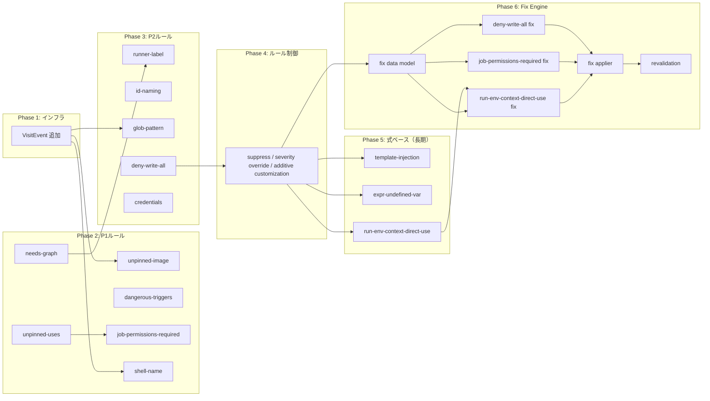

# Linter 実装計画

> 現状のルールエンジン実装を整理し、actionlint / ghalint / zizmor の各ルール群に対して優先度付きで実装を進めるための計画。各ステップは独立してテスト可能な単位で区切る。

---

## 現状サマリー

| 領域 | 現行状況 |
|---|---|
| エンジン本体 | `LintEngine` が `WorkflowParser.Parse` → `WorkflowVisitor` → 各 `IRule` の順で実行。診断は優先度ソート後に重複除去して `LintResult` へ返却 |
| Visitor | `WorkflowVisitor` が `WorkflowPre → VisitEvent* → JobPre → Step → JobPost → WorkflowPost` の順で巡回 |
| IRule / IPass | `IRule : IPass` を定義。`RuleBase` が診断収集・`LintConfig` 注入・位置情報構築の共通実装を提供 |
| SyntaxRule | `RuleCatalog` の全ルールを束ねるファサード。`LintEngine` のデフォルトエントリポイント |
| 実装済みルール | `job-structure` / `reusable-workflow` / `permissions` / `popular-action-inputs` / `unpinned-uses` / `unpinned-image` / `dangerous-triggers` / `job-permissions-required` / `needs-graph` / `shell-name` / `runner-label` / `id-naming` / `glob-pattern` / `deny-write-all` / `credentials` / `template-injection` / `expr-undefined-var` / `run-env-context-direct-use` / `runner-no-latest` / `run-secrets-context-direct-use` / `run-inputs-context-direct-use` / `secrets-whole-context-access` / `reusable-workflow-secrets-inherit` / `checkout-persist-credentials` の 24 ルール |
| 生成データ | `WebhookTypes.g.cs`（イベント名・種別）/ `PopularActions.g.cs`（アクション入力名）/ `RunnerLabels.g.cs`（hosted runner label）が利用可能 |
| ルール設定 | `LintConfig.RuleOptions` による rule 有効化/無効化（`Enabled`）と severity override（`Severity`）に加え、inline/config exclusion と suppression 可観測性、fail-safe 制約、ルール固有の加算カスタマイズ（仕様 §5.8）を実装済み |
| Fix Engine | `DiagnosticFix` / `TextEdit`、6 ルールの fix 生成、`FixEngine.Apply(...)`、`ApplyAndRelint(...)` による再検証ヘルパーを実装済み。仕様 §9 の formatting preservation MUST 項目（タブ導入制御・空白 churn 制御・曖昧時 no-fix）の網羅テストは追加余地あり |
| 式ベースルール | `template-injection` / `expr-undefined-var` / `run-env-context-direct-use` / `run-secrets-context-direct-use` / `run-inputs-context-direct-use` を実装済み。式 AST を linter ルールで活用開始 |

---

## 実装済みルール詳細

| RuleId | クラス | 検査内容 | 対応ツール |
|---|---|---|---|
| `job-structure` | `JobStructureRule` | `uses` と `steps`/`runs-on` の排他、両者の必須チェック | actionlint |
| `reusable-workflow` | `ReusableWorkflowRule` | `uses` なしで `with`/`secrets`、`uses` ありで禁止キー共存 | actionlint |
| `permissions` | `PermissionsRule` | scalar が `read-all`/`write-all` か、スコープ値が `read`/`write`/`none` か | actionlint |
| `popular-action-inputs` | `PopularActionInputsRule` | 既知アクション (`PopularActions.g.cs`) の入力名バリデーション（Warning） | actionlint（独自拡張） |
| `unpinned-uses` | `UnpinnedUsesRule` | `uses:` の ref が 40 桁 hex 以外（`@v4` / `@main` 等）の場合に warning。`./` ローカル・`docker://` は除外。reusable workflow も対象 | zizmor / ghalint |
| `unpinned-image` | `UnpinnedImageRule` | `uses: docker://...` / `container.image` / `services.*.image` が `@sha256:<64-hex>` 以外の場合に warning | 独自 |
| `dangerous-triggers` | `DangerousTriggersRule` | `pull_request_target` / `workflow_run` を検出したら warning | zizmor |
| `job-permissions-required` | `JobPermissionsRequiredRule` | `permissions` 未定義の全 job（通常 job・reusable workflow 呼び出し job 共通）を warning | ghalint |
| `needs-graph` | `NeedsGraphRule` | `needs` で存在しない job ID を参照している場合に error。循環参照を DFS で検出して error | actionlint |
| `shell-name` | `ShellNameRule` | `run:` step の `shell:` 値、`workflow.defaults.run.shell`、`job.defaults.run.shell` が有効値（bash / sh / pwsh / powershell / cmd / python）以外の場合に error | actionlint |
| `runner-label` | `RunnerLabelRule` | GitHub-hosted 既知 runner label 以外（`self-hosted` 含有・式は除外）の `runs-on` を warning | actionlint |
| `runner-no-latest` | `RunnerNoLatestRule` | `runs-on` の `ubuntu-latest` / `windows-latest` / `macos-latest` を warning（可変ラベル回避） | 独自 |
| `id-naming` | `IdNamingRule` | `job.id` / `step.id` が `[a-zA-Z0-9_-]` 以外の文字を含む場合に error | actionlint |
| `glob-pattern` | `GlobPatternRule` | `on.<event>.branches/tags/paths` 系フィルタ値の glob 構文（`***` / 未閉鎖 `[` / 余剰 `]`）を検査し、不正を error | actionlint |
| `deny-write-all` | `DenyWriteAllRule` | `permissions: write-all`（workflow / job）を検出して error | ghalint |
| `credentials` | `CredentialsRule` | `job.container` / `job.services.*` の image がカスタムレジストリで credentials 未設定の場合に warning | actionlint |
| `template-injection` | `TemplateInjectionRule` | `run:` / `step.env` の式に `github.event` 由来データを直接展開している場合に error | zizmor |
| `expr-undefined-var` | `ExprUndefinedVarRule` | `job/step` の `if` / `env` / `with` における使用不可コンテキスト参照（例: `steps` in job）を error | actionlint |
| `run-env-context-direct-use` | `RunEnvContextDirectUseRule` | `run:` 内 `${{ env.* }}`（dot/bracket/function 経由を含む）の直接展開を検出して error。shell 変数利用を促す | 独自 |
| `run-secrets-context-direct-use` | `RunSecretsContextDirectUseRule` | `run:` 内 `${{ secrets.* }}`（dot/bracket/function 経由を含む）の直接展開を検出して error。`env` 経由 + shell 変数利用を促す | 独自 |
| `run-inputs-context-direct-use` | `RunInputsContextDirectUseRule` | `run:` 内 `${{ inputs.* }}` / `${{ github.event.inputs.* }}`（dot/bracket/function 経由を含む）の直接展開を検出して error。`env` 経由 + shell 変数利用を促す | 独自 |
| `secrets-whole-context-access` | `SecretsWholeContextAccessRule` | `${{ toJson(secrets) }}` など `secrets` コンテキスト全体参照（`run:` / `env:` / `with:`）を検出して error | 独自 |
| `reusable-workflow-secrets-inherit` | `ReusableWorkflowSecretsInheritRule` | reusable workflow 呼び出し (`uses`) で `secrets: inherit` を使っている場合に warning。必要な secrets の明示マッピングを促す | 独自 |
| `checkout-persist-credentials` | `CheckoutPersistCredentialsRule` | `actions/checkout` で `with.persist-credentials: false` が未指定、式、または `false` 以外の場合に warning。単純な未指定/true は partial auto-fix 対象で、後続の認証付き git 操作見直しを促す | ghalint |

---

## インフラギャップ

ルール実装の前に対処すべきエンジン側の不足を優先度順に示す。

| # | ギャップ | 影響 | 深刻度 |
|---|---|---|---|
| G1 | `IRule`/`WorkflowVisitor` に `VisitEvent` がない | **解消済み（Phase 1 実装）** | ✅ |
| G2 | 式 AST ベースの主要セキュリティルール | **解消済み（Phase 5.4 実装）** | ✅ |
| G3 | ルール単位の exclusion / severity override がない | `LintConfig` にオプション欄がなく、仕様で定義した exclusion・フェイルセーフ・可観測性を満たせない | 🟡 中 |
| G4 | Job 横断ルール向けの共通状態管理ヘルパーがない | `needs` などで各ルールが ID 収集・集合管理を都度実装する必要があり、重複実装が発生する | 🟡 中 |
| G5 | `VisitStep(ExecRun)` / `VisitStep(ExecAction)` の型別フックがない | 各ルールで `step.Exec is ExecRun` キャストが必要になり冗長 | 🟢 低 |
| G6 | parser 仕様書（§8）に `VisitEvent` 拡張方針の注記がない | **解消済み（仕様同期済み）** | ✅ |
| G7 | ルール固有の加算カスタマイズ（仕様 §5.8 / C# spec §4.1）が未実装 | **解消済み（Step 4.6/4.7 実装）** | ✅ |
| G8 | Auto-fix データモデル / Fix 適用器 / 再検証パスが未実装 | **解消済み（Phase 6.1-6.7 実装）** | ✅ |
| G9 | Fix formatting preservation の MUST 項目の網羅テスト/安全化が未完 | 仕様 §9 / C# spec §4.3 の「タブ導入制御」「空白 churn 最小化」「曖昧時 no-fix fallback」の準拠を回帰で保証しきれない | 🟡 中 |

---

## Phase 1: VisitEvent の追加

**目標**: `WorkflowVisitor` に `On` イベント列の巡回フックを追加し、イベント系ルールの実装基盤を整える

### Step 1.0: linter 仕様書への同期注記を追加（完了）

**ファイル**: `Docs/Seiton_Linter_spec.md`, `Docs/Seiton_Parser_csharp_spec.md`

- 現行契約（`VisitEvent` なし）を維持したまま、Phase 1 実装予定として注記を追加
- 実装着手時に linter 仕様のインターフェース定義・巡回順を同時更新する運用ルールを明記

**完了条件**: linter 実装計画と linter 仕様書の間で、`VisitEvent` 追加の差分が明示されている

### Step 1.1: IPass / IRule に VisitEvent を追加

**ファイル**: `src/Seiton.Core/Linting/IPass.cs`, `src/Seiton.Core/Linting/IRule.cs`

- `void VisitEvent(Event ev)` を `IPass` に追加
- `RuleBase` にデフォルト空実装を追加（既存ルールへの影響をゼロにする）

**完了条件**: 既存 4 ルールがノータッチでビルド・テストがパスする

**実装メモ**: 完了。`IPass` と `RuleBase` に `VisitEvent` を追加し、既存ルールは無変更で動作。

### Step 1.2: WorkflowVisitor の巡回に VisitEvent を組み込む

**ファイル**: `src/Seiton.Core/Linting/WorkflowVisitor.cs`

- `Visit(Workflow)` 内で `workflow.On` を走査し、各 `Event` に対して全 pass の `VisitEvent` を呼ぶ
- 巡回順: `WorkflowPre → VisitEvent* → JobPre → Step → JobPost → WorkflowPost`

**完了条件**: `CountingRule` テストに `EventCount` を追加し、イベント数が正しく計上される

**実装メモ**: 完了。`RuleInterfaceTests` の `CountingRule` に `EventCount` を追加して検証済み。

### Step 1.3: SyntaxRule の VisitEvent を委譲

**ファイル**: `src/Seiton.Core/Linting/SyntaxRule.cs`

- `VisitEvent` を配下の全ルールへ委譲するよう追加

**完了条件**: ビルドが通り、既存テストがパス

**実装メモ**: 完了。`SyntaxRule.VisitEvent` を追加し、配下ルールへ委譲。

---

## Phase 2: P1 ルール（AST だけで実装可能・価値が高い）

**目標**: 既存 AST を使いきれる 6 ルールを追加する。新たな AST 変更は不要

### Step 2.1: unpinned-uses ルール

**ファイル**: `src/Seiton.Core/Linting/UnpinnedUsesRule.cs`

- 対応: zizmor `unpinned-uses`, ghalint `action_ref_should_be_full_length_commit_sha`
- `ExecAction.Uses.Value` を UTF-8 span でパース
  - `owner/repo@ref` の `ref` 部分を抽出
  - `ref` が 40 桁の hex 文字列でない場合に warning を報告
  - `./` ローカルパス参照、`docker://` スキームは除外
- `WorkflowCall.Uses`（reusable workflow）も同様に検査

**完了条件**: SHA ピン済みの uses は警告なし、`@v4` / `@main` 等は警告ありのテストがパスする

**実装メモ**: 完了。`UnpinnedUsesRule` を実装し、`IsFullLengthCommitShaPinned()` で 40 桁 hex 判定（UTF-8 span）。`VisitStep`（`ExecAction`）と `VisitJobPre`（`WorkflowCall`）の両経路を検査。`RuleCatalog` に priority 4 で登録済み。table-driven 回帰テスト（6 ケース）を `RuleInterfaceTests` に追加。

### Step 2.2: unpinned-image ルール

**ファイル**: `src/Seiton.Core/Linting/UnpinnedImageRule.cs`

- 対応: コンテナイメージの digest pin 強制（独自拡張）
- `VisitStep` で `uses: docker://...` を検査
  - `docker://<image>@sha256:<64 hex>` 形式のみを pinned とみなす
  - `:latest` や `:1.2.3` など tag 指定、implicit latest（tag/digest なし）は warning を報告
- `VisitJobPre` で `job.container.image` と `job.services.*.image` を検査
  - 同様に `@sha256:<64 hex>` 以外を warning
  - 式（`${{ }}`）は現段階では評価不能なためスキップ
- `run:` のシェルスクリプト内 `docker run ...` 解析はスコープ外
  - 文字列解析では誤検知/取りこぼしが多いため、必要なら将来 `run` 専用ルールとして分離

**完了条件**: `docker://...:latest` / `container.image: repo/app:tag` / `services.*.image: repo/app` で warning、`@sha256:...` では warning なしのテストがパスする

**実装メモ**: 完了。`UnpinnedImageRule` を実装（`unpinned-tag` から改名）。`IsSha256DigestPinned()` で `@sha256:<64-hex>` を判定（UTF-8 span）。`VisitStep`（`docker://` uses）、`VisitJobPre`（`job.container.image` / `services.*.image`）の 3 箇所を検査。`RuleBase` に `AddJobWarning(job, message, location)` オーバーロードを追加して正確な位置を付与。`RuleCatalog` に priority 5 で登録済み。table-driven 回帰テスト（8 ケース）を `RuleInterfaceTests` に追加。

### Step 2.3: dangerous-triggers ルール

**ファイル**: `src/Seiton.Core/Linting/DangerousTriggersRule.cs`

- 対応: zizmor `dangerous-triggers`
- **前提**: Phase 1 (Step 1.1–1.3) 完了
- `VisitEvent` で `WebhookEvent` を受け取り、`WebhookTypes.EventId` を参照
  - `PullRequestTarget` を検出したら warning を報告
  - `WorkflowRun`（外部ワークフロー書き込み権限を誘発しうる）も warning 対象
- 将来的に zizmor と ghalint の更新に合わせてリスト追加できるよう、検出対象を列挙で管理

**完了条件**: `pull_request_target` / `workflow_run` を含む workflow で warning が出る

**実装メモ**: 完了。`DangerousTriggersRule` を実装。`DangerousEventIds` 配列（`PullRequestTarget` / `WorkflowRun`）で検出対象を管理し、将来のイベント追加は配列 1 行で対応可能。`WebhookTypes.TryGet()` で UTF-8 span から `EventId` を取得する。`RuleBase` に `AddEventWarning()` / `BuildEventLocation()` ヘルパーを追加。`RuleCatalog` に priority 6 で登録済み。table-driven 回帰テスト（5 ケース）を `RuleInterfaceTests` に追加。

### Step 2.4: job-permissions-required ルール

**ファイル**: `src/Seiton.Core/Linting/JobPermissionsRequiredRule.cs`

- 対応: ghalint `job_permissions`
- `VisitJobPre` で `job.Permissions is null` の場合に warning を報告
  - reusable workflow 呼び出し job も対象。呼び出し側 job に `permissions:` を明示することで呼び出されるワークフローに渡す権限を制御できる

**完了条件**: permissions なし job（通常 job / reusable workflow 呼び出し job 両方）は warning、permissions あり job は warning なしのテストがパスする

**実装メモ**: 完了。`JobPermissionsRequiredRule` を実装。`VisitJobPre` で `job.Permissions is null` の場合に warning を報告。reusable workflow 呼び出し job も除外しない（呼び出し側 job に `permissions:` を設定することで呼び出されるワークフローに渡す権限を制御できるため）。`RuleCatalog` に priority 7 で登録済み。table-driven 回帰テスト（6 ケース）を `RuleInterfaceTests` に追加。

### Step 2.5: needs-graph ルール

**ファイル**: `src/Seiton.Core/Linting/NeedsGraphRule.cs`

- 対応: actionlint `needs` 系
- `VisitWorkflowPre` で `workflow.Jobs` の全 ID を収集して保持
- `VisitJobPre` で `job.Needs` の各エントリが収集済み ID に存在するかを検証
  - 存在しない ID を参照している場合にエラーを報告
- `VisitWorkflowPost` で DFS による循環参照検出を実行
  - GitHub Actions は循環参照を実行時エラーにするため、静的に検出してエラーを報告
  - DFS の gray（処理中）ノードへの back-edge を検出して循環と判定

**完了条件**: 存在しない job ID を `needs` で参照したときにエラーが出るテストがパスする。自己参照・2 job 間・3 job 間の循環でエラーが出るテストがパスする

**実装メモ**: 完了。`NeedsGraphRule` を実装。`VisitWorkflowPre` で `workflow.Jobs`（`IReadOnlyDictionary<Utf8String, Job>`）の参照をフィールドに保存。`VisitJobPre` で `job.Needs` の各エントリを `Utf8String.FromLowerAscii()` でキー化して `ContainsKey` 検証。GitHub Actions の job ID は case-insensitive（パーサーが `FromLowerAscii` で格納）なので同一の正規化を使用。エラー位置は `need.Range`（実際の needs エントリ被参照箇所）を使用。`VisitWorkflowPost` で iterative DFS（color: 0=unvisited / 1=gray / 2=black）による循環参照検出を追加。back-edge（gray ノードへの参照）を検出してエラーを報告。`RuleCatalog` に priority 8 で登録済み。table-driven 回帰テスト（8 ケース）を `RuleInterfaceTests` に追加。

### Step 2.6: shell-name ルール

**ファイル**: `src/Seiton.Core/Linting/ShellNameRule.cs`

- 対応: actionlint `shell-name`
- `VisitStep` で `step.Exec is ExecRun run` の場合に `run.Shell.Value` を検査
  - 有効値: `bash` / `sh` / `pwsh` / `powershell` / `cmd` / `python`（UTF-8 span 比較）
  - 式 (`${{ }}`) が含まれる場合はスキップ
  - それ以外は error を報告
- `VisitWorkflowPre` で `workflow.defaults.run.shell` を検査（同上）
- `VisitJobPre` で `job.defaults.run.shell` を検査（同上）

**完了条件**: 有効シェル名は通過、無効名はエラーのテストがパスする

**実装メモ**: 完了。`ShellNameRule` を実装。`VisitStep`（`ExecRun.Shell`）・`VisitWorkflowPre`（`workflow.Defaults.Run.Shell`）・`VisitJobPre`（`job.Defaults.Run.Shell`）の 3 箇所を検査。`IsValidShellName()` で `bash` / `sh` / `pwsh` / `powershell` / `cmd` / `python` の 6 値を UTF-8 span 比較。`Expression is not null` だけでなく `IndexOf("${{"u8) >= 0` のバイトスキャンで式値をスキップ（パーサーが `Shell` の `Expression` を常に設定するわけではないため）。`CheckDefaultsRunShell()` ヘルパーメソッドで workflow / job 両方の defaults 検査ロジックを共通化。`RuleBase` に `AddStepError(step, message, location)` ヘルパーを追加。エラー位置は各 `shellNode.Range` を使用。`RuleCatalog` に priority 9 で登録済み。table-driven 回帰テスト（14 ケース）を `RuleInterfaceTests` に追加。

### Step 2.7: RuleCatalog に P1 ルールを登録

**ファイル**: `src/Seiton.Core/Linting/RuleCatalog.cs`

- `DefaultRuleFactories` に `unpinned-uses`（priority 4）/ `unpinned-image`（5）/ `dangerous-triggers`（6）/ `job-permissions-required`（7）/ `needs-graph`（8）/ `shell-name`（9）を追加

**完了条件**: `new LintEngine()` だけで全 P1 ルールが動作する

**実装メモ**: 完了。`RuleCatalog.DefaultRuleFactories` に P1 ルール 6 件（priority 4-9）を登録済み。`RuleCatalog_DefaultRules_MatchDocumentedScope` でルール数 10 件、ID 順、priority 値を検証済み。

---

## Phase 3: P2 ルール（AST 検証ロジックがやや複雑）

**目標**: 生成データの拡充または複数 AST ノードにまたがるルールを追加する

### Step 3.1: runner-label ルール

**ファイル**: `src/Seiton.Core/Linting/RunnerLabelRule.cs`, `src/Seiton.Core/Generated/RunnerLabels.g.cs`

- 対応: actionlint `runner-label`
- `RunnerLabels.g.cs` に GitHub-hosted runner の既知ラベル一覧を生成（UTF-8 span ベース）
  - `ubuntu-*`, `windows-*`, `macos-*` 系の主要ラベルを網羅
- `VisitJobPre` で `job.RunsOn.Labels` を走査
  - `self-hosted` を含む場合はスキップ
  - `LabelsExpr` が非 null（式形式）の場合はスキップ
  - 既知ラベル外は warning を報告

**完了条件**: `ubuntu-latest` は通過、`ubuntu-9999` は warning のテストがパスする

**実装メモ**: 完了。`runner-labels` dataset を updater の既存生成フロー（fetch / parse / merge / sync / verify）に追加し、`https://docs.github.com/en/actions/reference/runners/github-hosted-runners.md` から hosted runner label 一覧を取得して `RunnerLabels.g.cs` を生成する方式に変更。preview ラベル（例: `windows-2025-vs2026`）は `PreviewLabels` として別管理しつつ `IsKnownHostedLabel` では許可対象に含める。`RunnerLabelRule` は `VisitJobPre` で `job.RunsOn.Labels` を検査し、`self-hosted` 含有 job と `LabelsExpr`（式）はスキップ。未知 label は warning（`label.Range` を位置に使用）。`RuleCatalog` に priority 10 で登録済み。table-driven 回帰テスト（8 ケース）を `RuleInterfaceTests` に追加。

### Step 3.2: id-naming ルール

**ファイル**: `src/Seiton.Core/Linting/IdNamingRule.cs`

- 対応: actionlint `id-naming`
- `VisitJobPre` で `job.Id.Value` を検査: `[a-zA-Z0-9_-]` のみ許可
- `VisitStep` で `step.Id?.Value` を検査: 同上
- 違反した場合にエラーを報告

**完了条件**: 有効 ID は通過、空白・記号を含む ID はエラーのテストがパスする

**実装メモ**: 完了。`IdNamingRule` を実装し、`VisitJobPre` で `job.Id`、`VisitStep` で `step.Id` を検査。文字種は UTF-8 バイト走査で `[a-zA-Z0-9_-]` のみ許可、空文字も不許可。式値（`Expression` または `${{` を含む値）は静的判定不能としてスキップ。違反時は `AddJobError(..., idNode.Range)` / `AddStepError(..., idNode.Range)` で ID ノード位置に error を報告。`RuleCatalog` に priority 11 で登録済み。table-driven 回帰テスト（6 ケース）を `RuleInterfaceTests` に追加。

### Step 3.3: glob-pattern ルール

**ファイル**: `src/Seiton.Core/Linting/GlobPatternRule.cs`

- 対応: actionlint `glob`
- **前提**: Phase 1 (VisitEvent) 完了
- `VisitEvent` で `WebhookEvent` の `Branches` / `BranchesIgnore` / `Tags` / `TagsIgnore` / `Paths` / `PathsIgnore` のフィルタ値を検査
  - 連続する `**` (`***` 以上)、`[` の閉じ忘れ等の不正パターンを検出
  - span ベースの軽量パターン検証で行う（regex 不使用）

**完了条件**: 有効パターンは通過、`***` / 未閉鎖 `[` 等はエラーのテストがパスする

**実装メモ**: 完了。`GlobPatternRule` を実装し、`VisitEvent` で `WebhookEvent` の `Branches` / `BranchesIgnore` / `Tags` / `TagsIgnore` / `Paths` / `PathsIgnore` を走査。各 `WebhookEventFilter.Values` に対して UTF-8 span ベースで軽量検証を行い、`***`（3 連続以上の `*`）・未閉鎖 `[`・対応しない `]` を検出した場合に error を報告。式値（`Expression` 非 null または `${{` を含む値）は静的判定不能としてスキップ。位置情報は `valueNode.Range` を使用。`RuleBase` に `AddEventError(..., TextRange)` を追加し、`RuleCatalog` へ priority 12 で登録。table-driven 回帰テスト（4 ケース）を `RuleInterfaceTests` に追加。

### Step 3.4: deny-write-all ルール

**ファイル**: `src/Seiton.Core/Linting/DenyWriteAllRule.cs`（または `PermissionsRule` の拡張）

- 対応: ghalint `deny_write_all_permissions`
- `PermissionsRule` は `write-all` を「有効値」として通過させているが、本ルールは明示的に禁止
- `VisitWorkflowPre` / `VisitJobPre` で `permissions.All` が `write-all` なら error を報告
- `PermissionsRule` と責務分離するため独立クラスを推奨

**完了条件**: `permissions: write-all` が error になるテストがパスする

**実装メモ**: 完了。`DenyWriteAllRule` を独立クラスとして追加し、`VisitWorkflowPre` / `VisitJobPre` で `permissions.All` を検査。`write-all` を検出した場合は error を報告する。判定は UTF-8 span の `SequenceEqual("write-all"u8)` を使用し、式値（`Expression` 非 null または `${{` を含む値）は静的評価不能としてスキップ。診断位置は `permissions.All.Range`。`RuleCatalog` に priority 13 で登録済み。`RuleInterfaceTests` に table-driven 回帰テスト（4 ケース）を追加し、workflow/job 両方の `write-all` でエラーになることと `read-all`/scope 指定が通過することを検証。

### Step 3.5: credentials ルール

**ファイル**: `src/Seiton.Core/Linting/CredentialsRule.cs`

- 対応: actionlint `credentials`
- `VisitJobPre` で `job.Container` および `job.Services` を走査
  - プライベートレジストリを示す image（`ghcr.io/`, `docker.io/` 以外のカスタムレジストリ）で `credentials` が null の場合に warning
  - 判定精度を上げるため、image 文字列に `/` を含みかつ `gcr.io` / `ghcr.io` / `docker.io` / `public.ecr.aws` 以外のホストを持つ場合を警告対象とする

**完了条件**: パブリックレジストリは通過、カスタムレジストリで credentials なしは warning のテストがパスする

**実装メモ**: 完了。`CredentialsRule` を実装し、`VisitJobPre` で `job.Container` と `job.Services.ServiceMap` を検査。`image` 文字列先頭要素（最初の `/` まで）が registry host と判定できる場合（`.` / `:` を含む、または `localhost`）のみ対象とし、`gcr.io` / `ghcr.io` / `docker.io` / `public.ecr.aws` / `quay.io` / `registry.k8s.io` / `mcr.microsoft.com` / `cgr.dev` / `nvcr.io` / `registry.access.redhat.com` は公開 registry として除外。これ以外の host で `credentials` が null のとき warning を報告。式値（`image.Expression` 非 null または `${{` を含む image）は静的判定不能としてスキップ。`RuleCatalog` に priority 14 で登録済み。`RuleInterfaceTests` に table-driven 回帰テスト（6 ケース）を追加し、公開 registry 通過・カスタム registry の credentials 未設定 warning を検証。

### Step 3.6: RuleCatalog に P2 ルールを登録

**ファイル**: `src/Seiton.Core/Linting/RuleCatalog.cs`

- `runner-label`（priority 10）/ `id-naming`（11）/ `glob-pattern`（12）/ `deny-write-all`（13）/ `credentials`（14）を追加

**完了条件**: `new LintEngine()` だけで全 P2 ルールが動作する

**実装メモ**: 完了。`RuleCatalog.DefaultRuleFactories` に P2 ルール 5 件（`runner-label`=10 / `id-naming`=11 / `glob-pattern`=12 / `deny-write-all`=13 / `credentials`=14）を登録済み。`RuleCatalog_DefaultRules_MatchDocumentedScope` でルール数 15 件、ID 順、priority 値を検証済み。`new LintEngine()` のデフォルト実行で P2 ルールが有効化されることを確認。

---

## Phase 4: ルール制御機構

**目標**: ユーザーがルールの有効化・無効化・severity 変更をできるようにする

### Step 4.1: LintConfig にルール設定を追加

**ファイル**: `src/Seiton.Core/Linting/LintConfig.cs`

- `IReadOnlyDictionary<string, RuleOption>? RuleOptions` を追加
- `RuleOption` は `Enabled` (bool) と `Severity` (DiagnosticSeverity?) を持つ record

**完了条件**: 型が追加されビルドが通る

**実装メモ**: 完了。`LintConfig` に `IReadOnlyDictionary<string, RuleOption>? RuleOptions` を追加し、`RuleOption` を `Enabled`（bool）と `Severity`（`DiagnosticSeverity?`）を持つ record として定義。Step 4.1 は型追加までがスコープのため、`LintEngine` での適用（有効化/無効化・severity 上書き）は Step 4.2 で実装する。

### Step 4.2: LintEngine でルールの有効化・無効化を実装

**ファイル**: `src/Seiton.Core/Linting/LintEngine.cs`

- `Check` 内で `RuleOptions` を参照し、`Enabled == false` のルールを `visitor` に登録しない
- `Severity` が指定されている場合は診断の `Severity` を上書きして出力

**完了条件**: `RuleOptions` で無効化したルールの診断が結果に含まれないテストがパスする

**実装メモ**: 完了。`LintEngine.Check(byte[], string, LintConfig?)` オーバーロードを追加し、`RuleOptions` を `Check` 実行時に参照。`Enabled == false` のルールは visitor 登録をスキップし、`RuleOption.Severity` が指定されているルール診断は severity を上書きして出力する。既存 API 互換のため `Check(byte[], string)` は新オーバーロードへ委譲。`RuleInterfaceTests` に rule disable と severity override の回帰テストを追加して検証。

### Step 4.3: ファイル内 inline exclusion（next-line）を実装

**ファイル**: `src/Seiton.Core/Linting/LintEngine.cs`, `src/Seiton.Core/Linting/LintConfig.cs`

- `# seiton: disable-next-line <rule-ids>` / `# seiton: disable-job <job-id> <rule-ids>` / `# seiton: disable-file <rule-ids>` をサポート
- `disable-next-line` は次行のみ、`disable-job` は指定 job、`disable-file` はファイル全体を適用範囲とする
- 未知 rule-id は設定エラーとして報告
- YAML コメント取得が困難なため、UTF-8 本文の行スキャンで directive を抽出

**完了条件**: next-line 抑制が動作し、未知 rule-id でエラーを返すテストがパスする

**実装メモ**: 完了。`LintEngine` で `# seiton: disable-next-line <rule-ids>` を行単位で解析し、次行（line+1）に対する rule-id 単位の抑制を適用。`# seiton: disable-job <job-id> <rule-ids>` と `# seiton: disable-file <rule-ids>` もサポートし、job/file スコープで抑制できるようにした。複数 rule-id（`,` 区切り、空白許容）をサポート。meaningful ID（例: `job-permissions-required`）と canonical ID（`seiton-lint-rule-001` 形式）の両方を受理し、内部 rule-id へ正規化して適用。未知 ID は設定エラー（`DiagnosticSeverity.Error`）として報告。`RuleInterfaceTests` に next-line/job/file 抑制と未知 ID/unknown job-id エラーの回帰テストを追加。

### Step 4.3a: ルールID UX改善（意味ID優先 + 後方互換）

**ファイル**: `src/Seiton.Core/Linting/LintEngine.cs`, `src/Seiton.Core/Linting/LintConfig.cs`, `src/Seiton.Core/Linting/LintResult.cs`, `src/Seiton.Core/Linting/RuleCatalog.cs`

- 目的: inline directive / config で利用する rule-id の可読性を改善し、抑制意図をレビュー時に判読しやすくする
- 方針:
  - 意味ID（例: `job-structure`）を第一候補として受理する
  - canonical ID（`seiton-lint-rule-001` 形式）は後方互換のため継続受理する
  - unknown rule-id のエラーでは候補 ID（近似候補）を提示して復旧性を上げる
  - diagnostics / suppression observability には意味IDを主表示し、必要に応じて canonical ID を補助表示する
- 運用支援（Phase 4.4 と連携）:
  - ルール一覧出力（ID / canonical ID / severity default / 説明）
  - 初期設定テンプレート生成で全 rule-id をコメント付き出力
  - LLM/MCP 利用向けに rule-id 一覧を機械可読形式で提供

**完了条件**: 意味IDと canonical ID の両方で suppression が動作し、unknown rule-id エラーが候補提示を含むテストがパスする

**実装メモ**: 完了。`RuleCatalog` に rule-id 解決ヘルパーを追加し、meaningful ID と canonical ID の相互解決を一元化。`LintEngine` では inline directive と `LintConfig.RuleOptions` の両方でこの解決器を利用し、意味IDを優先しつつ canonical ID 後方互換を維持。unknown rule-id は `Did you mean '<rule-id>'?` の候補提示付きで診断を返す。`RuleInterfaceTests` に semantic inline suppression / canonical RuleOptions / 候補提示付き unknown rule-id の回帰テストを追加。

### Step 4.4: file/job exclusion と可観測性を実装

**ファイル**: `src/Seiton.Core/Linting/LintEngine.cs`, `src/Seiton.Core/Linting/LintResult.cs`

- 設定ファイル exclusion で file glob（`/` 正規化 + case-sensitive）をサポート
- job スコープは `job.id` ベースで評価
- 抑制結果の可観測性を出力（総件数、rule 別件数、ruleId + line/column）

**完了条件**: suppression summary を含む結果が返り、CI で増減検知できる

**実装メモ**: 完了。`LintConfig` に `Exclusions`（`LintExclusion`）を追加し、`LintEngine` で file glob + optional `jobId` による rule 単位の設定 suppression を実装。path は `/` 正規化で case-sensitive にマッチする。job スコープは `job.id` と `Job.Range` の対応から判定し、unknown rule-id / unknown job-id は設定エラーとして報告。`LintResult` に `SuppressionSummary`（総件数、rule 別件数、`SuppressionRecord`）を追加し、inline/config いずれで抑制されたか（source）と source / diagnostic の line/column を出力する。`RuleInterfaceTests` に file/job exclusion と suppression summary、unknown 設定エラーの回帰テストを追加。

### Step 4.5: フェイルセーフ制約を実装

**ファイル**: `src/Seiton.Core/Linting/RuleCatalog.cs`, `src/Seiton.Core/Linting/LintEngine.cs`

- non-disableable rule を実装
- minimum severity 制約を実装（`Error > Warning > Info`）
- 制約違反設定は設定エラーとして報告

**完了条件**: disable 不可ルール無効化や最低 severity 未満設定が失敗するテストがパスする

**実装メモ**: 完了。`RuleCatalog` に fail-safe ポリシー（`IsNonDisableable` / `TryGetMinimumSeverity`）を追加し、`deny-write-all` を non-disableable + minimum severity `Error` として定義。`LintEngine` では `RuleOptions` 正規化時に disable 不可/最低 severity 制約を検証し、違反設定は設定エラーとして報告して無効化する。inline (`seiton: disable-*`) と config exclusion (`LintConfig.Exclusions`) でも non-disableable rule の抑制要求を設定エラーとして拒否。`RuleInterfaceTests` に rule-options / inline / config exclusion の fail-safe 回帰テストを追加し、制約違反時にルール診断が抑制されないことを検証。

### Step 4.6: ルール固有の加算カスタマイズ設定モデルを追加

**ファイル**: `src/Seiton.Core/Linting/LintConfig.cs`

- 仕様対応: `Seiton_Linter_spec.md` §5.8, `Seiton_Linter_csharp_spec.md` §4.1
- `LintConfig` にルール固有の拡張設定を追加
  - `dangerous-triggers.additionalDangerousEvents`
  - `runner-label.additionalKnownHostedLabels`
  - `credentials.additionalPublicRegistries`
- 3 ルール分をまとめる設定 record を追加し、`LintConfig` から参照できるようにする
- 入力値の正規化ポリシー（ASCII lower-case、空値/重複の扱い）を型・コメントで明示する

**完了条件**: `LintConfig` で 3 種類の追加エントリを受け取れる型が定義され、既存 API 互換を維持したままビルドが通る

**実装メモ**: 完了。`LintConfig` に `AdditiveCustomization`（`RuleSpecificAdditiveCustomization`）を追加し、`additionalDangerousEvents` / `additionalKnownHostedLabels` / `additionalPublicRegistries` を受け取れる設定モデルを定義。`RuleSpecificAdditiveCustomization.Empty` を既定値として持たせ、未指定時の後方互換を維持した。`LintEngine` の `effectiveConfig` 生成時にも `config.AdditiveCustomization` を引き継ぐよう更新し、Step 4.7 で各ルールが設定を参照できる受け口を整備した。

### Step 4.7: 3 ルールに加算マージと設定検証を実装

**ファイル**: `src/Seiton.Core/Linting/LintEngine.cs`, `src/Seiton.Core/Linting/DangerousTriggersRule.cs`, `src/Seiton.Core/Linting/RunnerLabelRule.cs`, `src/Seiton.Core/Linting/CredentialsRule.cs`, `tests/Seiton.Core.Tests/RuleInterfaceTests.cs`

- 仕様対応: `effective = built-in U custom-added`（追加のみ、既定値は削除しない）
- `SetConfig` で渡された設定を各ルールで解釈し、既定集合に対して決定的な union を構成
- 正規化後の重複は無視（同値判定は ASCII lower-case）
- 不正設定値は設定エラーを返す
  - event 名/runner label の空値
  - registry host として不正（scheme/path 含有など）
- `credentials` は `host` または `host:port` 単位で照合し、追加 public registry に一致した場合は警告抑止
- 既存の rule options / exclusion / fail-safe と競合しないことを確認

**完了条件**: 以下を満たす table-driven 回帰テストがパスする

- `additionalDangerousEvents` で追加した event が warning 対象になる
- `additionalKnownHostedLabels` で追加した label が unknown-label warning から除外される
- `additionalPublicRegistries` で追加した host が credentials warning から除外される
- 重複エントリは安定的に 1 件扱いになる
- 不正設定値は設定エラーとして報告される

**実装メモ**: 完了。`LintEngine` に `NormalizeAdditiveCustomization()` を追加し、`additionalDangerousEvents` / `additionalKnownHostedLabels` / `additionalPublicRegistries` を ASCII lower-case に正規化しつつ入力順を保って重複排除するよう更新。空 event 名 / 空 runner label / scheme・path を含む registry host は設定エラーとして診断化する。`DangerousTriggersRule` / `RunnerLabelRule` / `CredentialsRule` は `SetConfig` で正規化済み追加集合を取り込み、既定集合に対する additive union として評価するよう変更。`RuleInterfaceTests` に追加 event の warning、追加 label / registry による warning 抑止、重複正規化、無効設定値エラーの回帰テストを追加して検証した。

---

## Phase 5: 式ベースルール（長期）

**目標**: 既存の式 AST パイプライン（パーサー仕様 §6/§7）と linter を接続し、セキュリティ系ルールを追加する

> **前提**: パーサーの式 AST・セマンティクス（`ExpressionParser` / `ExpressionSemanticAnalyzer`）が linter から利用できる状態になっていること。

### Step 5.1: LintConfig に式解析コンテキストを追加

**ファイル**: `src/Seiton.Core/Linting/LintConfig.cs`

- `ExpressionContext ExprContext { get; init; }` を追加し、式解析時のコンテキスト（イベント種別等）を渡せるようにする

**実装メモ**: 完了。`LintConfig` に `ExprContext`（`ExpressionContext`）を追加し、`ExpressionContext.Empty` をデフォルト値として設定。`LintEngine` の `effectiveConfig` 生成時にも `config.ExprContext` を引き継ぐよう更新し、後続の式ベースルールが linter 実行コンテキストを参照できる受け口を整備した。

### Step 5.2: template-injection ルール

**ファイル**: `src/Seiton.Core/Linting/TemplateInjectionRule.cs`

- 対応: zizmor `template-injection`
- `VisitStep` で `ExecRun.Run` の文字列を走査
  - `${{ github.event.*.body }}` / `${{ github.event.pull_request.title }}` 等のユーザー制御可能な値を直接 `run:` や `env:` に展開している箇所を検出
  - 式 AST から taint source を判定し、run ステップへの直接展開を error とする

**実装メモ**: 完了。`TemplateInjectionRule` を追加し、`VisitStep` で `ExecRun.Run` と `step.Env`（`env` scalar / `env.<name>`）の埋め込み式 `${{ ... }}` を抽出して `ExpressionParser` で AST 解析するよう実装。AST 走査で `github.event` 参照チェーン（dot / bracket access を含む）を taint source と判定し、該当 sink へ直接展開している場合に error を報告。`RuleCatalog` に priority 15 で登録し、`RuleInterfaceTests` に table-driven 回帰テスト（5 ケース）を追加。

### Step 5.3: expr-undefined-var ルール

**ファイル**: `src/Seiton.Core/Linting/ExprUndefinedVarRule.cs`

- 対応: actionlint `expression`
- `VisitStep` / `VisitJobPre` の `if:` / `env:` / `with:` を式 AST で解析
  - `Availability.g.cs` を参照して、使用コンテキストで有効でない変数を error 報告

**実装メモ**: 完了。`ExprUndefinedVarRule` を追加し、`VisitJobPre` / `VisitStep` で `if`（全体式）と `env` / `with`（埋め込み式 `${{ ... }}`）を解析するよう実装。`ExpressionParser` + `ExpressionVisitor` で root identifier を抽出し、`Availability.IsRootContextAvailable` で job/step コンテキスト可用性を判定して未定義参照を error 報告する。`RuleCatalog` に priority 16 で登録し、`RuleInterfaceTests` に table-driven 回帰テスト（6 ケース）を追加。

### Step 5.4: run-env-context-direct-use ルール

**ファイル**: `src/Seiton.Core/Linting/RunEnvContextDirectUseRule.cs`

- 対応: 独自（template-injection 補完）
- `VisitStep` で `ExecRun.Run` を走査し、`${{ env.<name> }}`（dot/bracket access を含む）の直接展開を検出して error を報告
  - 例: `run: echo "${{ env.VERSION }}"` を検出
  - 例: `run: echo "${{ env['VERSION'] }}"` を検出
- `run` 内では shell 変数（`$VERSION` / `$env:VERSION`）の利用を推奨し、評価タイミング差による注入リスクを抑制する
- `env` セクション自体（`step.env` / `job.env` / `workflow.env`）の式利用は本ルールの対象外（Step 5.2 / 5.3 の責務を維持）

**完了条件**: `run` に `${{ env.* }}` を含むケースで error、shell 変数参照のみのケースで error なしのテストがパスする

**実装メモ**: 完了。`RunEnvContextDirectUseRule` を追加し、`VisitStep` で `ExecRun.Run` の埋め込み式 `${{ ... }}` を抽出して `ExpressionParser` で AST 解析するよう実装。AST 走査で root context が `env` の参照（dot / bracket / function 引数経由）を検出した場合に error を報告し、メッセージで shell 変数（`$NAME` / `$env:NAME`）利用を案内する。`RuleCatalog` に priority 17 で登録し、`RuleInterfaceTests` に table-driven 回帰テスト（5 ケース）を追加。

---

## Phase 6: Fix Engine（Auto-Fix 実装）

**目標**: 仕様 `Seiton_Linter_spec.md` §8-§10 および `Seiton_Linter_csharp_spec.md` §4.2-§4.4 に沿って、fix データモデル、fixable ルール 4 件、適用器、適用後の再検証フローを実装する。

> **初期スコープ**: 仕様上 fixable と定義した 4 ルールのみを対象とする。
>
> - `deny-write-all`
> - `job-permissions-required`
> - `run-env-context-direct-use`
> - `checkout-persist-credentials`

### Step 6.1: DiagnosticFix / TextEdit データモデルを追加

**ファイル**: `src/Seiton.Core/Parsing/Diagnostics.cs`（または `src/Seiton.Core/Linting/` 配下の fix モデルファイル）, `src/Seiton.Core/Linting/LintResult.cs`

- `TextEdit` を追加
  - `Offset` (int)
  - `Length` (int)
  - `NewText` (string)
- `DiagnosticFix` を追加
  - `Description`
  - `Edits`
- `Diagnostic` に optional fix payload を追加
- `LintResult` から fixable diagnostics を列挙・集計しやすい API を追加

**完了条件**: fix を持つ `Diagnostic` を生成でき、既存ルール・既存テストを壊さずビルドが通る

**実装メモ**: 完了。`Parsing/Diagnostics.cs` に `TextEdit` と `DiagnosticFix` を追加し、`Diagnostic` が optional な `Fix` payload を保持できるよう更新。`LintResult` には `HasFixableDiagnostics` / `FixableDiagnosticCount` / `FixableDiagnostics` を追加し、caller が fixable diagnostics を列挙・集計できるようにした。`FixModelTests` を追加して fix payload と集計 API の回帰を検証。

### Step 6.2: Fix Engine 共通ヘルパーを追加

**ファイル**: `src/Seiton.Core/Linting/Fixing/FixEngine.cs`, `src/Seiton.Core/Linting/Fixing/FixFormatting.cs`（新規）

- 元 UTF-8 YAML と `TextEdit[]` を受け取り、offset 降順で編集を適用する共通適用器を実装
- fix 競合検出を実装
  - 同一 fix 内の overlapping edits を拒否
  - 複数 diagnostic から集めた edits の overlap も拒否
- 改行コード（LF / CRLF）判定ヘルパーを追加
- インデント推定ヘルパーを追加
  - sibling key 優先
  - fallback は parent + 1 level
- quote 維持ヘルパーを追加
  - scalar-to-scalar 置換時の quote 形式維持

**完了条件**: 単体テストで edit 適用順・overlap reject・改行維持・インデント推定が検証できる

**実装メモ**: 完了。`Linting/Fixing/FixEngine.cs` に UTF-8 byte offset ベースの `TextEdit[]` 適用器を追加し、offset 降順適用と overlap/conflict 検出を実装。`Linting/Fixing/FixFormatting.cs` に改行コード判定、インデント推定、quote style 判定ヘルパーを追加した。`FixEngineTests` で edit 適用順、overlap reject、CRLF/LF 判定、sibling 優先 + parent fallback のインデント推定、source-text ベースの quote 判定を検証。

### Step 6.3: `deny-write-all` に fix を追加

**ファイル**: `src/Seiton.Core/Linting/DenyWriteAllRule.cs`

- `permissions.All` が `write-all` のとき、`read-all` への scalar 置換 fix を付与
- quote 付き/なしの両方で既存 style を維持
- workflow / job 両方の `permissions` に対応

**完了条件**: `write-all` 診断に fix が付き、適用結果が `read-all` になり再 lint で当該 rule が消えるテストがパスする

**実装メモ**: 完了。`DenyWriteAllRule` に `DiagnosticFix` を付与し、`permissions: write-all`（workflow/job）検出時に `TextEdit` で `read-all` へ置換できるようにした。置換は scalar slice offset を基準に行い、quote 付き値でも style を維持するよう source bytes 周辺を考慮する。`RuleInterfaceTests` に fix 付与・適用・再 lint で rule 診断が消える回帰テストを追加した。

### Step 6.4: `job-permissions-required` に fix を追加

**ファイル**: `src/Seiton.Core/Linting/JobPermissionsRequiredRule.cs`

- `permissions` 欄が未定義の job に対して `permissions: {}` を挿入する fix を付与
- 挿入位置は次の順で決定
  1. `runs-on:` の直後
  2. `uses:` の直後（reusable workflow call job）
  3. job mapping 先頭の既存 sibling key の直前/直後（fallback）
- インデントと改行コードは surrounding block から推定

**完了条件**: 通常 job / reusable workflow call job の両方で fix が付き、適用後 YAML が妥当で、再 lint で当該 warning が消える

**実装メモ**: 完了。`JobPermissionsRequiredRule` に `permissions: {}` 挿入 fix を追加した。挿入位置は `runs-on:` 直後、次に `uses:` 直後、最後に job mapping の先頭 sibling key 前（fallback）で決定する。改行コードは `FixFormatting.DetectDominantLineEnding`、インデントは `FixFormatting.InferIndentation` で推定する。`RuleInterfaceTests` に通常 job / reusable workflow call job の fix 適用 + 再 lint 回帰テストを追加した。

### Step 6.5: `run-env-context-direct-use` に fix を追加

**ファイル**: `src/Seiton.Core/Linting/RunEnvContextDirectUseRule.cs`

- `${{ env.NAME }}` / `${{ env['NAME'] }}` / `${{ env["NAME"] }}` を shell 変数へ置換する fix を付与
- 初期スコープ:
  - `NAME` が単純識別子 (`[A-Za-z_][A-Za-z0-9_]*`) のケースのみ auto-fix
  - shell 判定不能時は POSIX 互換の `${NAME}` を使う
  - `pwsh` / `powershell` が静的に分かる場合は `$env:NAME` を使う
- 関数呼び出しや複合式を含む `env` 参照は fix を出さず診断のみ

**完了条件**: 単純な `${{ env.VERSION }}` / bracket access に fix が付き、複合式には fix が付かないテストがパスする

**実装メモ**: 完了。`RunEnvContextDirectUseRule` は env 直接参照を検出した際、単純参照（`env.NAME` / `env['NAME']` / `env["NAME"]`）のみ `DiagnosticFix` を付与するよう更新した。shell が `pwsh`/`powershell` と静的判定できる場合は `$env:NAME`、それ以外は `${NAME}` を生成する。関数呼び出しなど複合式は診断のみ（no-fix）を維持。`RuleInterfaceTests` に dot/bracket の fix 適用 + 再 lint と composite no-fix の回帰を追加した。

### Step 6.6: Fix Apply API を `LintEngine` 外部に公開

**ファイル**: `src/Seiton.Core/Linting/Fixing/FixEngine.cs`, `src/Seiton.Core/Linting/LintResult.cs`

- lint 実行と fix 適用を分離した API を公開
  - 例: `FixEngine.Apply(byte[] utf8Yaml, IEnumerable<DiagnosticFix> fixes)`
  - 例: `FixEngine.Apply(byte[] utf8Yaml, IEnumerable<Diagnostic> diagnosticsWithFix)`
- `LintResult` 自体は immutable のまま維持
- file 単位の fix 適用のみをサポート（multi-file fix はスコープ外）

**完了条件**: caller が `LintResult.Diagnostics` から fix を選択し、更新済み UTF-8 YAML を取得できる

**実装メモ**: 完了。`FixEngine` に `Apply(byte[] utf8Yaml, IEnumerable<DiagnosticFix> fixes)` と `Apply(byte[] utf8Yaml, IEnumerable<Diagnostic> diagnosticsWithFix)` を追加し、lint 実行と fix 適用を分離した外部 API を公開した。`diagnosticsWithFix` overload は `Diagnostic.Fix` がある要素のみを抽出して適用し、`Fix` なし診断は無視する。`LintResult` には `Fixes` プロパティを追加し、caller が `LintResult.Diagnostics` から選択・列挙した fix payload を簡潔に取得できるようにした。`FixEngineTests` に新 overload と `LintResult.Fixes` の回帰テストを追加して検証。

### Step 6.7: 再検証（revalidation）ヘルパーを追加

**ファイル**: `src/Seiton.Core/Linting/Fixing/FixEngine.cs`, `tests/Seiton.Core.Tests/RuleInterfaceTests.cs`, `tests/Seiton.Core.Tests/FixEngineTests.cs`

- fix 適用後に `LintEngine.Check` を再実行する helper を追加
  - 例: `ApplyAndRelint(...)`
- 再検証では少なくとも以下を確認
  - YAML parse fatal error が増えていない
  - 対象 rule の元診断が消えている
  - overlap/invalid-fix は適用前に検出される
- 4 ルール分の end-to-end 回帰テストを追加

**完了条件**: `deny-write-all` / `job-permissions-required` / `run-env-context-direct-use` / `checkout-persist-credentials` の fix → 再 lint が green になる E2E テストがパスする

**実装メモ**: 完了。`FixEngine` に `ApplyAndRelint(...)` を追加し、fix 適用と再 lint を 1 API で実行できるようにした。helper は (1) 適用前後で fatal parse error が増えていないこと、(2) 選択して適用した診断が再 lint 後に残存しないことを検証し、違反時は `InvalidOperationException` を返す。`DiagnosticFix` 入力の overload では expected cleared rule-id を指定可能にし、rule 単位の再検証も行える。`FixEngineTests` に fatal 増加検出・overlap 事前検出・selected diagnostics 消失検証を追加し、`RuleInterfaceTests` では `deny-write-all` / `job-permissions-required` / `run-env-context-direct-use` / `checkout-persist-credentials` の fix E2E を `ApplyAndRelint` 経由で検証するよう更新した。

### Step 6.8: Formatting Preservation MUST 準拠を補強

**ファイル**: `src/Seiton.Core/Linting/Fixing/FixFormatting.cs`, `src/Seiton.Core/Linting/JobPermissionsRequiredRule.cs`, `tests/Seiton.Core.Tests/FixEngineTests.cs`, `tests/Seiton.Core.Tests/RuleInterfaceTests.cs`

- 仕様対応: `Seiton_Linter_spec.md` §9, `Seiton_Linter_csharp_spec.md` §4.3
- 次を実装/明文化する
  - タブ導入制御: target scope が space インデントの場合は tab を導入しない
  - whitespace churn 最小化: edit 範囲外の空白変更を行わないことを回帰で保証
  - trailing spaces 不導入を回帰で保証
  - インデント推定が曖昧な場合は no-fix fallback（diagnostic のみ）

**完了条件**:

- mixed indent（tabs+spaces）ケースで tab 不要導入が起きない
- fix 適用後に trailing spaces が新規導入されない
- 曖昧ケースで `Fix` を出さないことを確認するテストがパスする

**実装メモ**: 完了。`FixFormatting` に `TryInferIndentation(...)` を追加し、(1) target scope 内で child indentation が spaces/tabs 混在する場合、(2) parent が space-only かつ sibling 不在でグローバル推定 unit が tab になる場合を「曖昧」として `false` を返すようにした。`JobPermissionsRequiredRule` はこの推定 API を利用し、推定失敗時は仕様どおり no-fix（diagnostic のみ）へフォールバックする。`RuleInterfaceTests` には tab 導入抑止、whitespace churn 不発生、trailing spaces 不導入、曖昧時 no-fix の回帰テストを追加し、`FixEngineTests` には mixed indentation / global tab unit に対する推定失敗テストを追加した。

### Step 6.9: Auto-Fix Catalog 準拠テストを追加

**ファイル**: `tests/Seiton.Core.Tests/RuleInterfaceTests.cs`, `tests/Seiton.Core.Tests/FixEngineTests.cs`

- 仕様対応: `Seiton_Linter_spec.md` §8.4, `Seiton_Linter_csharp_spec.md` §4.2
- 24 ルールのうち fixable 6 ルールのみが `Diagnostic.Fix` を付与することを検証
  - fixable: `deny-write-all`, `job-permissions-required`, `run-env-context-direct-use`, `run-secrets-context-direct-use`, `run-inputs-context-direct-use`, `checkout-persist-credentials`
  - non-fixable ルール群は `Fix is null`

**完了条件**: ルール別 table-driven 回帰で fixability catalog 準拠が担保される

**実装メモ**: 完了。`RuleInterfaceTests` に 24 ルールを対象とした table-driven `AutoFixCatalog_OnlySixRulesAttachFix_TableDriven` を追加し、各 rule の診断発生ケースで `Diagnostic.Fix` の有無を検証した。fix 付与を許可する rule-id は `deny-write-all` / `job-permissions-required` / `run-env-context-direct-use` / `run-secrets-context-direct-use` / `run-inputs-context-direct-use` / `checkout-persist-credentials` の 6 件のみであることを固定化し、他ルールで fix が付かないことを回帰保証した。加えて `FixEngineTests` に mixed diagnostics を使った `AutoFixCatalog_MixedDiagnostics_AttachFixesOnlyForDocumentedRuleIds` を追加し、実運用形（複数ルール同時発火）でも付与済み fix の rule-id が catalog 6 件に限定されることを検証した。

### Step 6.10: Dry-Run diff プレビューを追加

**ファイル**: `src/Seiton.Core/Linting/Fixing/FixEngine.cs`, `tests/Seiton.Core.Tests/FixEngineTests.cs`, `Docs/Seiton_Linter_spec.md`, `Docs/Seiton_Linter_csharp_spec.md`

- fix を適用せずに変更内容のみを unified diff 形式で確認できる dry-run API を追加
  - `BuildUnifiedDiff(...)`（文字列返却）
  - `WriteUnifiedDiff(...)`（`TextWriter` 出力）
- 出力は変更ハンクのみを表示し、`@@ -a,b +c,d @@` ヘッダと `-` / `+` 行を含む
- 前後コンテキスト行数を指定可能にし、既定値を 2 行に設定（1-3 行ユースケースを満たす）
- 既存 `Apply(...)` と同一の fix 入力を受け取り、source bytes は不変（non-mutating）を保証
- 置換編集・挿入編集の diff 表示回帰テストを追加

**完了条件**: dry-run 実行で変更行中心の unified diff が得られ、source を更新しないことを確認できるテストがパスする

**実装メモ**: 完了。`FixEngine` に `BuildUnifiedDiff(byte[], IEnumerable<DiagnosticFix>, string, int)` / `BuildUnifiedDiff(byte[], IEnumerable<Diagnostic>, string, int)` と、標準出力接続向けの `WriteUnifiedDiff(...)` overload を追加した。内部では適用後テキストとの差分を LCS ベースで算出し、変更ハンクのみを unified diff 形式で生成する。`tests/Seiton.Core.Tests/FixEngineTests.cs` に置換編集と挿入編集の 2 ケースを追加し、`---/+++` ヘッダ、`@@` ハンク、`-`/`+` 行、前後コンテキスト出力を回帰保証した。あわせて `Docs/Seiton_Linter_spec.md` §10 と `Docs/Seiton_Linter_csharp_spec.md` §4.4 に dry-run diff 観測契約を同期した。

---

## Phase 7: ネットワーク支援 Pin Remediation

**目標**: 仕様 `Seiton_Linter_spec.md` §12 および `Seiton_Linter_csharp_spec.md` §4.5 に沿って、`unpinned-uses` / `unpinned-image` 診断に対してネットワーク経由で SHA/digest を解決し、fix payload を付与する opt-in 機能を実装する。

> **前提**: Phase 6 (Fix Engine) が完了していること。§8.3 の「fix 生成中は I/O 禁止」制約は維持され、本 Phase の機能は `LintEngine.Check()` とは独立した `PinRemediationEngine.RemediateAsync()` として実装する。

> **初期スコープ**: `allow_network: true` のときのみ有効。デフォルト無効。GHES サポートは Phase 7 に含め、初期実装として提供する。

### Step 7.1: `PinResolutionConfig` と設定モデルを追加

**ファイル**: `src/Seiton.Core/Linting/PinRemediation/PinResolutionConfig.cs`（新規）

- `PinResolutionConfig` record を追加
  - `AllowNetwork` (bool, default false)
  - `GitHubActions` (`GitHubActionsResolutionConfig`)
  - `Images` (`ImageResolutionConfig`)
  - `FailOpen` (bool, default true)
  - `RequestTimeoutSec` (int, default 30)
  - `MaxConcurrency` (int, default 4)
- `GitHubActionsResolutionConfig` record を追加
  - `TokenEnvVars` (`IReadOnlyList<string>`, default `["SEITON_GITHUB_TOKEN", "GITHUB_TOKEN"]`)
  - `GhesApiUrl` (string?, default null)
  - `GhesFallback` (bool, default false)
  - `IgnoreActions` (`IReadOnlyList<IgnoreActionEntry>`, default empty)
  - `ExcludeBranches` (`IReadOnlyList<string>`, default `["main", "master"]`)
- `ImageResolutionConfig` record を追加
  - `ExcludeImages` (`IReadOnlyList<string>`, default `["scratch"]`)
  - `ExcludeTags` (`IReadOnlyList<string>`, default `["latest"]`)
  - `IgnoreImages` (`IReadOnlyList<string>`, default empty — doublestar glob)
- `IgnoreActionEntry` record を追加 (`NamePattern` / `RefPattern` — regex)
- `scratch` は `ExcludeImages` に常に強制付加（コンストラクション時に保証）

**完了条件**: 型が定義されビルドが通る

**実装メモ**: 完了。`src/Seiton.Core/Linting/PinRemediation/PinResolutionConfig.cs` を新規作成し、`PinResolutionConfig` / `GitHubActionsResolutionConfig` / `ImageResolutionConfig` / `IgnoreActionEntry` の 4 record を定義した。`ImageResolutionConfig.ExcludeImages` の `init` アクセサで `EnforceScratch()` を呼び出し、ユーザーが `scratch` を省略しても常に付加される不変条件を実装（frizbee `MergeUserConfig` パターンに相当）。`LintConfig` に `PinResolution PinResolutionConfig? { get; init; }` を追加し、既存 `LintConfig.Empty` を壊さずに後方互換を維持した。`PinResolutionConfigTests` に 8 件の回帰テストを追加し（デフォルト値、scratch 強制付加、重複なし、`LintConfig` 連携）、全件パスを確認した。

### Step 7.2: `IActionShaResolver` / `IImageDigestResolver` インターフェースを追加

**ファイル**: `src/Seiton.Core/Linting/PinRemediation/IActionShaResolver.cs`, `src/Seiton.Core/Linting/PinRemediation/IImageDigestResolver.cs`（新規）

- `IActionShaResolver` を追加
  - `Task<(string? Sha, string? TagComment)> ResolveAsync(string owner, string repo, string refStr, CancellationToken ct)`
  - `null` return = config による skip
- `IImageDigestResolver` を追加
  - `Task<string?> ResolveAsync(string imageRef, CancellationToken ct)`
  - `null` return = config による skip
- `RemediationResult` record を追加
  - `IReadOnlyList<Diagnostic> Diagnostics`
  - `int ResolvedCount`
  - `int SkippedCount`
  - `int FailedCount`

**完了条件**: インターフェースが定義されビルドが通る。モック実装でテスト補助できる型が揃う。

**実装メモ**: 完了。`src/Seiton.Core/Linting/PinRemediation/IActionShaResolver.cs` と `src/Seiton.Core/Linting/PinRemediation/IImageDigestResolver.cs` を追加し、`ResolveAsync(..., CancellationToken)` 契約を定義した（skip は `null` 戻り値で表現）。加えて `src/Seiton.Core/Linting/PinRemediation/RemediationResult.cs` を追加し、`Diagnostics` と `ResolvedCount` / `SkippedCount` / `FailedCount` を保持する結果モデルを定義した。`tests/Seiton.Core.Tests/PinRemediationContractsTests.cs` を新規追加し、2 つのフェイクリゾルバ実装でインターフェース契約がテスト補助に利用できること、`RemediationResult` のカウンタ保持が正しいことを回帰検証した。`dotnet build src/Seiton.Core/Seiton.Core.csproj --configuration Debug` は成功、新規テスト 3 件は全件パス。

### Step 7.3: `PinRemediationEngine` のコアを実装

**ファイル**: `src/Seiton.Core/Linting/PinRemediation/PinRemediationEngine.cs`（新規）

- `PinRemediationEngine` を追加
  - コンストラクタで `IActionShaResolver?` / `IImageDigestResolver?` / `PinResolutionConfig` を受け取る
  - `AllowNetwork: false` かつ/または resolver が null の場合、`RemediateAsync` は入力を pass-through で返す（ネットワーク呼び出しゼロ）
- `RemediateAsync(IReadOnlyList<Diagnostic>, byte[], CancellationToken)` を実装
  - `unpinned-uses` 診断 → `IActionShaResolver` に解決依頼
  - `unpinned-image` 診断 → `IImageDigestResolver` に解決依頼
  - 解決成功 → `DiagnosticFix` を付与した `Diagnostic` に置き換え
  - skip (resolver が null 返却) → fix なし、SkippedCount++
  - 解決失敗 + `FailOpen: true` → fix なし、FailedCount++; 例外を飲み込む
  - 解決失敗 + `FailOpen: false` → 例外を伝播
  - `MaxConcurrency` を使って `SemaphoreSlim` で並列度を制限
  - `RequestTimeoutSec` を CancellationToken に追加して per-request timeout を適用

**完了条件**:
- `AllowNetwork: false` かつ resolver null でも pass-through になるテストがパスする
- モック resolver で resolve/skip/fail それぞれのパスが検証できる単体テストがパスする

**実装メモ**: 完了。`src/Seiton.Core/Linting/PinRemediation/PinRemediationEngine.cs` を追加し、`IActionShaResolver?` / `IImageDigestResolver?` / `PinResolutionConfig` を受け取るコア実装を導入した。`RemediateAsync(IReadOnlyList<Diagnostic>, byte[], CancellationToken)` では `unpinned-uses` / `unpinned-image` のみを対象にし、`AllowNetwork: false` または resolver 未注入時は pass-through を返す。実行時は `SemaphoreSlim` で `MaxConcurrency` を制限し、`RequestTimeoutSec` を linked token に適用。`FailOpen: true` では例外を握りつぶして `FailedCount` を加算、`FailOpen: false` では例外を再送出する。diagnostic message の引用値（`'...'`）から参照文字列を抽出し、resolver 成功時は `TextRange` 範囲内検索（fallback で file 全体検索）で `TextEdit` を生成して `DiagnosticFix` を付与する。`tests/Seiton.Core.Tests/PinRemediationEngineTests.cs` を追加し、pass-through、resolve/skip/fail のカウント検証、`FailOpen: false` の例外伝播を回帰テスト化。`dotnet build src/Seiton.Core/Seiton.Core.csproj --configuration Debug` 成功、`PinRemediationEngineTests` 3 件全件パス。

### Step 7.4: Actions SHA resolver 実装（GitHub API）

**ファイル**: `src/Seiton.Core/Linting/PinRemediation/GitHubActionShaResolver.cs`（新規）

- `GitHubActionShaResolver : IActionShaResolver` を追加
- 実装要件:
  - GitHub REST API `GET /repos/{owner}/{repo}/git/refs/tags/{ref}` で SHA 解決
  - アノテーション付きタグの場合は `GET /repos/{owner}/{repo}/git/commits/{sha}` で commit SHA に追跡
  - `GitHubActionsResolutionConfig.TokenEnvVars` 順で env var を探しトークンを設定（最初に非空の値を使用）
  - GHES サポート: `GhesApiUrl` が設定されている場合は GHES API に向ける、`GhesFallback: true` の場合は 404 時に github.com にフォールバック
  - `ExcludeBranches` に合致する ref は `(null, null)` を返す（skip）
  - `IgnoreActions` 正規表現に合致する name/ref は skip
  - 結果を in-process `ConcurrentDictionary` でキャッシュ（成功のみ）
- HTTP クライアントは `IHttpClientFactory` 経由で取得（テスト可能性のため）

**完了条件**:
- 正常 SHA 解決（モック HTTP）でテストがパスする
- アノテーション付きタグの追跡（2 段階 API 呼び出し）でテストがパスする
- GHES フォールバック（404 → github.com 再試行、モック）でテストがパスする
- `ExcludeBranches` と `IgnoreActions` の skip ケースがテストでパスする

**実装メモ**: 完了。`src/Seiton.Core/Linting/PinRemediation/GitHubActionShaResolver.cs` を追加し、`IHttpClientFactory` と `GitHubActionsResolutionConfig` を受け取る GitHub API ベースの SHA resolver を実装した。public API は `https://api.github.com/`、GHES は `GhesApiUrl` を正規化して利用し、`GhesFallback: true` の場合に GHES の 404 のみ github.com へフォールバックする。`GET /repos/{owner}/{repo}/git/ref/tags/{ref}` で ref を取得し、annotated tag (`object.type == tag`) の場合は `GET /repos/{owner}/{repo}/git/tags/{sha}` を追加で辿って最終 commit SHA を解決する。`TokenEnvVars` を順に見て Bearer token を付与し、`ExcludeBranches` と `IgnoreActions` は constructor で regex/compiled matcher 化して skip を先行判定する。成功結果のみ `ConcurrentDictionary<string, string>` にキャッシュする。`tests/Seiton.Core.Tests/GitHubActionShaResolverTests.cs` を追加し、direct tag、annotated tag、GHES fallback、skip、success cache の 5 ケースをモック HTTP で検証した。`Directory.Packages.props` と `src/Seiton.Core/Seiton.Core.csproj` には `Microsoft.Extensions.Http` を追加。`dotnet build src/Seiton.Core/Seiton.Core.csproj --configuration Debug` 成功、`GitHubActionShaResolverTests` 5 件全件パス。

**追記（2026-04-17）**: `min_age_days` は単一 ref の post-check ではなく、pinact 方式に合わせて version-like ref（`vN` / `vN.M` / `vN.M.P`）を対象に `releases` → `tags` の候補集合を age で絞り、同一バージョンファミリ内で最適候補を選択してから SHA 解決する方式へ更新した。候補が尽きた場合のみ skip（no-fix）とする。

### Step 7.5: OCI image digest resolver 実装

**ファイル**: `src/Seiton.Core/Linting/PinRemediation/OciImageDigestResolver.cs`（新規）

- `OciImageDigestResolver : IImageDigestResolver` を追加
- 実装要件:
  - OCI Distribution API `HEAD /v2/{name}/manifests/{reference}` を呼び出す
  - レスポンスの `Docker-Content-Digest` ヘッダーから `sha256:<hex>` を取得
  - 認証: `~/.docker/config.json` から credential を読み取る（`credHelpers` / `auths` / `credsStore` を順にサポート。実装コストが高い場合は `auths` のみの単純実装を初期スコープとし、credential helper は TODO として残す）
  - `ExcludeImages` に一致する image は skip（`scratch` は常に skip）
  - `ExcludeTags` に一致する tag は skip（`latest` はデフォルト skip）
  - `IgnoreImages` doublestar glob に一致する image は skip
  - 結果を in-process `ConcurrentDictionary` でキャッシュ（成功のみ）

**完了条件**:
- 正常 digest 解決（モック HTTP）でテストがパスする
- `scratch` / `latest` が常に skip されるテストがパスする
- `ExcludeImages` / `ExcludeTags` / `IgnoreImages` それぞれの skip ケースがパスする

**実装メモ**: 完了。`src/Seiton.Core/Linting/PinRemediation/OciImageDigestResolver.cs` を追加し、`IHttpClientFactory` と `ImageResolutionConfig` を受け取る OCI Distribution API ベースの digest resolver を実装した。resolver は `docker://` prefix を正規化し、明示 registry と Docker Hub 既定 registry（`registry-1.docker.io`、single-segment image は `library/` 補完）を解決対象にする。`HEAD /v2/{name}/manifests/{reference}` に OCI/Docker manifest accept header 群を付与して `Docker-Content-Digest` を取得し、成功結果のみ `ConcurrentDictionary<string, string>` にキャッシュする。skip 判定は `ExcludeImages` / `ExcludeTags` / `IgnoreImages` を正規化して行い、`scratch` と `latest` / implicit latest は resolver 側で常に no-op になる。認証は初期スコープとして `~/.docker/config.json` の `auths` を読み取り、registry host に対する Basic auth を付与する形で実装した。`credHelpers` / `credsStore` は今後の拡張余地として残している。`tests/Seiton.Core.Tests/OciImageDigestResolverTests.cs` を追加し、digest 解決、`scratch` / `latest` skip、`ExcludeImages` / `ExcludeTags` / `IgnoreImages` skip、Docker auths、success cache の 5 ケースをモック HTTP で検証した。`dotnet build src/Seiton.Core/Seiton.Core.csproj --configuration Debug` 成功、`OciImageDigestResolverTests` 5 件全件パス。

### Step 7.6: pin fix フォーマット実装

**ファイル**: `src/Seiton.Core/Linting/PinRemediation/PinFixFormatter.cs`（新規）

- `PinFixFormatter` static class を追加
- `BuildActionsShaFix(Diagnostic diagnostic, string sha40, string tagComment, byte[] utf8Yaml)` → `DiagnosticFix`
  - `uses:` scalar の `@ref` 部分を `@<sha40> # <tagComment>` に置換する `TextEdit` を生成
  - 既存が 40-hex SHA の場合は fix なし（`null` 返却）
  - separator は ` # ` 固定（仕様 §12.5.1）
- `BuildImageDigestFix(Diagnostic diagnostic, string digest, byte[] utf8Yaml)` → `DiagnosticFix`
  - image reference の tag 直後に `@sha256:<hex>` を追記する `TextEdit` を生成
  - 既存に `@sha256:` が含まれる場合は fix なし（`null` 返却）
- 既存 `FixFormatting` ヘルパーと整合させる（offset 計算は `TextRange` から）

**完了条件**:
- actions SHA fix の TextEdit が正しい offset/length になるテストがパスする
- image digest fix の TextEdit が正しい offset/length になるテストがパスする
- 既ピン済みの場合 null 返却がパスする

**実装メモ**: 完了。`src/Seiton.Core/Linting/PinRemediation/PinFixFormatter.cs` を追加し、`BuildActionsShaFix(...)` / `BuildImageDigestFix(...)` の 2 API で pin remediation 向け `DiagnosticFix` 生成を共通化した。actions 側は診断メッセージ内の quoted `uses` ref を抽出して `@<sha40> # <tagComment>` へ置換し、既に 40-hex SHA の場合は `null` を返す。image 側は quoted image ref を `@sha256:<hex>` 付きに置換し、既に `@sha256:` を含む場合は `null` を返す。offset 計算は `Diagnostic.Location` 範囲内検索を優先し、失敗時は file-wide fallback で `TextEdit` を確定する。`src/Seiton.Core/Linting/PinRemediation/PinRemediationEngine.cs` は fix 生成責務を `PinFixFormatter` へ移譲するよう更新し、既存の replace helper を削除した。`tests/Seiton.Core.Tests/PinFixFormatterTests.cs` を追加して actions/image の offset/length 検証と既ピン済み null 返却を回帰化。`dotnet build src/Seiton.Core/Seiton.Core.csproj --configuration Debug` 成功、`PinFixFormatterTests` 4 件全件パス、`PinRemediation*` 回帰 6 件全件パス。

### Step 7.7: `pin_resolution` 設定ファイルパース連携

**ファイル**: `src/Seiton.Core/Linting/LintConfig.cs`（更新）、またはコンフィグ読み込みレイヤー

- `LintConfig` に `PinResolution PinResolutionConfig? { get; init; }` を追加
- 設定ファイル（`.github/seiton.yaml`）の `pin_resolution:` セクションをパースして `PinResolutionConfig` に変換するロジックを追加
- `scratch` 強制付加の不変条件をここに組み込む

**完了条件**: `pin_resolution.allow_network: true` を含む設定ファイルを読み込んだとき、`LintConfig.PinResolution.AllowNetwork == true` になるテストがパスする

**実装メモ**: 完了。`src/Seiton.Core/Linting/LintConfigLibrary.cs` に `pin_resolution` セクションのパースと正規化を追加し、`LintConfigValidationResult.Config.PinResolution` へ反映するよう実装した。`LintConfigLineParser` では top-level `pin_resolution`（互換として `pinResolution` も許容）を受理し、`allow_network` / `fail_open` / `request_timeout_sec` / `max_concurrency` に加え、`github_actions`（`token_env_vars` / `ghes_api_url` / `ghes_fallback` / `ignore_actions` / `exclude_branches`）と `images`（`exclude_images` / `exclude_tags` / `ignore_images`）の入れ子設定を解析する。`ignore_actions` は `name` と `ref` の両フィールド必須で検証し、`request_timeout_sec < 0` と `max_concurrency <= 0` は設定エラーとして診断化する。正規化段では空白トリム・重複除去を行い、`ImageResolutionConfig` 再構築経由で `scratch` 強制付加不変条件を保持する。`src/Seiton.Core/Linting/LintConfigLibrary.cs` のテンプレート生成にも `pin_resolution` セクションを追加した。`tests/Seiton.Core.Tests/LintConfigLibraryTests.cs` に Step 完了条件テスト（`allow_network: true` → `LintConfig.PinResolution.AllowNetwork == true`）を含む回帰を追加し、ネスト項目のマッピングと `scratch` 強制付加も検証した。`LintConfigLibraryTests` 7 件および `PinRemediation*` 回帰 6 件は全件パス。

### Step 7.8: E2E 統合テストを追加

**ファイル**: `tests/Seiton.Core.Tests/PinRemediationTests.cs`（新規）

- `PinRemediationEngine` の end-to-end テストを追加
  - `unpinned-uses` 診断に対して mock resolver が SHA を返すケース → fix 付与の検証
  - `unpinned-image` 診断に対して mock resolver が digest を返すケース → fix 付与の検証
  - `AllowNetwork: false` のとき fix が付かないことの検証
  - `FailOpen: true` で resolver が例外を投げたとき fix なし + FailedCount++ の検証
  - `FailOpen: false` で resolver が例外を投げたとき `RemediateAsync` が例外を伝播することの検証
  - fix 適用後に `LintEngine.Check()` で当該 rule 診断が消えることの E2E 検証（`ApplyAndRelint` 経由）

**完了条件**: 上記 5+ ケースが全件パスし、`dotnet test` が全パスする

**実装メモ**: 完了。`tests/Seiton.Core.Tests/PinRemediationTests.cs` を新規追加し、`PinRemediationEngine` の E2E 統合テストを実装した。`LintEngine`（`UnpinnedUsesRule` + `UnpinnedImageRule`）で生成した実診断を入力に `RemediateAsync` を実行し、(1) actions SHA 解決で fix 付与、(2) image digest 解決で fix 付与、(3) `AllowNetwork: false` で resolver 未呼び出し + no-fix、(4) `FailOpen: true` で例外を握りつぶして `FailedCount` 加算、(5) `FailOpen: false` で例外伝播、をそれぞれ回帰化した。さらに `FixEngine.ApplyAndRelint(...)` と接続し、remediation で付与された fix を適用後に `unpinned-uses` / `unpinned-image` 診断が再 lint で消えること、および更新 YAML に SHA/digest pin が反映されることを検証した。

---

## Phase 8: Runner Stability Rule（latest ラベル検出）

**目標**: `runs-on` の `*-latest` 指定（例: `ubuntu-latest`）を検出し、再現性の低い可変ラベル利用を警告する。

> **背景**: `runner-label` は未知ラベル検出の責務を持つが、`*-latest` は既知かつ可変であり、別のポリシーとして明示警告が必要。

### Step 8.1: `runner-no-latest` ルールを追加

**ファイル**: `src/Seiton.Core/Linting/RunnerNoLatestRule.cs`, `tests/Seiton.Core.Tests/RuleInterfaceTests.cs`

- 対応: 独自（再現性ポリシー）
- `VisitJobPre` で `job.RunsOn.Labels` を走査し、以下の移動ラベルを warning 報告
  - `ubuntu-latest`
  - `windows-latest`
  - `macos-latest`
- 判定は UTF-8 span 比較で行う（ホットパスで文字列生成を避ける）
- `self-hosted` を含むジョブは対象外（self-hosted ポリシーは別ルール責務）
- `LabelsExpr`（式形式）は静的判定不能としてスキップ

**完了条件**: `runs-on: ubuntu-latest` / `windows-latest` / `macos-latest` で warning、`ubuntu-24.04` 等の固定バージョンラベルで warning なしの table-driven テストがパスする

**実装メモ**: 完了。`RunnerNoLatestRule` を追加し、`VisitJobPre` で `runs-on` ラベルを走査して `ubuntu-latest` / `windows-latest` / `macos-latest` を warning 報告するよう実装。判定は UTF-8 span 比較を使用し、`LabelsExpr` と `self-hosted` 含有ジョブはスキップ。`RuleInterfaceTests` に table-driven 回帰テスト（6 ケース）を追加して検証した。

### Step 8.2: RuleCatalog と仕様同期を更新

**ファイル**: `src/Seiton.Core/Linting/RuleCatalog.cs`, `Docs/Seiton_Linter_spec.md`, `Docs/Seiton_Linter_csharp_spec.md`, `Docs/Seiton_Linter_go_spec.md`, `tests/Seiton.Core.Tests/RuleInterfaceTests.cs`

- `RuleCatalog.DefaultRuleFactories` に `runner-no-latest` を priority 18 で追加
- `RuleCatalog_DefaultRules_MatchDocumentedScope` の件数・priority 検証を更新
- 3 仕様書の default rule catalog / fixability catalog（no-auto-fix）を同期

**完了条件**: `new LintEngine()` で `runner-no-latest` が有効化され、仕様と実装テストの rule 一覧が一致する

**実装メモ**: 完了。`RuleCatalog.DefaultRuleFactories` に `runner-no-latest` を priority 18 で登録し、`RuleCatalog_DefaultRules_MatchDocumentedScope` のルール件数と priority 検証を更新した。`Docs/Seiton_Linter_spec.md` / `Docs/Seiton_Linter_csharp_spec.md` / `Docs/Seiton_Linter_go_spec.md` の default rule catalog（および共通 spec の fixability catalog）を同期済み。

---

## Phase 9: Secret Handling Rule（run 内 secrets 直接参照検出）

**目標**: `run:` 文字列内の `${{ secrets.* }}` 直接参照を検出し、`env` 経由で受け渡したシェル変数（`${ENV_NAME}` / `$ENV_NAME` / `$env:ENV_NAME`）の利用を促す。

> **背景**: `run-env-context-direct-use` は `env.*` の直接展開を対象としているが、`secrets.*` の直接展開も同様に run スクリプト評価境界での取り扱いを明示する必要がある。

### Step 9.1: `run-secrets-context-direct-use` ルールを追加

**ファイル**: `src/Seiton.Core/Linting/RunSecretsContextDirectUseRule.cs`, `tests/Seiton.Core.Tests/RuleInterfaceTests.cs`

- 対応: 独自（secret 取り扱い強化）
- `VisitStep` で `ExecRun.Run` の埋め込み式 `${{ ... }}` を解析し、`secrets` ルート参照を検出したら error を報告
  - 例: `${{ secrets.MY_TOKEN }}`
  - 例: `${{ secrets['MY_TOKEN'] }}`
  - 例: 関数引数経由での `secrets.*` 参照
- 診断メッセージでは `env` に受けてから run 側はシェル変数を参照する運用を案内
- ルールは no-fix（自動置換は行わない）

**完了条件**: run 内で `${{ secrets.* }}` を含むケースは error、`env:` で secrets を受けて run 側が `${TOKEN}` / `$TOKEN` / `$env:TOKEN` を使うケースは error なしの table-driven テストがパスする

**実装メモ**: 完了。`RunSecretsContextDirectUseRule` を追加し、`VisitStep` で `ExecRun.Run` の埋め込み式 `${{ ... }}` を `ExpressionParser` で解析、AST 走査で `secrets` ルート参照（dot / bracket / function 引数経由）を検出した場合に error を報告するよう実装した。fix は付与せず no-fix を維持。`RuleInterfaceTests` に table-driven 回帰テスト（5 ケース）を追加し、`run` 内 direct 参照の検出と `env` 経由 + shell 変数利用の許容を検証した。

### Step 9.2: RuleCatalog と仕様同期を更新

**ファイル**: `src/Seiton.Core/Linting/RuleCatalog.cs`, `Docs/Seiton_Linter_spec.md`, `Docs/Seiton_Linter_csharp_spec.md`, `Docs/Seiton_Linter_go_spec.md`, `tests/Seiton.Core.Tests/RuleInterfaceTests.cs`

- `RuleCatalog.DefaultRuleFactories` に `run-secrets-context-direct-use` を priority 19 で追加
- `RuleCatalog_DefaultRules_MatchDocumentedScope` の件数・priority 検証を更新
- 3 仕様書の default rule catalog と共通 spec の fixability catalog を同期

**完了条件**: `new LintEngine()` で `run-secrets-context-direct-use` が有効化され、仕様と実装テストの rule 一覧が一致する

**実装メモ**: 完了。`RuleCatalog.DefaultRuleFactories` に `run-secrets-context-direct-use` を priority 19 で登録し、`RuleCatalog_DefaultRules_MatchDocumentedScope` のルール件数（20）および rule id / priority 検証を更新した。`AutoFixCatalog_OnlyThreeRulesAttachFix_TableDriven` に `run-secrets-context-direct-use`（no-fix）ケースを追加し、fixability catalog 準拠も回帰保証した。

---

## Phase 10: Inputs Handling Rule（run 内 inputs 直接参照検出）

**目標**: `run:` 文字列内の `${{ inputs.* }}` と `${{ github.event.inputs.* }}` 直接参照を検出し、`env` 経由で受け渡したシェル変数（`${ENV_NAME}` / `$ENV_NAME` / `$env:ENV_NAME`）の利用を促す。

> **背景**: `run-env-context-direct-use` と `run-secrets-context-direct-use` はそれぞれ `env.*` / `secrets.*` の直接展開を対象としているが、`workflow_call` / `workflow_dispatch` 起点の入力値（`inputs.*` / `github.event.inputs.*`）も同様に run スクリプト評価境界での取り扱いを明示する必要がある。

### Step 10.1: `run-inputs-context-direct-use` ルールを追加

**ファイル**: `src/Seiton.Core/Linting/RunInputsContextDirectUseRule.cs`, `tests/Seiton.Core.Tests/RuleInterfaceTests.cs`

- 対応: 独自（inputs 取り扱い強化）
- `VisitStep` で `ExecRun.Run` の埋め込み式 `${{ ... }}` を解析し、以下のルート参照を検出したら error を報告
  - `inputs.*`
  - `github.event.inputs.*`
  - 上記の関数引数経由参照
- 診断メッセージでは `env` に受けてから run 側はシェル変数を参照する運用を案内
- ルールは no-fix（自動置換は行わない）

**完了条件**: run 内で `${{ inputs.* }}` / `${{ github.event.inputs.* }}` を含むケースは error、`env:` で入力値を受けて run 側が `${NAME}` / `$NAME` / `$env:NAME` を使うケースは error なしの table-driven テストがパスする

**実装メモ**: 完了。`RunInputsContextDirectUseRule` を追加し、`VisitStep` で `ExecRun.Run` の埋め込み式を `ExpressionParser` で解析するよう実装した。検出パスは 2 つ: (1) ルート `inputs` 識別子（`inputs.*` / `inputs['*']`）、(2) `IsGithubEventInputsChain` ヘルパーで `github.event.inputs` MemberAccess チェーンを判定して `github.event.inputs.*` を検出。関数引数経由も含めて再帰的にトラバースする。fix は付与せず no-fix を維持。`RuleInterfaceTests` に table-driven 回帰テスト（6 ケース）を追加し、`inputs.x` / `inputs['x']` / `github.event.inputs.x` / 関数経由の検出と env 経由 + shell 変数利用の許容を検証した。

### Step 10.2: RuleCatalog と仕様同期を更新

**ファイル**: `src/Seiton.Core/Linting/RuleCatalog.cs`, `Docs/Seiton_Linter_spec.md`, `Docs/Seiton_Linter_csharp_spec.md`, `Docs/Seiton_Linter_go_spec.md`, `tests/Seiton.Core.Tests/RuleInterfaceTests.cs`

- `RuleCatalog.DefaultRuleFactories` に `run-inputs-context-direct-use` を priority 20 で追加
- `RuleCatalog_DefaultRules_MatchDocumentedScope` の件数・priority 検証を更新
- 3 仕様書の default rule catalog と共通 spec の fixability catalog を同期

**完了条件**: `new LintEngine()` で `run-inputs-context-direct-use` が有効化され、仕様と実装テストの rule 一覧が一致する

**実装メモ**: 完了。`RuleCatalog.DefaultRuleFactories` に `run-inputs-context-direct-use` を priority 20 で登録し、`RuleCatalog_DefaultRules_MatchDocumentedScope` のルール件数（21）および rule id / priority 検証を更新した。`AutoFixCatalog_OnlyThreeRulesAttachFix_TableDriven` に `run-inputs-context-direct-use`（no-fix）ケースを追加し、fixability catalog 準拠も回帰保証した。

---

## Phase 11: Secrets Whole Context Rule（secrets コンテキスト全体参照検出）

**目標**: `${{ toJson(secrets) }}` のように `secrets` コンテキスト全体をオブジェクトとして参照する式を検出し、すべてのシークレットが一括で漏洩するリスクをブロックする。

> **背景**: `run-secrets-context-direct-use` は `secrets.KEY` という特定シークレットの `run:` 直接展開を対象とするが、`toJson(secrets)` のような全コンテキスト参照はより危険で、`run:` 以外（`env:`、`with:`）にも出現しうる。個別ルールで別途カバーする必要がある。

### Step 11.1: `secrets-whole-context-access` ルールを追加

**ファイル**: `src/Seiton.Core/Linting/SecretsWholeContextAccessRule.cs`, `tests/Seiton.Core.Tests/RuleInterfaceTests.cs`

- 対応: 独自（シークレット全体漏洩防止）
- `VisitStep` で以下を走査し、`secrets` 識別子が特定キーアクセス（`secrets.KEY` / `secrets['KEY']`）以外で使われている場合に error を報告
  - `run:` スクリプト内の埋め込み式
  - `step.env:` 値の埋め込み式
  - `step.with:` inputs の埋め込み式
- `VisitJobPre` で以下を走査
  - `job.env:` 値の埋め込み式
  - `job.with:` (reusable workflow call) inputs の埋め込み式
- 検出ロジック: `Identifier("secrets")` の親ノードが `MemberAccess` / `IndexAccess` / `WildcardAccess`（かつ left child）でない場合 → 全体参照
- 代表的な検出パターン: `toJson(secrets)`, `format('{0}', secrets)`, 単体 `${{ secrets }}`
- ルールは no-fix（自動置換は行わない）

**完了条件**: `${{ toJson(secrets) }}` を含むケースで error、`${{ secrets.MY_KEY }}` を env に受けるケースで error なしの table-driven テストがパスする

**実装メモ**: 完了。`SecretsWholeContextAccessRule` を追加し、`VisitStep`（run:, step env:, step with:）と `VisitJobPre`（job env:, job with:）を走査するよう実装した。検出ヘルパー `IsWholeContextAccess` は `secrets` 識別子の親が MemberAccess/IndexAccess/WildcardAccess の left child でない場合に whole-context access と判定する。これにより `toJson(secrets)` / `format('{0}', secrets)` / 単体 `secrets` は検出。`secrets.KEY` / `secrets['KEY']` はスルー（既存 `run-secrets-context-direct-use` のスコープ）。fix は付与せず no-fix を維持。`RuleInterfaceTests` に table-driven 回帰テスト（7 ケース：ok 2 + ng 5）を追加した。

### Step 11.2: RuleCatalog と仕様同期を更新

**ファイル**: `src/Seiton.Core/Linting/RuleCatalog.cs`, `Docs/Seiton_Linter_spec.md`, `Docs/Seiton_Linter_csharp_spec.md`, `Docs/Seiton_Linter_go_spec.md`, `tests/Seiton.Core.Tests/RuleInterfaceTests.cs`

- `RuleCatalog.DefaultRuleFactories` に `secrets-whole-context-access` を priority 21 で追加
- `RuleCatalog_DefaultRules_MatchDocumentedScope` の件数・priority 検証を更新
- 3 仕様書の default rule catalog と共通 spec の fixability catalog を同期

**完了条件**: `new LintEngine()` で `secrets-whole-context-access` が有効化され、仕様と実装テストの rule 一覧が一致する

**実装メモ**: 完了。`RuleCatalog.DefaultRuleFactories` に `secrets-whole-context-access` を priority 21 で登録し、`RuleCatalog_DefaultRules_MatchDocumentedScope` のルール件数（22）および rule id / priority 検証を更新した。`AutoFixCatalog_OnlyThreeRulesAttachFix_TableDriven` に `secrets-whole-context-access`（no-fix）ケースを追加し、fixability catalog 準拠も回帰保証した。

---

## Phase 12: Run Context Partial Auto-Fix（secrets/inputs）

**目標**: `run-secrets-context-direct-use` と `run-inputs-context-direct-use` に対して、安全境界付き partial auto-fix を導入し、既存の no-fix ポリシーを「曖昧時 no-fix」に進化させる。

> **安全境界**: 次の条件をすべて満たす場合のみ fix を付与する。
>
> - `run:` 側の参照が単純参照（dot/bracket）である
> - 同一キーに対応する既存 `env` マッピング（step/job/workflow のいずれか）を静的に 1 件だけ特定できる
> - 複合式・複数候補・マッピング未検出は no-fix

### Step 12.1: `run-secrets-context-direct-use` の partial auto-fix

**ファイル**: `src/Seiton.Core/Linting/RunSecretsContextDirectUseRule.cs`, `tests/Seiton.Core.Tests/RuleInterfaceTests.cs`

- `VisitWorkflowPre` / `VisitJobPre` で現在スコープを保持し、`run` 検査時に step→job→workflow の `env` を参照できるようにする
- `${{ secrets.KEY }}` / `${{ secrets['KEY'] }}` の単純参照を解析し、同一 secret key を参照する既存 `env` 変数名を探索
- 一意に決定できる場合のみ置換 fix を付与
  - POSIX 系: `${VAR}`
  - PowerShell: `$env:VAR`
- それ以外（複合式、候補なし、候補複数）は診断のみ

**完了条件**: 単純参照 + 一意マッピングで fix が付き、適用後に同 rule 診断が消える。曖昧/未解決ケースでは fix が付かないテストがパスする。

**実装メモ**: 完了。`RunSecretsContextDirectUseRule` に safe partial auto-fix を実装し、既存 `env` マッピングが一意に解決できるケースでのみ fix を付与するよう更新した。`RuleInterfaceTests` に fix 成功ケースと no-fix ケース（曖昧マッピング）を追加して検証した。

### Step 12.2: `run-inputs-context-direct-use` の partial auto-fix

**ファイル**: `src/Seiton.Core/Linting/RunInputsContextDirectUseRule.cs`, `tests/Seiton.Core.Tests/RuleInterfaceTests.cs`

- `${{ inputs.KEY }}` / `${{ github.event.inputs.KEY }}`（dot/bracket）の単純参照を解析
- 既存 `env` から同一 input key へのマッピングを探索し、一意に決定できる場合のみ shell 変数置換 fix を付与
- `pwsh` / `powershell` は `$env:VAR`、それ以外は `${VAR}` を生成
- 複合式・複数候補・未検出は no-fix

**完了条件**: 単純参照 + 一意マッピングで fix が付き、適用後に同 rule 診断が消える。曖昧/未解決ケースでは fix が付かないテストがパスする。

**実装メモ**: 完了。`RunInputsContextDirectUseRule` に safe partial auto-fix を実装し、`inputs.*` / `github.event.inputs.*` の単純参照に対して一意マッピング時のみ fix を付与するよう更新した。PowerShell 置換パスを含む fix テストと no-fix テスト（曖昧マッピング）を追加して検証した。

### Step 12.3: Auto-fix catalog 回帰の更新

**ファイル**: `tests/Seiton.Core.Tests/RuleInterfaceTests.cs`, `tests/Seiton.Core.Tests/FixEngineTests.cs`, `Docs/Seiton_Linter_spec.md`

- fixable ルール集合を 6 件へ更新
  - `deny-write-all`
  - `job-permissions-required`
  - `run-env-context-direct-use`
  - `run-secrets-context-direct-use`
  - `run-inputs-context-direct-use`
  - `checkout-persist-credentials`
- mixed diagnostics テストの許可 rule-id 集合を同期
- 共通仕様の §4.5 / §8.4 を partial auto-fix 方針に同期

**完了条件**: fixability catalog 回帰テストが green で、仕様と実装の fixable rule-id が一致する。

**実装メモ**: 完了。`AutoFixCatalog_OnlySixRulesAttachFix_TableDriven` に更新し、`FixEngineTests` の fixable rule-id 集合を 6 件へ同期した。`Seiton_Linter_spec.md` では `run-secrets-context-direct-use` / `run-inputs-context-direct-use` を `△ Partial` に更新した。

---

## Phase 13: Checkout Credential Persistence Rule（actions/checkout hardening）

**目標**: `actions/checkout` で `with.persist-credentials: false` の明示を促し、`.git/config` への認証情報残留リスクを warning と partial auto-fix で抑制する。

> **背景**: `actions/checkout` は既定で認証情報を Git 設定へ保持しうるため、その後の step でワークツリーや `.git` ディレクトリを再利用・アーカイブ・解析するフローでは資格情報露出面が広がる。安全側の既定として `persist-credentials: false` を明示し、必要な git 認証は後続 step で明示的に再構成する方針を取る。

### Step 13.1: `checkout-persist-credentials` ルールを追加

**ファイル**: `src/Seiton.Core/Linting/CheckoutPersistCredentialsRule.cs`, `tests/Seiton.Core.Tests/RuleInterfaceTests.cs`

- 対応: ghalint 系 hardening ルール
- `VisitStep` で `actions/checkout` 呼び出しを検出し、`with.persist-credentials` を評価
- 次のケースを warning 対象とする
  - `persist-credentials` 未指定
  - `persist-credentials: true`
  - `persist-credentials` が式値
  - `persist-credentials` が `false` 以外の静的値
- 診断メッセージでは、後続の認証付き git 操作を行う場合は明示的な認証設定へ切り替えるよう案内する

**完了条件**: `actions/checkout` で `persist-credentials: false` がないケースは warning、`false` 明示時は warning なしの table-driven テストがパスする。

**実装メモ**: 完了。`CheckoutPersistCredentialsRule` を追加し、`actions/checkout` の `with.persist-credentials` が未指定・式・`false` 以外の静的値である場合に warning を報告するよう実装した。`RuleInterfaceTests` に table-driven 回帰テストを追加し、`false` 明示時の許容と各 warning ケースを検証した。

### Step 13.2: partial auto-fix と caution message を追加

**ファイル**: `src/Seiton.Core/Linting/CheckoutPersistCredentialsRule.cs`, `tests/Seiton.Core.Tests/RuleInterfaceTests.cs`, `tests/Seiton.Core.Tests/FixEngineTests.cs`, `Docs/Seiton_Linter_spec.md`

- 安全に決定できる場合のみ partial auto-fix を付与
  - `persist-credentials` 未指定で、通常 mapping への挿入位置が一意に決まる
  - `persist-credentials: true` など単純 scalar の `false` 置換
- 次のケースは no-fix を維持
  - 式値
  - flow mapping など style-safe な挿入/置換が曖昧なケース
- fix 説明と診断メッセージに、`git push` など後続の認証付き git 操作では明示的な認証設定が必要になる可能性を含める
- fixability catalog と mixed diagnostics テストを同期する

**完了条件**: 単純な未指定/`true` ケースで fix が付き、適用後に当該 rule 診断が消える。式値/曖昧ケースでは fix が付かないテストがパスする。

**実装メモ**: 完了。`CheckoutPersistCredentialsRule` に partial auto-fix を追加し、deterministic な挿入/置換ケースにのみ fix を付与するよう更新した。fix 説明には downstream の認証付き git 操作見直しを含め、`RuleInterfaceTests` と `FixEngineTests` に fix 成功・no-fix・catalog 同期の回帰を追加した。`Seiton_Linter_spec.md` の rule guidance / fixability catalog も partial auto-fix 方針へ同期済み。

---

## ルール実装ロードマップ

---

## ルール優先度一覧

| Priority | RuleId | Phase | 対応ツール | 前提 |
|---|---|---|---|---|
| 0 | `job-structure` | 実装済み | actionlint | — |
| 1 | `reusable-workflow` | 実装済み | actionlint | — |
| 2 | `permissions` | 実装済み | actionlint | — |
| 3 | `popular-action-inputs` | 実装済み | actionlint | — |
| 4 | `unpinned-uses` | **実装済み** | zizmor / ghalint | — |
| 5 | `unpinned-image` | **実装済み** | 独自 | — |
| 6 | `dangerous-triggers` | **実装済み** | zizmor | VisitEvent |
| 7 | `job-permissions-required` | **実装済み** | ghalint | — |
| 8 | `needs-graph` | **実装済み** | actionlint | — |
| 9 | `shell-name` | **実装済み** | actionlint | — |
| 10 | `runner-label` | **実装済み** | actionlint | RunnerLabels.g.cs |
| 11 | `id-naming` | **実装済み** | actionlint | — |
| 12 | `glob-pattern` | **実装済み** | actionlint | VisitEvent |
| 13 | `deny-write-all` | **実装済み** | ghalint | — |
| 14 | `credentials` | **実装済み** | actionlint | — |
| 15 | `template-injection` | **実装済み** | zizmor | 式 AST 連携 |
| 16 | `expr-undefined-var` | **実装済み** | actionlint | 式 AST 連携 |
| 17 | `run-env-context-direct-use` | **実装済み** | 独自 | 式 AST 連携 |
| 18 | `runner-no-latest` | **実装済み** | 独自 | `runner-label` 実装済み |
| 19 | `run-secrets-context-direct-use` | **実装済み** | 独自 | 式 AST 連携 |
| 20 | `run-inputs-context-direct-use` | **実装済み** | 独自 | 式 AST 連携 |
| 21 | `secrets-whole-context-access` | **実装済み** | 独自 | 式 AST 連携 |
| 22 | `reusable-workflow-secrets-inherit` | **実装済み** | 独自 | — |
| 23 | `checkout-persist-credentials` | **実装済み** | ghalint | `PopularActions.g.cs` |

## チェックリスト（全 Phase 共通）

各ルール実装完了時に以下を確認する:

### ビルド / テスト
- [ ] `dotnet build` が通る
- [ ] `dotnet test` が全パスする（回帰なし）

### ルール実装品質（Linting フォルダ対象）
- [ ] `RuleBase` を継承し、`Id` / `Name` / 必要な `VisitXxx` のみをオーバーライドしている
- [ ] `VisitXxx` ホットパスで UTF-8 span 比較を使い、`Decode()` / `string` 生成を診断メッセージ構築時のみに限定している
- [ ] `new T[]` / `List<T>` / LINQ / regex を `VisitXxx` ホットパスに導入していない
- [ ] 位置情報（`TextRange`）が正確である（`BuildJobLocation` / `BuildStepLocation` / `BuildEventLocation` 等を適切に使用）
- [ ] diagnostics のメッセージが有用で、対象（rule id / ファイルパス / 問題箇所）を特定できる

### Visitor / Catalog 連携
- [ ] `SyntaxRule` の `VisitXxx` 委譲が漏れなく追加されている（新 hook を追加した場合のみ確認）
- [ ] `RuleCatalog.DefaultRuleFactories` に正しい priority で登録されている
- [ ] `RuleCatalog_DefaultRules_MatchDocumentedScope` テストが更新されている

### テスト
- [ ] `RuleInterfaceTests` に table-driven 回帰テストが追加されている（正常系 1 件以上 + 異常系 2 件以上）
- [ ] 本計画書の該当 Step に記載された完了条件をすべて満たすテストが全件パスする

### ドキュメント
- [ ] 本計画書の該当 Step に **実装メモ**: 完了 を追記した
- [ ] 完了したルールを「実装済みルール詳細」テーブルに追加した
- [ ] 「現状サマリー」の実装済みルール数を更新した
- [ ] 「ルール優先度一覧」の Phase 列を **実装済み** に更新した
