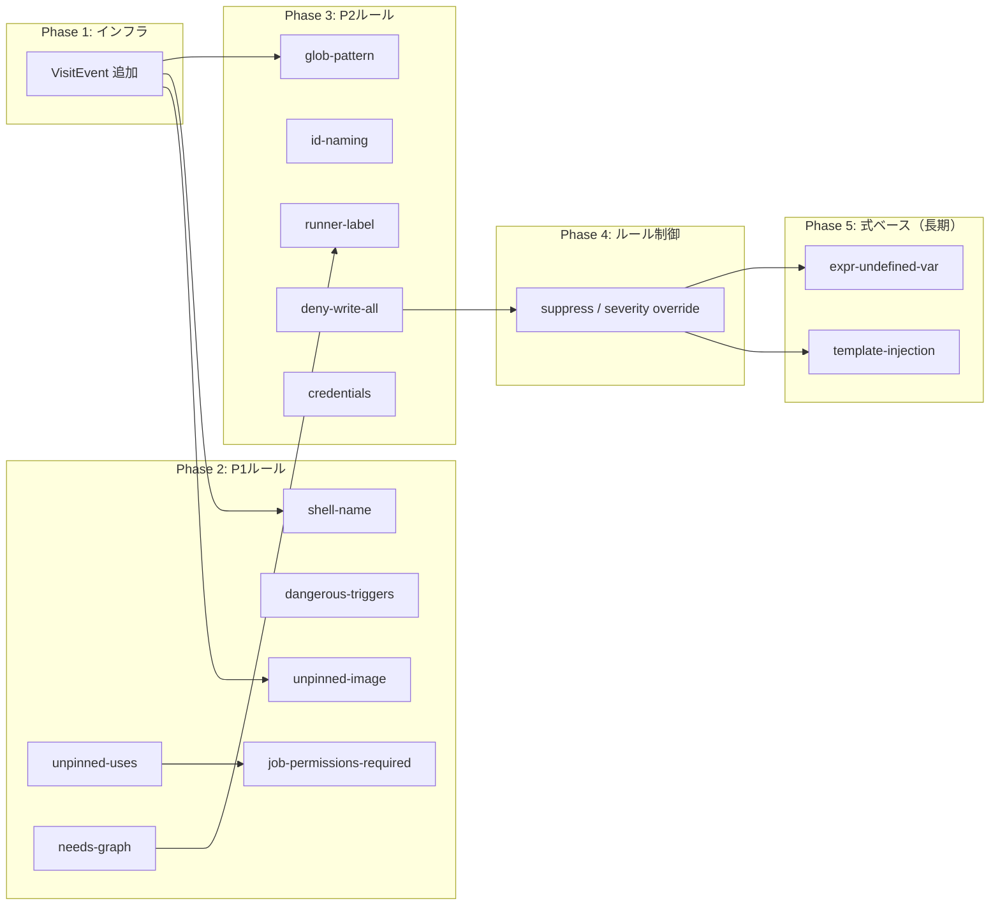

# Linter 実装計画

> 現状のルールエンジン実装を整理し、actionlint / ghalint / zizmor の各ルール群に対して優先度付きで実装を進めるための計画。各ステップは独立してテスト可能な単位で区切る。

---

## 現状サマリー

| 領域 | 現行状況 |
|---|---|
| エンジン本体 | `LintEngine` が `WorkflowParser.Parse` → `WorkflowVisitor` → 各 `IRule` の順で実行。診断は優先度ソート後に重複除去して `LintResult` へ返却 |
| Visitor | `WorkflowVisitor` が `WorkflowPre → VisitEvent* → JobPre → Step → JobPost → WorkflowPost` の順で巡回 |
| IRule / IPass | `IRule : IPass` を定義。`RuleBase` が診断収集・`LintConfig` 注入・位置情報構築の共通実装を提供 |
| SyntaxRule | `RuleCatalog` の全ルールを束ねるファサード。`LintEngine` のデフォルトエントリポイント |
| 実装済みルール | `job-structure` / `reusable-workflow` / `permissions` / `popular-action-inputs` / `unpinned-uses` / `unpinned-image` / `dangerous-triggers` / `job-permissions-required` / `needs-graph` / `shell-name` / `runner-label` / `id-naming` / `glob-pattern` の 13 ルール |
| 生成データ | `WebhookTypes.g.cs`（イベント名・種別）/ `PopularActions.g.cs`（アクション入力名）/ `RunnerLabels.g.cs`（hosted runner label）が利用可能 |
| ルール設定 | 現実装は `LintConfig` がファイルパスと UTF-8 本文のみ。`Seiton_Linter_spec.md` で定義された rule exclusion（config + inline next-line）/ severity override / fail-safe は実装待ち |
| 式ベースルール | 式 AST（`${{ }}`）は parser に存在するが、linter ルールからの活用はゼロ |

---

## 実装済みルール詳細

| RuleId | クラス | 検査内容 | 対応ツール |
|---|---|---|---|
| `job-structure` | `JobStructureRule` | `uses` と `steps`/`runs-on` の排他、両者の必須チェック | actionlint |
| `reusable-workflow` | `ReusableWorkflowRule` | `uses` なしで `with`/`secrets`、`uses` ありで禁止キー共存 | actionlint |
| `permissions` | `PermissionsRule` | scalar が `read-all`/`write-all` か、スコープ値が `read`/`write`/`none` か | actionlint |
| `popular-action-inputs` | `PopularActionInputsRule` | 既知アクション (`PopularActions.g.cs`) の入力名バリデーション（Warning） | actionlint（独自拡張） |
| `unpinned-uses` | `UnpinnedUsesRule` | `uses:` の ref が 40 桁 hex 以外（`@v4` / `@main` 等）の場合に warning。`./` ローカル・`docker://` は除外。reusable workflow も対象 | zizmor / ghalint |
| `unpinned-image` | `UnpinnedImageRule` | `uses: docker://...` / `container.image` / `services.*.image` が `@sha256:<64-hex>` 以外の場合に warning | 独自 |
| `dangerous-triggers` | `DangerousTriggersRule` | `pull_request_target` / `workflow_run` を検出したら warning | zizmor |
| `job-permissions-required` | `JobPermissionsRequiredRule` | `permissions` 未定義の全 job（通常 job・reusable workflow 呼び出し job 共通）を warning | ghalint |
| `needs-graph` | `NeedsGraphRule` | `needs` で存在しない job ID を参照している場合に error。循環参照を DFS で検出して error | actionlint |
| `shell-name` | `ShellNameRule` | `run:` step の `shell:` 値、`workflow.defaults.run.shell`、`job.defaults.run.shell` が有効値（bash / sh / pwsh / powershell / cmd / python）以外の場合に error | actionlint |
| `runner-label` | `RunnerLabelRule` | GitHub-hosted 既知 runner label 以外（`self-hosted` 含有・式は除外）の `runs-on` を warning | actionlint |
| `id-naming` | `IdNamingRule` | `job.id` / `step.id` が `[a-zA-Z0-9_-]` 以外の文字を含む場合に error | actionlint |
| `glob-pattern` | `GlobPatternRule` | `on.<event>.branches/tags/paths` 系フィルタ値の glob 構文（`***` / 未閉鎖 `[` / 余剰 `]`）を検査し、不正を error | actionlint |

---

## インフラギャップ

ルール実装の前に対処すべきエンジン側の不足を優先度順に示す。

| # | ギャップ | 影響 | 深刻度 |
|---|---|---|---|
| G1 | `IRule`/`WorkflowVisitor` に `VisitEvent` がない | **解消済み（Phase 1 実装）** | ✅ |
| G2 | 式 AST の linter 連携がない | `template-injection` / `expr-*` 系が全滅 | 🔴 高 |
| G3 | ルール単位の exclusion / severity override がない | `LintConfig` にオプション欄がなく、仕様で定義した exclusion・フェイルセーフ・可観測性を満たせない | 🟡 中 |
| G4 | Job 横断ルール向けの共通状態管理ヘルパーがない | `needs` などで各ルールが ID 収集・集合管理を都度実装する必要があり、重複実装が発生する | 🟡 中 |
| G5 | `VisitStep(ExecRun)` / `VisitStep(ExecAction)` の型別フックがない | 各ルールで `step.Exec is ExecRun` キャストが必要になり冗長 | 🟢 低 |
| G6 | parser 仕様書（§8）に `VisitEvent` 拡張方針の注記がない | **解消済み（仕様同期済み）** | ✅ |

---

## Phase 1: VisitEvent の追加

**目標**: `WorkflowVisitor` に `On` イベント列の巡回フックを追加し、イベント系ルールの実装基盤を整える

### Step 1.0: linter 仕様書への同期注記を追加（完了）

**ファイル**: `Docs/Seiton_Linter_spec.md`, `Docs/Seiton_Parser_csharp_spec.md`

- 現行契約（`VisitEvent` なし）を維持したまま、Phase 1 実装予定として注記を追加
- 実装着手時に linter 仕様のインターフェース定義・巡回順を同時更新する運用ルールを明記

**完了条件**: linter 実装計画と linter 仕様書の間で、`VisitEvent` 追加の差分が明示されている

### Step 1.1: IPass / IRule に VisitEvent を追加

**ファイル**: `src/Seiton.Core/Linting/IPass.cs`, `src/Seiton.Core/Linting/IRule.cs`

- `void VisitEvent(Event ev)` を `IPass` に追加
- `RuleBase` にデフォルト空実装を追加（既存ルールへの影響をゼロにする）

**完了条件**: 既存 4 ルールがノータッチでビルド・テストがパスする

**実装メモ**: 完了。`IPass` と `RuleBase` に `VisitEvent` を追加し、既存ルールは無変更で動作。

### Step 1.2: WorkflowVisitor の巡回に VisitEvent を組み込む

**ファイル**: `src/Seiton.Core/Linting/WorkflowVisitor.cs`

- `Visit(Workflow)` 内で `workflow.On` を走査し、各 `Event` に対して全 pass の `VisitEvent` を呼ぶ
- 巡回順: `WorkflowPre → VisitEvent* → JobPre → Step → JobPost → WorkflowPost`

**完了条件**: `CountingRule` テストに `EventCount` を追加し、イベント数が正しく計上される

**実装メモ**: 完了。`RuleInterfaceTests` の `CountingRule` に `EventCount` を追加して検証済み。

### Step 1.3: SyntaxRule の VisitEvent を委譲

**ファイル**: `src/Seiton.Core/Linting/SyntaxRule.cs`

- `VisitEvent` を配下の全ルールへ委譲するよう追加

**完了条件**: ビルドが通り、既存テストがパス

**実装メモ**: 完了。`SyntaxRule.VisitEvent` を追加し、配下ルールへ委譲。

---

## Phase 2: P1 ルール（AST だけで実装可能・価値が高い）

**目標**: 既存 AST を使いきれる 6 ルールを追加する。新たな AST 変更は不要

### Step 2.1: unpinned-uses ルール

**ファイル**: `src/Seiton.Core/Linting/UnpinnedUsesRule.cs`

- 対応: zizmor `unpinned-uses`, ghalint `action_ref_should_be_full_length_commit_sha`
- `ExecAction.Uses.Value` を UTF-8 span でパース
  - `owner/repo@ref` の `ref` 部分を抽出
  - `ref` が 40 桁の hex 文字列でない場合に warning を報告
  - `./` ローカルパス参照、`docker://` スキームは除外
- `WorkflowCall.Uses`（reusable workflow）も同様に検査

**完了条件**: SHA ピン済みの uses は警告なし、`@v4` / `@main` 等は警告ありのテストがパスする

**実装メモ**: 完了。`UnpinnedUsesRule` を実装し、`IsFullLengthCommitShaPinned()` で 40 桁 hex 判定（UTF-8 span）。`VisitStep`（`ExecAction`）と `VisitJobPre`（`WorkflowCall`）の両経路を検査。`RuleCatalog` に priority 4 で登録済み。table-driven 回帰テスト（6 ケース）を `RuleInterfaceTests` に追加。

### Step 2.2: unpinned-image ルール

**ファイル**: `src/Seiton.Core/Linting/UnpinnedImageRule.cs`

- 対応: コンテナイメージの digest pin 強制（独自拡張）
- `VisitStep` で `uses: docker://...` を検査
  - `docker://<image>@sha256:<64 hex>` 形式のみを pinned とみなす
  - `:latest` や `:1.2.3` など tag 指定、implicit latest（tag/digest なし）は warning を報告
- `VisitJobPre` で `job.container.image` と `job.services.*.image` を検査
  - 同様に `@sha256:<64 hex>` 以外を warning
  - 式（`${{ }}`）は現段階では評価不能なためスキップ
- `run:` のシェルスクリプト内 `docker run ...` 解析はスコープ外
  - 文字列解析では誤検知/取りこぼしが多いため、必要なら将来 `run` 専用ルールとして分離

**完了条件**: `docker://...:latest` / `container.image: repo/app:tag` / `services.*.image: repo/app` で warning、`@sha256:...` では warning なしのテストがパスする

**実装メモ**: 完了。`UnpinnedImageRule` を実装（`unpinned-tag` から改名）。`IsSha256DigestPinned()` で `@sha256:<64-hex>` を判定（UTF-8 span）。`VisitStep`（`docker://` uses）、`VisitJobPre`（`job.container.image` / `services.*.image`）の 3 箇所を検査。`RuleBase` に `AddJobWarning(job, message, location)` オーバーロードを追加して正確な位置を付与。`RuleCatalog` に priority 5 で登録済み。table-driven 回帰テスト（8 ケース）を `RuleInterfaceTests` に追加。

### Step 2.3: dangerous-triggers ルール

**ファイル**: `src/Seiton.Core/Linting/DangerousTriggersRule.cs`

- 対応: zizmor `dangerous-triggers`
- **前提**: Phase 1 (Step 1.1–1.3) 完了
- `VisitEvent` で `WebhookEvent` を受け取り、`WebhookTypes.EventId` を参照
  - `PullRequestTarget` を検出したら warning を報告
  - `WorkflowRun`（外部ワークフロー書き込み権限を誘発しうる）も warning 対象
- 将来的に zizmor と ghalint の更新に合わせてリスト追加できるよう、検出対象を列挙で管理

**完了条件**: `pull_request_target` / `workflow_run` を含む workflow で warning が出る

**実装メモ**: 完了。`DangerousTriggersRule` を実装。`DangerousEventIds` 配列（`PullRequestTarget` / `WorkflowRun`）で検出対象を管理し、将来のイベント追加は配列 1 行で対応可能。`WebhookTypes.TryGet()` で UTF-8 span から `EventId` を取得する。`RuleBase` に `AddEventWarning()` / `BuildEventLocation()` ヘルパーを追加。`RuleCatalog` に priority 6 で登録済み。table-driven 回帰テスト（5 ケース）を `RuleInterfaceTests` に追加。

### Step 2.4: job-permissions-required ルール

**ファイル**: `src/Seiton.Core/Linting/JobPermissionsRequiredRule.cs`

- 対応: ghalint `job_permissions`
- `VisitJobPre` で `job.Permissions is null` の場合に warning を報告
  - reusable workflow 呼び出し job も対象。呼び出し側 job に `permissions:` を明示することで呼び出されるワークフローに渡す権限を制御できる

**完了条件**: permissions なし job（通常 job / reusable workflow 呼び出し job 両方）は warning、permissions あり job は warning なしのテストがパスする

**実装メモ**: 完了。`JobPermissionsRequiredRule` を実装。`VisitJobPre` で `job.Permissions is null` の場合に warning を報告。reusable workflow 呼び出し job も除外しない（呼び出し側 job に `permissions:` を設定することで呼び出されるワークフローに渡す権限を制御できるため）。`RuleCatalog` に priority 7 で登録済み。table-driven 回帰テスト（6 ケース）を `RuleInterfaceTests` に追加。

### Step 2.5: needs-graph ルール

**ファイル**: `src/Seiton.Core/Linting/NeedsGraphRule.cs`

- 対応: actionlint `needs` 系
- `VisitWorkflowPre` で `workflow.Jobs` の全 ID を収集して保持
- `VisitJobPre` で `job.Needs` の各エントリが収集済み ID に存在するかを検証
  - 存在しない ID を参照している場合にエラーを報告
- `VisitWorkflowPost` で DFS による循環参照検出を実行
  - GitHub Actions は循環参照を実行時エラーにするため、静的に検出してエラーを報告
  - DFS の gray（処理中）ノードへの back-edge を検出して循環と判定

**完了条件**: 存在しない job ID を `needs` で参照したときにエラーが出るテストがパスする。自己参照・2 job 間・3 job 間の循環でエラーが出るテストがパスする

**実装メモ**: 完了。`NeedsGraphRule` を実装。`VisitWorkflowPre` で `workflow.Jobs`（`IReadOnlyDictionary<Utf8String, Job>`）の参照をフィールドに保存。`VisitJobPre` で `job.Needs` の各エントリを `Utf8String.FromLowerAscii()` でキー化して `ContainsKey` 検証。GitHub Actions の job ID は case-insensitive（パーサーが `FromLowerAscii` で格納）なので同一の正規化を使用。エラー位置は `need.Range`（実際の needs エントリ被参照箇所）を使用。`VisitWorkflowPost` で iterative DFS（color: 0=unvisited / 1=gray / 2=black）による循環参照検出を追加。back-edge（gray ノードへの参照）を検出してエラーを報告。`RuleCatalog` に priority 8 で登録済み。table-driven 回帰テスト（8 ケース）を `RuleInterfaceTests` に追加。

### Step 2.6: shell-name ルール

**ファイル**: `src/Seiton.Core/Linting/ShellNameRule.cs`

- 対応: actionlint `shell-name`
- `VisitStep` で `step.Exec is ExecRun run` の場合に `run.Shell.Value` を検査
  - 有効値: `bash` / `sh` / `pwsh` / `powershell` / `cmd` / `python`（UTF-8 span 比較）
  - 式 (`${{ }}`) が含まれる場合はスキップ
  - それ以外は error を報告
- `VisitWorkflowPre` で `workflow.defaults.run.shell` を検査（同上）
- `VisitJobPre` で `job.defaults.run.shell` を検査（同上）

**完了条件**: 有効シェル名は通過、無効名はエラーのテストがパスする

**実装メモ**: 完了。`ShellNameRule` を実装。`VisitStep`（`ExecRun.Shell`）・`VisitWorkflowPre`（`workflow.Defaults.Run.Shell`）・`VisitJobPre`（`job.Defaults.Run.Shell`）の 3 箇所を検査。`IsValidShellName()` で `bash` / `sh` / `pwsh` / `powershell` / `cmd` / `python` の 6 値を UTF-8 span 比較。`Expression is not null` だけでなく `IndexOf("${{"u8) >= 0` のバイトスキャンで式値をスキップ（パーサーが `Shell` の `Expression` を常に設定するわけではないため）。`CheckDefaultsRunShell()` ヘルパーメソッドで workflow / job 両方の defaults 検査ロジックを共通化。`RuleBase` に `AddStepError(step, message, location)` ヘルパーを追加。エラー位置は各 `shellNode.Range` を使用。`RuleCatalog` に priority 9 で登録済み。table-driven 回帰テスト（14 ケース）を `RuleInterfaceTests` に追加。

### Step 2.7: RuleCatalog に P1 ルールを登録

**ファイル**: `src/Seiton.Core/Linting/RuleCatalog.cs`

- `DefaultRuleFactories` に `unpinned-uses`（priority 4）/ `unpinned-image`（5）/ `dangerous-triggers`（6）/ `job-permissions-required`（7）/ `needs-graph`（8）/ `shell-name`（9）を追加

**完了条件**: `new LintEngine()` だけで全 P1 ルールが動作する

**実装メモ**: 完了。`RuleCatalog.DefaultRuleFactories` に P1 ルール 6 件（priority 4-9）を登録済み。`RuleCatalog_DefaultRules_MatchDocumentedScope` でルール数 10 件、ID 順、priority 値を検証済み。

---

## Phase 3: P2 ルール（AST 検証ロジックがやや複雑）

**目標**: 生成データの拡充または複数 AST ノードにまたがるルールを追加する

### Step 3.1: runner-label ルール

**ファイル**: `src/Seiton.Core/Linting/RunnerLabelRule.cs`, `src/Seiton.Core/Generated/RunnerLabels.g.cs`

- 対応: actionlint `runner-label`
- `RunnerLabels.g.cs` に GitHub-hosted runner の既知ラベル一覧を生成（UTF-8 span ベース）
  - `ubuntu-*`, `windows-*`, `macos-*` 系の主要ラベルを網羅
- `VisitJobPre` で `job.RunsOn.Labels` を走査
  - `self-hosted` を含む場合はスキップ
  - `LabelsExpr` が非 null（式形式）の場合はスキップ
  - 既知ラベル外は warning を報告

**完了条件**: `ubuntu-latest` は通過、`ubuntu-9999` は warning のテストがパスする

**実装メモ**: 完了。`runner-labels` dataset を updater の既存生成フロー（fetch / parse / merge / sync / verify）に追加し、`https://docs.github.com/en/actions/reference/runners/github-hosted-runners.md` から hosted runner label 一覧を取得して `RunnerLabels.g.cs` を生成する方式に変更。preview ラベル（例: `windows-2025-vs2026`）は `PreviewLabels` として別管理しつつ `IsKnownHostedLabel` では許可対象に含める。`RunnerLabelRule` は `VisitJobPre` で `job.RunsOn.Labels` を検査し、`self-hosted` 含有 job と `LabelsExpr`（式）はスキップ。未知 label は warning（`label.Range` を位置に使用）。`RuleCatalog` に priority 10 で登録済み。table-driven 回帰テスト（8 ケース）を `RuleInterfaceTests` に追加。

### Step 3.2: id-naming ルール

**ファイル**: `src/Seiton.Core/Linting/IdNamingRule.cs`

- 対応: actionlint `id-naming`
- `VisitJobPre` で `job.Id.Value` を検査: `[a-zA-Z0-9_-]` のみ許可
- `VisitStep` で `step.Id?.Value` を検査: 同上
- 違反した場合にエラーを報告

**完了条件**: 有効 ID は通過、空白・記号を含む ID はエラーのテストがパスする

**実装メモ**: 完了。`IdNamingRule` を実装し、`VisitJobPre` で `job.Id`、`VisitStep` で `step.Id` を検査。文字種は UTF-8 バイト走査で `[a-zA-Z0-9_-]` のみ許可、空文字も不許可。式値（`Expression` または `${{` を含む値）は静的判定不能としてスキップ。違反時は `AddJobError(..., idNode.Range)` / `AddStepError(..., idNode.Range)` で ID ノード位置に error を報告。`RuleCatalog` に priority 11 で登録済み。table-driven 回帰テスト（6 ケース）を `RuleInterfaceTests` に追加。

### Step 3.3: glob-pattern ルール

**ファイル**: `src/Seiton.Core/Linting/GlobPatternRule.cs`

- 対応: actionlint `glob`
- **前提**: Phase 1 (VisitEvent) 完了
- `VisitEvent` で `WebhookEvent` の `Branches` / `BranchesIgnore` / `Tags` / `TagsIgnore` / `Paths` / `PathsIgnore` のフィルタ値を検査
  - 連続する `**` (`***` 以上)、`[` の閉じ忘れ等の不正パターンを検出
  - span ベースの軽量パターン検証で行う（regex 不使用）

**完了条件**: 有効パターンは通過、`***` / 未閉鎖 `[` 等はエラーのテストがパスする

**実装メモ**: 完了。`GlobPatternRule` を実装し、`VisitEvent` で `WebhookEvent` の `Branches` / `BranchesIgnore` / `Tags` / `TagsIgnore` / `Paths` / `PathsIgnore` を走査。各 `WebhookEventFilter.Values` に対して UTF-8 span ベースで軽量検証を行い、`***`（3 連続以上の `*`）・未閉鎖 `[`・対応しない `]` を検出した場合に error を報告。式値（`Expression` 非 null または `${{` を含む値）は静的判定不能としてスキップ。位置情報は `valueNode.Range` を使用。`RuleBase` に `AddEventError(..., TextRange)` を追加し、`RuleCatalog` へ priority 12 で登録。table-driven 回帰テスト（4 ケース）を `RuleInterfaceTests` に追加。

### Step 3.4: deny-write-all ルール

**ファイル**: `src/Seiton.Core/Linting/DenyWriteAllRule.cs`（または `PermissionsRule` の拡張）

- 対応: ghalint `deny_write_all_permissions`
- `PermissionsRule` は `write-all` を「有効値」として通過させているが、本ルールは明示的に禁止
- `VisitWorkflowPre` / `VisitJobPre` で `permissions.All` が `write-all` なら error を報告
- `PermissionsRule` と責務分離するため独立クラスを推奨

**完了条件**: `permissions: write-all` が error になるテストがパスする

### Step 3.5: credentials ルール

**ファイル**: `src/Seiton.Core/Linting/CredentialsRule.cs`

- 対応: actionlint `credentials`
- `VisitJobPre` で `job.Container` および `job.Services` を走査
  - プライベートレジストリを示す image（`ghcr.io/`, `docker.io/` 以外のカスタムレジストリ）で `credentials` が null の場合に warning
  - 判定精度を上げるため、image 文字列に `/` を含みかつ `gcr.io` / `ghcr.io` / `docker.io` / `public.ecr.aws` 以外のホストを持つ場合を警告対象とする

**完了条件**: パブリックレジストリは通過、カスタムレジストリで credentials なしは warning のテストがパスする

### Step 3.6: RuleCatalog に P2 ルールを登録

**ファイル**: `src/Seiton.Core/Linting/RuleCatalog.cs`

- `runner-label`（priority 10）/ `id-naming`（11）/ `glob-pattern`（12）/ `deny-write-all`（13）/ `credentials`（14）を追加

**完了条件**: `new LintEngine()` だけで全 P2 ルールが動作する

---

## Phase 4: ルール制御機構

**目標**: ユーザーがルールの有効化・無効化・severity 変更をできるようにする

### Step 4.1: LintConfig にルール設定を追加

**ファイル**: `src/Seiton.Core/Linting/LintConfig.cs`

- `IReadOnlyDictionary<string, RuleOption>? RuleOptions` を追加
- `RuleOption` は `Enabled` (bool) と `Severity` (DiagnosticSeverity?) を持つ record

**完了条件**: 型が追加されビルドが通る

### Step 4.2: LintEngine でルールの有効化・無効化を実装

**ファイル**: `src/Seiton.Core/Linting/LintEngine.cs`

- `Check` 内で `RuleOptions` を参照し、`Enabled == false` のルールを `visitor` に登録しない
- `Severity` が指定されている場合は診断の `Severity` を上書きして出力

**完了条件**: `RuleOptions` で無効化したルールの診断が結果に含まれないテストがパスする

### Step 4.3: ファイル内 inline exclusion（next-line）を実装

**ファイル**: `src/Seiton.Core/Linting/LintEngine.cs`, `src/Seiton.Core/Linting/LintConfig.cs`

- `# seiton-lint: disable-next-line seiton-lint-rule-001[,seiton-lint-rule-xxx...]` をサポート
- 適用範囲は次行のみ
- 未知 rule-id は設定エラーとして報告
- YAML コメント取得が困難なため、UTF-8 本文の行スキャンで directive を抽出

**完了条件**: next-line 抑制が動作し、未知 rule-id でエラーを返すテストがパスする

### Step 4.4: file/job exclusion と可観測性を実装

**ファイル**: `src/Seiton.Core/Linting/LintEngine.cs`, `src/Seiton.Core/Linting/LintResult.cs`

- 設定ファイル exclusion で file glob（`/` 正規化 + case-sensitive）をサポート
- job スコープは `job.id` ベースで評価
- 抑制結果の可観測性を出力（総件数、rule 別件数、ruleId + line/column）

**完了条件**: suppression summary を含む結果が返り、CI で増減検知できる

### Step 4.5: フェイルセーフ制約を実装

**ファイル**: `src/Seiton.Core/Linting/RuleCatalog.cs`, `src/Seiton.Core/Linting/LintEngine.cs`

- non-disableable rule を実装
- minimum severity 制約を実装（`Error > Warning > Info`）
- 制約違反設定は設定エラーとして報告

**完了条件**: disable 不可ルール無効化や最低 severity 未満設定が失敗するテストがパスする

---

## Phase 5: 式ベースルール（長期）

**目標**: 既存の式 AST パイプライン（パーサー仕様 §6/§7）と linter を接続し、セキュリティ系ルールを追加する

> **前提**: パーサーの式 AST・セマンティクス（`ExpressionParser` / `ExpressionSemanticAnalyzer`）が linter から利用できる状態になっていること。

### Step 5.1: LintConfig に式解析コンテキストを追加

**ファイル**: `src/Seiton.Core/Linting/LintConfig.cs`

- `ExpressionContext ExprContext { get; init; }` を追加し、式解析時のコンテキスト（イベント種別等）を渡せるようにする

### Step 5.2: template-injection ルール

**ファイル**: `src/Seiton.Core/Linting/TemplateInjectionRule.cs`

- 対応: zizmor `template-injection`
- `VisitStep` で `ExecRun.Run` の文字列を走査
  - `${{ github.event.*.body }}` / `${{ github.event.pull_request.title }}` 等のユーザー制御可能な値を直接 `run:` や `env:` に展開している箇所を検出
  - 式 AST から taint source を判定し、run ステップへの直接展開を error とする

### Step 5.3: expr-undefined-var ルール

**ファイル**: `src/Seiton.Core/Linting/ExprUndefinedVarRule.cs`

- 対応: actionlint `expression`
- `VisitStep` / `VisitJobPre` の `if:` / `env:` / `with:` を式 AST で解析
  - `Availability.g.cs` を参照して、使用コンテキストで有効でない変数を error 報告

---

## ルール実装ロードマップ

---

## ルール優先度一覧

| Priority | RuleId | Phase | 対応ツール | 前提 |
|---|---|---|---|---|
| 0 | `job-structure` | 実装済み | actionlint | — |
| 1 | `reusable-workflow` | 実装済み | actionlint | — |
| 2 | `permissions` | 実装済み | actionlint | — |
| 3 | `popular-action-inputs` | 実装済み | actionlint | — |
| 4 | `unpinned-uses` | **実装済み** | zizmor / ghalint | — |
| 5 | `unpinned-image` | **実装済み** | 独自 | — |
| 6 | `dangerous-triggers` | **実装済み** | zizmor | VisitEvent |
| 7 | `job-permissions-required` | **実装済み** | ghalint | — |
| 8 | `needs-graph` | **実装済み** | actionlint | — |
| 9 | `shell-name` | **実装済み** | actionlint | — |
| 10 | `runner-label` | **実装済み** | actionlint | RunnerLabels.g.cs |
| 11 | `id-naming` | **実装済み** | actionlint | — |
| 12 | `glob-pattern` | Phase 3 | actionlint | VisitEvent |
| 13 | `deny-write-all` | Phase 3 | ghalint | — |
| 14 | `credentials` | Phase 3 | actionlint | — |
| — | `template-injection` | Phase 5 | zizmor | 式 AST 連携 |
| — | `expr-undefined-var` | Phase 5 | actionlint | 式 AST 連携 |

## チェックリスト（全 Phase 共通）

各ルール実装完了時に以下を確認する:

### ビルド / テスト
- [ ] `dotnet build` が通る
- [ ] `dotnet test` が全パスする（回帰なし）

### ルール実装品質（Linting フォルダ対象）
- [ ] `RuleBase` を継承し、`Id` / `Name` / 必要な `VisitXxx` のみをオーバーライドしている
- [ ] `VisitXxx` ホットパスで UTF-8 span 比較を使い、`Decode()` / `string` 生成を診断メッセージ構築時のみに限定している
- [ ] `new T[]` / `List<T>` / LINQ / regex を `VisitXxx` ホットパスに導入していない
- [ ] 位置情報（`TextRange`）が正確である（`BuildJobLocation` / `BuildStepLocation` / `BuildEventLocation` 等を適切に使用）
- [ ] diagnostics のメッセージが有用で、対象（rule id / ファイルパス / 問題箇所）を特定できる

### Visitor / Catalog 連携
- [ ] `SyntaxRule` の `VisitXxx` 委譲が漏れなく追加されている（新 hook を追加した場合のみ確認）
- [ ] `RuleCatalog.DefaultRuleFactories` に正しい priority で登録されている
- [ ] `RuleCatalog_DefaultRules_MatchDocumentedScope` テストが更新されている

### テスト
- [ ] `RuleInterfaceTests` に table-driven 回帰テストが追加されている（正常系 1 件以上 + 異常系 2 件以上）
- [ ] 本計画書の該当 Step に記載された完了条件をすべて満たすテストが全件パスする

### ドキュメント
- [ ] 本計画書の該当 Step に **実装メモ**: 完了 を追記した
- [ ] 完了したルールを「実装済みルール詳細」テーブルに追加した
- [ ] 「現状サマリー」の実装済みルール数を更新した
- [ ] 「ルール優先度一覧」の Phase 列を **実装済み** に更新した
